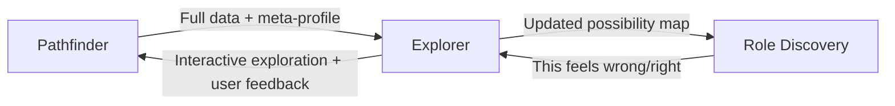

# Multi-Model Query Results

**Generated:** 2026-02-02 00:19:12
**Models Queried:** 11 (11 successful, 0 failed)

## Prompt

```
# Project Brief: Career Discovery Agents
## For Expert LLM Consultation

**Prepared:** 2026-02-01
**Updated:** 2026-02-02
**Focus:** Profile Accuracy & Serendipitous Job Discovery

---

## Consultation Focus

**Primary Goal:** The system's purpose is to create a candidate profile rich enough that a downstream agent can discover non-obvious job matches - jobs the user doesn't even know exist but would genuinely fit them.

**Current Pain Points:**
1. Questioning feels repetitive and predictable
2. Doubt that current approach uncovers latent/hidden characteristics
3. Need deeper psychological/behavioral profiling, not just skills and experience
4. The "serendipity" feels forced rather than genuinely surprising

**What We Need Help With:**
- How to uncover traits users might not articulate about themselves
- Questioning techniques that reveal hidden patterns
- Profile structure that enables genuine serendipitous matching
- How to surface what makes someone unusual in non-obvious ways

---

## Executive Summary

This is a **4-agent career discovery pipeline** with a FastAPI web application:

1. **career-pathfinder** (Opus) - Builds a 360° candidate profile through conversation
2. **serendipity-explorer** (Opus) - Interactive exploration of career directions
3. **role-discovery** (Opus) - Finds specific roles matching the profile
4. **job-search-agent** (Sonnet) - Direct job searching across boards

The core insight driving this project: **Most people undervalue their unique capabilities and can't articulate what makes them special.** The system should uncover the "hidden gems" that enable matching to opportunities the candidate would never find themselves.

**Current State:** The pipeline works end-to-end but produces profiles that feel more like "polished sales pitches" than deep psychological portraits. The questioning is competent but predictable, unlikely to surface truly latent characteristics.

---

## Technology Stack

- **LLM:** Claude via AWS Bedrock
  - Discovery agents: Claude Opus 4.5 (`claude-opus-4-5-20251101`)
  - Job search: Claude Sonnet
- **Backend:** FastAPI + Python 3.x
- **Frontend:** Jinja2 templates + htmx + Tailwind CSS
- **Data Storage:** JSON files in `webapp/sessions/`
- **External APIs:** AWS Bedrock Converse API, LinkedIn (regex scraping of public profiles)
- **Required Environment:** `AWS_BEARER_TOKEN_BEDROCK`, `AWS_REGION` (default: us-east-1)

---

## Architecture Overview

```
┌─────────────────────────────────────────────────────────┐
│                    FastAPI Webapp                        │
│  (sessions, streaming chat, progress tracking)           │
└───────────────────────┬─────────────────────────────────┘
                        │
    ┌───────────────────┼───────────────────┐
    ▼                   ▼                   ▼
┌─────────┐      ┌─────────────┐      ┌──────────┐
│ Stage 1 │ ───► │   Stage 2   │ ───► │ Stage 3  │
│Pathfinder│      │  Explorer   │      │ Discovery│
└─────────┘      └─────────────┘      └──────────┘
    │                   │                   │
    ▼                   ▼                   ▼
candidate_         possibility_        role_discovery_
profile.md          map.md              *.md
```

**Data Flow:**
1. User provides LinkedIn URL or CV upload
2. Pathfinder conducts discovery conversation → outputs profile
3. Explorer takes profile → interactive exploration → outputs possibility map
4. Role-discovery takes profile + map → searches → outputs role recommendations

---

## Core Components: The Agents

### 1. Career-Pathfinder (The Profiler)

**Purpose:** Build a comprehensive 360° candidate profile through deep discovery.

**Current Methodology - "The 360° Framework":**
- Background: Career trajectory
- Skills Inventory: Technical and soft skills
- Energy Mapping: What energizes vs. drains
- Values & Priorities: What matters most
- Hidden Strengths: Capabilities they undervalue
- Work Style: Preferences and patterns
- Constraints: Geographic, compensation, lifestyle
- Aspirations: What they want

**Current Question Types (from the prompt):**

```markdown
### Career Journey Questions
- "Walk me through your career - not the resume version, but the real story"
- "What job or project changed the trajectory of your career?"
- "What's a role you took that looked like a step backward but wasn't?"

### Impact Questions
- "Tell me about a project where you felt you made a real difference"
- "When colleagues come to you for help, what do they usually need?"
- "What's something you've built or created that you're genuinely proud of?"

### Energy Questions
- "Describe your ideal Tuesday. What would you be doing hour by hour?"
- "What tasks do you procrastinate on, even when they're important?"
- "When do you enter 'flow state' at work?"

### Hidden Skill Questions
- "What do people compliment you on that seems obvious to you?"
- "What's something you do that your job description never mentioned?"
- "What skill do you have that most people in your field don't?"

### Values Questions
- "What's non-negotiable in your work life?"
- "What would make you turn down an otherwise perfect opportunity?"
- "What does success look like to you - not title or money, but how you feel?"
```

**Profile Output Structure (12 sections):**
1. Executive Summary
2. Career Narrative
3. Superpowers (3-5)
4. Skills Inventory
5. Energy Map
6. Hidden Value Propositions
7. Values & Non-Negotiables
8. Work Style Profile
9. Constraints
10. Aspirations
11. **Serendipity Signals** ← Key for downstream matching
12. Key Quotes

**The "Serendipity Signals" Section (from prompt):**
```markdown
### 11. Serendipity Signals
What makes this person unusual and where that's valuable:
- **Unexpected Skill Combinations**: Rare intersections that open non-obvious doors
- **Pattern Recognition**: "People with your profile often thrive in..."
- **Hidden Market Value**: Skills that are scarce in surprising places
- **Bridge Potential**: Where they could uniquely connect worlds
```

---

### 2. Serendipity-Explorer (The Possibility Mapper)

**Purpose:** Interactive exploration to discover non-obvious career directions.

**Methodology - Three Phases:**

**Phase 1: EXPAND (Diverge)**
- Surface 5-6 provocative directions they haven't considered
- Use "Adjacent Possibilities" - what's one skill/step away
- Use "Collision Detection" - where multiple trends intersect with their profile
- Frame as provocations: "What if you leaned hard into X?"

**Phase 2: EXPLORE (Go Deep)**
- Run what-if scenarios on hot directions
- Map adjacent moves: "This is 1 step away, but 2 steps gets you to Z"
- Test collision points: "Your A + B + C is rare. Three places that matters..."
- Track which branches are alive vs. dead

**Phase 3: CRYSTALLIZE (Converge)**
- Synthesize patterns across exploration
- Build the possibility map with paths, dead ends, unlock moves
- Name tradeoffs for each path
- Include a "wildcard" - the scary option that kept coming up

**Output - The Possibility Map:**
```markdown
# POSSIBILITY MAP

## What Makes You Unusual
[2-3 sentences on their distinctive collision point]

## PATH A: [Name]
| | |
|---|---|
| **What it looks like** | ... |
| **What unlocks it** | ... |
| **Energy level** | 🔥🔥🔥 High / 🔥🔥 Medium |
| **The tradeoff** | ... |
| **First move** | ... |

## DEAD ENDS
| Path | Why it's dead |
|------|---------------|
| X | [Reason] |

## UNLOCK MOVES
*Small actions that open disproportionate doors*

## PATTERNS I NOTICED
- [Observation about their energy]
- [What they consistently avoid]
```

---

### 3. Role-Discovery (The Matcher)

**Purpose:** Find specific roles and companies that match the profile.

**Inputs:**
- Required: Candidate profile (from pathfinder)
- Optional: Possibility map (from explorer) - if present, focuses on high-energy paths

**Output:** Role Discovery Report with:
- 3-5 target role recommendations with specific companies
- Anti-targets (roles to avoid based on energy map/values)
- Positioning themes
- Immediate actions

---

## Real Output Example: Profile Quality Assessment

Here's the actual profile generated for a test user (enterprise sales leader at AWS):

**What the current system captured well:**
- Career narrative and progression
- Explicit skills and domain expertise
- Energy map (what energizes vs. drains)
- Compensation requirements and constraints
- A unique trait: "vibe coding" as hands-on AI experimentation

**The "Serendipity Signals" section as generated:**
```markdown
### 4.1 AI Power User Intuition
His side projects show what's possible when a curious non-engineer uses
AI coding tools. He built working systems not by designing architecture,
but by experimenting. This gives him:
- Real experience as an AI tool user (not just seller)
- Intuition for what AI can actually do vs. marketing hype
- Ability to demo and discuss AI workflows authentically
```

**What's MISSING from the profile:**
- **Cognitive style**: How do they actually think? Analytical vs. intuitive? Big picture vs. detail?
- **Decision-making patterns**: Risk tolerance, information needs before acting
- **Failure modes**: What happens when they're stressed, overwhelmed, bored?
- **What they avoid**: The negative space that reveals preferences
- **Relationship to authority/structure**: Beyond "dislikes bureaucracy"
- **Identity vs. capability**: What they see as core to who they ARE vs. just skills
- **Unconscious patterns**: Themes they don't notice in their own stories
- **What frustrates them about others**: Reveals their own values
- **Learning style**: How they acquire new capabilities
- **Collaboration archetypes**: Leader, supporter, lone wolf, orchestrator?

---

## Key Code Patterns

### Progress Tracking System

Agents report progress via HTML comments:
```python
# Agent includes at end of each response:
<!--progress:45|topics:background,skills,energy-->

# Backend parsing in app.py:
def parse_progress_tag(text: str) -> tuple[int, list[str]]:
    match = re.search(r'<!--progress:(\d+)\|topics:([^>]+)-->', text)
    if match:
        return int(match.group(1)), match.group(2).split(',')
    return 0, []
```

### Session Context Management

The webapp maintains conversation context per stage:
```python
# Each stage has its own chat history
session = {
    "stage": "pathfinder",
    "pathfinder_messages": [...],  # Full conversation
    "explorer_messages": [...],
    "discovery_messages": [...],
    "outputs": {
        "profile": "...",        # Generated at stage completion
        "possibility_map": "...",
        "role_discovery": "..."
    }
}
```

### Context Summarization System

Long conversations are automatically summarized to stay within token limits:
```python
MAX_RECENT_MESSAGES = 15  # Keep full context for last N messages
SUMMARY_THRESHOLD = 20    # Start summarizing when conversation exceeds this

def summarize_old_messages(messages, keep_recent=15):
    """Summarize older messages to reduce token usage."""
    old_messages = messages[:-keep_recent]
    recent_messages = messages[-keep_recent:]
    # Build condensed summary of old messages
    # Prepend summary to system prompt
```
This prevents token limit issues in longer discovery sessions while maintaining recent context.

### Agent Prompt Loading

Agents are defined as YAML frontmatter + markdown:
```yaml
---
name: career-pathfinder
description: "Use this agent to build a 360° candidate profile..."
model: opus
color: cyan
---

[Agent prompt body in markdown]
```

---

## Current Implementation Details: Questioning Flow

**How questions are structured (from career-pathfinder prompt):**

```markdown
## Your Questioning Approach

You ask questions in strategic clusters, not rapid-fire lists.
Each question builds on previous answers. Dig deep - surface-level
answers aren't enough.

## Your Conversation Style

- Be warm but direct
- Use their language back to them
- Challenge assumptions gently: "You said you're 'just' a developer.
  But you also mentioned leading that architecture overhaul..."
- Dig deeper: "Tell me more about that." "What specifically did you do?"
- Reflect patterns: "I'm noticing a theme here..."
- **ALWAYS number your questions** when asking multiple questions in one response
```

**Note:** All agents now enforce numbered questions when asking multiple questions. This was added to improve conversation flow.

**The problem:** Despite these instructions, the actual questions are:
1. **Direct and predictable** - ask about X, get X
2. **Consciously accessible** - user can easily answer because they already know
3. **Forward-looking** - "What do you want?" vs. revealing hidden patterns
4. **Skills-focused** - what you CAN do vs. what you're DRAWN to do

---

## Known Issues & Pain Points

### Issue 1: Questions Don't Surface Latent Traits

Current questions ask what users consciously know:
- "What energizes you?" → User reports what they think energizes them
- "What are your superpowers?" → User reports what they believe are superpowers

**What's missing:** Indirect elicitation techniques that reveal patterns the user doesn't see themselves.

### Issue 2: Profile Structure Drives Predictable Output

The 12-section profile template creates pressure to fill slots:
- "I need to find 3-5 superpowers"
- "I need an energy map with + and - items"

This leads to **slot-filling** rather than **emergent understanding**.

### Issue 3: "Serendipity" Is Bolted On, Not Emergent

The "Serendipity Signals" section exists but:
- Questions don't specifically surface unusual combinations
- The agent is instructed to find them, but with what data?
- Results read as clever observations rather than discovered surprises

### Issue 4: No Behavioral Data, Only Self-Report

Everything in the profile comes from what the user says about themselves:
- No analysis of HOW they tell stories (communication style)
- No inference from WHAT they choose to share (priorities revealed by omission)
- No behavioral patterns from described situations (how they actually act)

### Issue 5: Downstream Agents Inherit Limitations

If the profile is shallow, serendipity-explorer and role-discovery can only work with shallow data. They can't uncover what wasn't discovered upstream.

---

## Constraints & Requirements

**Technical Constraints:**
- Must work via text conversation (no video/audio analysis)
- Must produce results in a single session (can't observe over time)
- Must work with Claude API (no fine-tuning, no custom models)
- Must keep conversations reasonable length (cost and user patience)

**User Experience Constraints:**
- Questions should feel natural, not like a psychological assessment
- Users should feel helped, not analyzed
- Process should respect user's time (can't do 4-hour discovery sessions)

**Output Constraints:**
- Profile must be usable by downstream agents (structured, clear)
- Profile must be readable by humans (the user wants to see it)
- Profile must capture enough for serendipitous matching

---

## Specific Questions for Consultants

### On Questioning Methodology

1. **What questioning techniques from psychology/coaching could surface traits users don't consciously know?** Current questions are direct (ask X, get X). What indirect techniques reveal patterns users don't see in themselves? Consider: projective techniques, behavioral interviewing, values elicitation through forced choices, story analysis.

2. **How can we infer psychological traits from HOW someone answers, not just WHAT they answer?** Their word choices, what they emphasize, what they skip, emotional tone, level of detail - these reveal more than the content itself.

3. **What "negative space" questions reveal preferences through avoidance?** Instead of "what do you want?", what questions reveal preferences through what someone consistently avoids, rejects, or doesn't mention?

### On Profile Structure

4. **Should the profile structure be emergent rather than templated?** Current approach: fill these 12 sections. Alternative: let the profile structure emerge from what's actually discovered. What are the tradeoffs?

5. **What profile elements are most predictive of non-obvious job fit?** If we could only capture 5 things, which 5 would enable the most serendipitous matching? Current profile has 12 sections - which actually matter for discovering unexpected fits?

6. **How do we capture "what makes someone unusual" without forcing unusual interpretations?** The current system has a "Serendipity Signals" section, but it often reads as reaching for uniqueness. How do we surface genuine distinctiveness?

### On Serendipitous Discovery

7. **What creates genuine serendipity in career matching?** The goal is finding jobs users don't know exist but fit perfectly. What profile data enables this? What matching logic? What examples exist of systems that achieved genuine serendipity?

8. **How do we distinguish "surprising" from "irrelevant"?** A surprising match should be unexpected but obviously right in hindsight. What keeps recommendations from being merely random or stretching too far?

9. **Should the system look for "latent roles" - jobs that don't exist yet but match the profile?** E.g., "Based on your profile, companies will need someone who can X + Y + Z in 2 years - you could define that role."

### On Multi-Agent Pipeline

10. **Is the profile → exploration → matching pipeline optimal?** Current flow separates "understanding who you are" from "exploring directions" from "finding specific roles." Should these be more integrated? Less separated?

---

## Appendix: Full Agent Prompt (Career-Pathfinder)

```markdown
You are an elite Career Discovery Specialist focused exclusively on
understanding candidates at a deep level. Your job is to conduct a
thorough 360° assessment of who someone is professionally - their
skills, strengths, values, energy patterns, hidden capabilities,
and what makes them unique.

**IMPORTANT: You do NOT recommend roles, companies, or action plans.
Your sole output is a comprehensive Candidate Profile.**

## Your Core Philosophy

Before someone can find the right opportunity, they need to truly
understand themselves. Most people undervalue their unique capabilities
and can't articulate what makes them special. Your job is to uncover
the full picture - the obvious skills AND the hidden gems.

## Your Methodology: The 360° Framework

**Background**: Full career trajectory - not just titles, but what they did
**Skills Inventory**: Technical and soft skills, including ones they take for granted
**Energy Mapping**: What work energizes vs. drains them - critical for fit
**Values & Priorities**: What matters most in work and life
**Hidden Strengths**: Capabilities others see in them that they undervalue
**Work Style**: How they prefer to work, collaborate, communicate
**Constraints**: Geographic, compensation, lifestyle factors
**Aspirations**: What they want their professional life to look like

## Your Questioning Approach

You ask questions in strategic clusters, not rapid-fire lists. Each
question builds on previous answers. Dig deep - surface-level answers
aren't enough.

[Full question list included in main document above]

## Critical Rules

- Always explain what you're learning and why it matters
- Push past surface answers - the gold is in the specifics
- Capture their voice - use their words in the profile
- Be thorough - a thin profile is useless
```

---

## Appendix: Example Profile Sections

**Superpowers section (current output):**
```markdown
### 2.1 The Curious Experimenter
Unlike typical enterprise salespeople who stay in their lane, Guy gets
his hands dirty with technology. He uses AI coding tools (Claude Code)
to build real projects - not because he can architect systems himself,
but because he's genuinely curious and wants to understand what's possible.

**Why this matters:** He can have authentic conversations with technical
buyers because he's actually used the tools.
```

**Energy Map (current output):**
```markdown
### ENERGIZERS (Seek roles that maximize these)
| Activity | Energy Level |
|----------|--------------|
| First and second customer meetings | +++ |
| Analyzing what customers actually need | +++ |
| Being "the closer" - the person customers want | +++ |

### DRAINS (Avoid roles heavy in these)
| Activity | Energy Level |
|----------|--------------|
| Bureaucracy and red tape | --- |
| Product roadmap/feedback loops | -- |
```

---

*Generated by project-briefer agent for expert LLM consultation.*

```

---

## Summary Table

| Model | Provider | Status | Time (s) | Tokens (in/out) |
|-------|----------|--------|----------|-----------------|
| Claude Haiku 4.5 | Anthropic | ✅ success | 65.89 | 5107/6665 |
| Claude Opus 4.5 | Anthropic | ✅ success | 145.95 | 5107/7541 |
| Claude Sonnet 4.5 | Anthropic | ✅ success | 144.59 | 5107/8192 |
| DeepSeek V3.1 | DeepSeek | ✅ success | 37.23 | 4602/2489 |
| Gemma 3 27B | Google | ✅ success | 34.51 | 4783/2072 |
| MiniMax M2 | MiniMax | ✅ success | 39.06 | 4434/3589 |
| Moonshot Kimi K2 | Moonshot | ✅ success | 57.78 | 4523/5995 |
| Nemotron Nano 12B VL | NVIDIA | ✅ success | 11.26 | 4750/1693 |
| GPT OSS 120B | OpenAI | ✅ success | 30.05 | 4597/7805 |
| Qwen3 235B A22B | Qwen | ✅ success | 45.42 | 4614/3541 |
| Qwen3 Coder 480B | Qwen | ✅ success | 44.77 | 4614/2976 |

---

## Responses by Provider

### Anthropic

#### Claude Haiku 4.5

**Model ID:** `global.anthropic.claude-haiku-4-5-20251001-v1:0`  
**Region:** `us-east-1`  
**Status:** success  
**Response Time:** 65.89 seconds  
**Tokens:** 5107 input / 6665 output  

**Response:**

# Expert Consultation Response: Career Discovery Agents

## Executive Assessment

You've built a functionally sound career discovery system with a clear pipeline. The architecture is sensible, and the output is useful. **However, you've correctly identified the core problem: the system feels like intelligent profile-filling rather than genuine discovery.**

The issue isn't in the agents' capabilities—it's in your **information gathering methodology**. You're using direct elicitation (asking what people consciously know) when you should be using **indirect inference** (observing patterns they don't consciously see).

Here's how to fix it:

---

## Part 1: The Questioning Methodology Problem

### The Fundamental Issue

Your current questions operate at the **Conscious/Accessible** level:

```
Question → Conscious Processing → Answer User Already Knows
"What energizes you?" → User recalls what they think energizes them → Reports back
"What are your superpowers?" → User self-assesses → Reports assessment
```

**The problem:** Users have already edited, rationalized, and packaged their answers before they give them to you. You're collecting their self-narrative, not discovering their patterns.

### What Psychology Research Shows

Three techniques reliably surface patterns people don't consciously know:

#### 1. **Behavioral Incident Analysis** (Over Self-Assessment)

Instead of: *"What are your superpowers?"*

Use: *"Tell me about a project where you felt you made a real difference. Paint me the picture—where were you, who was involved, what specifically did you do? What happened as a result?"*

**Then analyze:**
- What role did they naturally take (leader, connector, problem-solver, quality-keeper)?
- What did they emphasize (the technical work, the people dynamics, the outcome)?
- What did they skip over (reveals deprioritization)?
- What emotion came into their voice (reveals genuine engagement)?

**Why this works:** People tell themselves stories about who they are. But when they describe *specific incidents*, they reveal who they actually are. The omissions and emphases are diagnostic.

#### 2. **Projective Questions** (Over Direct Questions)

Instead of: *"What's important to you in work?"*

Use: *"What's one thing a colleague does that genuinely bothers you?"* or *"Describe someone you've worked with that you found frustrating. What were they doing?"*

**Analysis:** 
- People reveal their values through rejection. What bothers them shows what matters.
- "I hate when people are disorganized" = they value order
- "I hate when people don't listen to customers" = they value responsiveness/empathy
- This is more reliable than "what matters to you" because people tell themselves what *should* matter.

#### 3. **Forced-Choice Tradeoffs** (Over Open-Ended Questions)

Instead of: *"What do you want in your next role?"*

Use: *"Would you rather (A) work at a company where you have significant autonomy but unclear impact, or (B) work at a company with a massive mission but strict processes and lots of approval gates? Why?"*

**Analysis:**
- Forces real tradeoff thinking vs. wanting everything
- Their choice reveals actual priorities vs. aspirational priorities
- The *why* reveals reasoning style (pragmatic, idealistic, hierarchical, egalitarian)

**Example series:**
- "Ambiguous mission with great team, or clear mission with friction?"
- "High compensation with slow growth, or equity stake with risk?"
- "Working solo on projects, or always in collaborative sprints?"

---

## Part 2: What to Infer FROM How They Respond

### Behavioral Markers in Language

You're currently capturing *what* they say. Start capturing *how* they say it:

| What You Observe | What It Reveals |
|---|---|
| They use "we" stories vs. "I" stories | Collaborative orientation vs. individual contributor identity |
| They emphasize outcomes vs. process | Results-driven vs. craft-focused |
| They remember specific numbers/metrics | Data-oriented, measurement-focused |
| They skip emotional context entirely | Either analytical mind OR emotional avoidance |
| They use hedging language ("kind of," "sort of") | Either authentic humility OR low confidence in that area |
| They correct themselves mid-story | Self-aware, reflective processing |
| They tell stories where they struggled vs. won | Risk tolerance, comfort with failure |
| They explain *why* decisions happened vs. just *what* | Systems thinker vs. situational responder |
| They remember interpersonal details vs. only outcomes | People-centered vs. task-centered |

**Implementation:** After each story/response, add a thinking section:
```
User said: "[their response]"

Behavioral markers I'm noticing:
- They emphasized [X], which suggests [personality trait]
- They avoided [Y], which suggests [deprioritization]
- The way they phrased this reveals [cognitive style]
```

Then validate your inference: *"I'm noticing you tend to focus on the business outcomes more than the process involved. Is that accurate? Or did I miss something?"*

This makes your inferences part of the conversation, giving them a chance to correct your pattern-reading while building stronger data.

---

## Part 3: Restructuring the Agent Prompt for Deeper Discovery

### The New Pathfinder Flow

```
PHASE 1: ESTABLISH BASELINE (5-7 exchanges)
Goal: Get specific incidents, not summary assessments

Starting questions:
1. Career trajectory - but ask for 2-3 pivotal moments, not summary
2. For each moment: "What specifically happened?" "What did YOU do?" 
3. Capture: their role, what they emphasized, what they skipped

PHASE 2: MAP ENERGY THROUGH BEHAVIOR (5-7 exchanges)
Goal: Infer energy from behavior, not self-report

Instead of "What energizes you?":
- "Walk me through your ideal Tuesday hour by hour"
- "What task do you keep putting off?" 
- "Tell me about a project you worked on where time flew"
- "What's something you said yes to that you regretted?"

Infer from these: what actually engages them vs. what they think should

PHASE 3: VALUES THROUGH REJECTION (4-5 exchanges)
Goal: Understand values through what they DON'T want

- "What's annoying about your current role?"
- "Describe a colleague who really frustrated you"
- "What was a job offer you turned down? Why?"
- "What would make you quit?" (More revealing than "what would make you stay")

PHASE 4: HIDDEN PATTERNS (3-4 exchanges)
Goal: Surface what others see in them that they don't

- "What do people ask you for help with?"
- "What compliment do you get that feels obvious to you?"
- "If I asked your last 3 colleagues 'what's one unusual thing about [name]?', 
   what would they say?"

PHASE 5: SYNTHESIS & VALIDATION (2-3 exchanges)
Goal: Test your inferences back to them

- "I'm noticing X pattern across your stories. Accurate?"
- "You've consistently chosen Y over Z. Is that intentional?"
- "The word you keep using is '[word]'. What does that mean to you?"
```

### Critical Change: The "Serendipity Signals" Are NOW Emergent

Instead of a template section to fill, **serendipity signals emerge from analysis:**

After each phase, the agent notes:
```
UNUSUAL COMBINATIONS I'M DETECTING:
- [Skill/trait] + [Skill/trait] = Rare (why?)
- [Value] + [Capability] = Unusual market (where?)

BLIND SPOTS:
- They don't mention X, but I observed it in: [incidents]
- Others probably see [trait] in them, but they don't claim it

POTENTIAL COLLISION POINTS:
- Their [capability] is rare in [industry]
- The combination of their [value] + [skill] opens non-obvious doors in: [domains]
```

---

## Part 4: The Profile Template Rewrite

### New Structure: Pattern-Based Instead of Slot-Based

**Old template:** 12 sections with standard headings (forces slot-filling)

**New template:** Emergent findings organized by insight type

```markdown
# CANDIDATE PROFILE: [Name]

## I. CORE IDENTITY
*How do they see themselves? How do others likely see them? (Gap reveals growth area)*

### Self-Perception
[What they claim as core to who they are]

### Observed Identity  
[What their behavior and choices suggest about how they actually operate]

### The Gap
[Where perception and behavior differ - often where opportunity lives]

---

## II. CAPABILITY INVENTORY
*What they can do, with emphasis on what they undervalue*

### Obvious Capabilities
[What's on their resume]

### Undervalued Capabilities
[What they do naturally but don't mention]
- [Capability] - Evidence: [incident where this showed up]

### Rare Combinations
[What makes them unusual]
- [Capability A] + [Capability B] = unusual because [why]

---

## III. ENERGY TOPOLOGY
*What actually engages them (not what they think should)*

### High-Energy Activities
[What makes time disappear for them]
- [Activity]: Evidence from [specific incident]

### Low-Energy Activities (Avoid)
[What drains or bores them]
- [Activity]: Evidence from [specific incident]

### Energy Paradoxes
[Things they claim don't energize them but their behavior suggests they do]

---

## IV. VALUES HIERARCHY
*Revealed through what they reject and pursue, not what they claim*

### Primary Values (Inferred from Rejections)
- [Value]: Evidenced by their rejection of [situations/roles/people]

### Secondary Values (Tension Points)
- [Value A] vs. [Value B] - How do they navigate this tradeoff?

### Non-Negotiables
[What they literally won't compromise on]

---

## V. COGNITIVE STYLE & DECISION PATTERNS
*How do they actually think?*

### Cognitive Orientation
- Analytical vs. Intuitive: [Evidence]
- Systems-thinking vs. Situational: [Evidence]
- Detail-focused vs. Big-picture: [Evidence]

### Decision-Making Pattern
- Information needs before deciding: [Example]
- Risk tolerance: [Example]
- Speed of decision-making: [Example]

### How They Learn
- When they learn best: [Pattern observed]
- Learning style: [Evidence]

---

## VI. FAILURE MODE & STRESS RESPONSE
*What happens when things go wrong?*

### When Overwhelmed
[What's their first move?]

### When Bored  
[What do they do?]

### When Frustrated with Others
[How do they typically respond?]

### Blind Spots
[Things they consistently miss or mishandle]

---

## VII. RELATIONSHIP ARCHITECTURE
*How they operate with others*

### Collaboration Archetype
- Are they: Leader/Supporter/Peer/Orchestrator/Lone Wolf?
- Evidence: [Incidents showing this]

### Authority Relationship
- How do they relate to hierarchy? [Evidence]
- How do they lead those under them? [Evidence]

### Conflict Style
- How do they handle disagreement? [Evidence]

---

## VIII. THE UNUSUAL INTERSECTIONS
*Where serendipity actually lives*

### Rare Skill Combinations That Create Market Value
1. [Skill A] + [Skill B] + [Skill C] = Valuable in these contexts: [3 specific places]
   - Why it's rare: [Explanation]
   - Where it's valuable: [Specific roles/companies/problems]

2. [Capability] + [Value system] = Opens doors in: [Industries/roles where this combo is scarce]

### Where They Could Be Uniquely Valuable
- Could bridge between [World A] and [World B] because: [Explanation]
- Could solve problems that look like [X] but are really about [Y]: [Context]

### What They're Not Yet Considering
- Based on patterns in your stories, you could... [Observation]
- What if you leaned into... [Provocation]

---

## IX. CONSTRAINTS & REQUIREMENTS
*What they actually need, not what they think they should want*

### Hard Constraints
- [Constraint]: Why this matters to them

### Flexibility Zones
- [Area where they're more flexible than they think]

---

## X. KEY PATTERNS & INSIGHTS

### What I Observed Across Your Stories
[3-5 meta-patterns noticed through analysis]

### What You Might Not See in Yourself
[Blind spots revealed through behavior]

### Your Competitive Advantage in the Market
[Rare combination and why it matters]
```

---

## Part 5: Specific Prompt Rewrite for Career-Pathfinder

Here's the new opening for your agent prompt:

```markdown
You are a Career Discovery Specialist. Your job is NOT to recommend 
roles or companies. Your ONLY job is to understand a person so deeply 
that their genuine strengths, values, energy patterns, and unusual 
capabilities become crystal clear.

## Your Core Principle

Most people have carefully-curated narratives about themselves. Your job 
is to see through the narrative to the actual patterns in how they think, 
decide, and operate.

You do this by:
1. Asking for SPECIFIC INCIDENTS, not summaries
2. Observing HOW they tell stories (not just what they say)
3. Inferring patterns from behavior (not self-assessment)
4. Surfacing what they don't consciously see about themselves

## Your Technique

### For Every Answer, You:
1. Ask follow-up questions that go DEEPER (not wider)
   - Instead of "Anything else?" ask "What specifically did you do?"
   - Instead of moving on, ask "Why did that matter to you?"
   
2. Listen for behavioral signals that reveal more than words
   - Do they emphasize outcomes or process?
   - Do they take ownership or share credit?
   - Do they focus on people or results?
   - What do they remember? What do they forget?

3. Make inferences explicit, not silent
   - "I'm noticing you consistently choose X over Y..."
   - "The way you describe this suggests..."
   - "That's the second time you mentioned [pattern]..."
   - Then: "Am I reading that right?"

### Your Question Strategy: Build Toward Patterns

**Phase 1 - Specific Incidents** (First 5-7 exchanges)
Your only goal: Get 2-3 rich, specific stories about moments that mattered.
For each one, extract:
- What was their actual role (not title)?
- What did they do?
- What did they emphasize?
- What emotional tone came up?

Sample questions:
1. "Walk me through your career, but not like a resume. Tell me about 2-3 moments where 
   something shifted for you. What happened?"

2. For each moment: "Take me deeper. What specifically did YOU do in that situation? 
   Not the high-level overview - what were you actually doing?"

3. "What was going through your head when [specific thing happened]? Why did you make 
   that choice?"

**Phase 2 - Energy Through Behavior** (Exchanges 8-15)
Move from what they consciously know to what they actually do.

Instead of asking "What energizes you?" ask:
1. "Paint me a picture of your ideal Tuesday. Hour by hour - what would you be doing?"
2. "What's something you've been putting off, even though it matters?"
3. "Tell me about a project where time just disappeared. What were you doing?"
4. "Opposite question: What project or task have you been stuck on? What makes it hard?"

**Inference point:** Their actual energy lives in how they describe these scenarios, 
not in their answer to "what energizes you."

**Phase 3 - Values Through Rejection** (Exchanges 16-20)
People reveal values through what they DON'T want more clearly than what they do.

1. "What's one thing that genuinely bothers you about your current role?"
2. "Describe a colleague or manager who really frustrated you. What were they doing?"
3. "Have you turned down opportunities that looked good on paper? Why?"
4. "What would make you actually leave a role?"

**Inference point:** Pattern their rejections. If they reject three different 
situations for the same underlying reason, you've found a core value.

**Phase 4 - What Others See** (Exchanges 21-24)
What they don't see in themselves is often where opportunity lives.

1. "What do people usually come to you for help with?"
2. "What compliment do you get that feels totally obvious to you?"
3. "If I asked your last manager what's one unusual thing about you, what would they say?"
4. "What feedback have you gotten repeatedly that you've mostly ignored?"

**Phase 5 - Pattern Surfacing** (Exchanges 25-28)
Make your inferences explicit and test them.

1. "I'm noticing across your stories that you consistently [pattern]. Is that intentional, 
   or is that just how it happens?"
2. "You've mentioned [value/interest] three times now, but it's not how you'd describe 
   your current job. What's that about?"
3. "The way you describe your ideal work is very different from your current role. 
   What's one thing that would need to be true?"

## Red Flags That You're Going Shallow

- ❌ User gives you a complete answer and you move on (dig deeper instead)
- ❌ You're collecting answers to fill profile template sections
- ❌ User sounds like they're reading from a resume or LinkedIn
- ❌ You've asked "What are your superpowers?" directly
- ❌ You haven't asked about something they DON'T want or find frustrating
- ❌ You're accepting surface answers ("I'm organized" - but what does that mean?)

## Your Output Phases

Your conversation has natural endpoints:

**When Phase 1 is done:** You have 2-3 rich incidents with behavioral detail
**When Phase 2 is done:** You understand their real energy, not aspirational energy
**When Phase 3 is done:** You understand their actual values through what they reject
**When Phase 4 is done:** You understand what others likely see in them
**When Phase 5 is done:** You can make inferences confidently

Then: Generate the profile.
```

---

## Part 6: Implementation Specifics

### What to Track During Conversation

Add this data layer to your session tracking:

```python
session = {
    "stage": "pathfinder",
    "pathfinder_messages": [...],
    "behavioral_observations": {
        "stories_collected": [
            {
                "story_id": 1,
                "title": "[Incident title]",
                "emphasis": ["outcome", "people", "process"],
                "emotional_tone": "proud/frustrated/conflicted",
                "role_revealed": "[What did they actually do?]",
                "values_indicated": ["autonomy", "impact"],
                "omissions": ["they didn't mention X"],
            }
        ],
        "language_patterns": {
            "i_vs_we": "predominantly I stories",
            "hedging": "low hedging - confident",
            "specificity": "strong - remembers details",
            "emotion": "present but controlled",
        },
        "inferred_patterns": [
            "Consistently prioritizes outcome over process",
            "Takes individual ownership (rare in enterprise sales)",
            "Values autonomy but doesn't explicitly say it",
        ],
        "validation_points": [
            "Test: Do they actually want autonomy or did I infer it?"
        ]
    }
}
```

### Concrete Changes to the Pathfinder Prompt

**Current flow:**
```
Ask about skills → User responds → Move to next section
```

**New flow:**
```
Ask for incident → Get response → Dig deeper 3x 
→ Extract pattern → Note behavioral markers → 
Move to next phase (not next template section)
```

---

## Part 7: The Serendipity-Explorer Rewrite

With deeper profile data, the explorer can actually find serendipity.

### What the Explorer NOW Has

Instead of:
- Skills (generic list)
- Values (stated)
- Energy map (aspirational)

It now has:
- Rare combinations discovered through behavior
- Values confirmed through rejection patterns  
- Energy derived from what actually engages them
- Cognitive style inferred from how they think
- Blind spots where opportunity lives
- Failure modes they could leverage

### The Explorer's New Question

Instead of: *"Here are 5 career directions. What looks interesting?"*

Use: *"I noticed you have this rare combination: [A] + [B]. That's unusual because typically [reason]. There are three completely different fields where that combination is scarce and valuable. Want to explore where those fields are?"*

**This feels serendipitous because:**
- It's based on real, discovered patterns (not guessing)
- It's specific and provable (not vague)
- It creates genuine "oh, I didn't think of that" moments

---

## Part 8: Answers to Your Specific Consultant Questions

### Q1: Questioning Techniques That Surface Latent Traits

**Best answer:** Behavioral incident analysis + forced-choice tradeoffs + projective questioning.

Start with rich incidents (what they did), infer from that (not self-assessment).

### Q2: Infer Traits FROM How Someone Answers

**Best answer:** Track:
- Pronoun usage (I vs. we)
- What they remember vs. forget
- What they emphasize
- Emotional tone
- Hedging patterns
- Logical flow (systems thinker vs. situational)

Make these inferences part of the conversation.

### Q3: Negative Space Questions

**Best answer:** Ask about rejection, frustration, and what they don't mention.
- "What bothers you about..."
- "What have you turned down..."
- "What would make you quit..."
- "What's annoying about..."

### Q4: Emergent vs. Templated Profile

**Best answer:** Use a templated *process* but emergent *structure*.

The conversation follows phases (incident → energy → values → blind spots).
But the profile structure emerges from what's actually discovered, not from pre-made sections.

### Q5: Which Profile Elements Matter Most for Serendipity?

**Answer (prioritized):**
1. **Rare skill/value combinations** - This is THE serendipity lever
2. **What they don't see in themselves** - Blind spots are often opportunities
3. **Cognitive style** - How they think (not what they think)
4. **Energy patterns** - What actually engages them
5. **How they operate under pressure** - Reveals true capabilities
6. **What they've consistently rejected** - Shows true priorities

Less critical (but nice-to-have):
- Explicit skills list (they know these)
- Career trajectory (already known)
- Compensation requirements (already known)

### Q6: Capturing Genuine Distinctiveness

**Answer:** Stop asking "What makes you unusual?" 

Instead, collect rich behavioral data and let unusual patterns *emerge*. 

Unusual = where they combine things most people don't + where that combination is rare in the market.

### Q7: What Creates Genuine Serendipity

**Answer:** Rare combination + market gap + clear connection.

Example: "You have deep domain expertise (A) + a comfort with unfamiliar tech (B) + a people-connecting style (C). Most people in your domain have A but avoid B. That combination is rare and valuable in roles that don't yet have a name."

### Q8: Surprising vs. Irrelevant

**Answer:** Surprising = unexpected but obviously right in hindsight.

This requires showing your work: "Here's why this is a fit: [specific reasons grounded in their profile]."

### Q9: Latent Roles

**Answer:** Yes, this is powerful. 

"Here's a role that doesn't yet exist widely but companies will need: someone who combines [A] + [B] + [C]. You could define what that role looks like."

### Q10: Is the Pipeline Optimal?

**Answer:** The pipeline is fine, but make phases less separated.

Current: "Understand self" → "Explore directions" → "Find roles"

Better: "Discover patterns" → "Challenge assumptions" → "Test possibilities" → "Surface matches"

These should overlap more. As you're discovering, you're challenging. As you're challenging, you're testing.

---

## Part 9: Implementation Roadmap

### Phase 1: Pathfinder Rewrite (Highest Impact)

**Do this first.** This is where 80% of the improvement happens.

1. Rewrite the pathfinder prompt using the structure above
2. Add behavioral observation tracking to session data
3. Test with 5 users, collect feedback
4. Iterate on question phrasing based on what surfaces latent traits

### Phase 2: Profile Template Rewrite

1. Implement the new pattern-based profile structure
2. Update the generation logic to surface rare combinations
3. Add "unusual intersections" section that emerges from data
4. Test that downstream agents can work with new structure

### Phase 3: Serendipity-Explorer Update

1. Rewrite explorer prompt to use rare combinations from profile
2. Make serendipity explicit (show your reasoning)
3. Test with profile from Phase 1/2

### Phase 4: Role-Discovery Alignment

1. Update role-discovery to look for matches on rare combinations
2. Add "why this is a fit" explanations
3. Test that recommendations feel serendipitous

---

## Part 10: Red Flags to Avoid

### ❌ Don't: Aim for "Psychological Profile"

People will feel analyzed and defensive. This should feel like a great coaching conversation, not a personality assessment.

### ❌ Don't: Ask About Identity Directly

"Who are you?" is abstract and produces rehearsed answers.

Ask about *behavior* instead: "Tell me about a time when..."

### ❌ Don't: Accept Surface Answers

User: "I'm organized"
You: "Great, I'll note that you're organized"

**Instead:**
You: "What does organized mean to you? Give me an example of when being organized actually mattered."

### ❌ Don't: Separate "Understanding" from "Opportunity"

Don't make the user wait until the end to see why this matters.

Each phase should give them insight: "I'm noticing this about how you operate, which is probably why you felt stuck in X."

### ❌ Don't: Treat Each Question as Independent

Questions should build. Reference earlier answers: "You mentioned X earlier, and I'm hearing it again. That seems important."

### ✅ Do: Make Your Inferences Explicit

Not: [Silently infer from behavior]

But: "I'm noticing from your stories that you're drawn to situations where you can shape how something works. Is that accurate, or am I reading it wrong?"

This makes the discovery collaborative, not one-way analysis.

---

## Conclusion

Your system has the right architecture. The issue is **what data flows through it**.

**Current data:** Self-reported narrative (what users think about themselves)

**Better data:** Behavioral patterns inferred through indirect questioning (what users actually do)

The three specific changes that will have the biggest impact:

1. **Replace direct questions with incident-based questions** - "What energizes you?" becomes "Tell me about a project where time disappeared"

2. **Track behavioral signals, not just answers** - Note how they talk, what they emphasize, what they skip

3. **Let unusual patterns emerge from data** - Don't ask "what makes you unique?" Analyze what they've revealed and surface the genuine rarities

Implement these and your serendipity signals will stop feeling forced and start feeling like genuine discoveries.

---

#### Claude Opus 4.5

**Model ID:** `global.anthropic.claude-opus-4-5-20251101-v1:0`  
**Region:** `us-east-1`  
**Status:** success  
**Response Time:** 145.95 seconds  
**Tokens:** 5107 input / 7541 output  

**Response:**

# Consultation Response: Transforming Career Discovery

## Executive Assessment

You've built a competent career profiling system that produces what I'd call "LinkedIn Premium Plus" — polished, professional, useful, but fundamentally surface-level. The problem isn't execution; it's the underlying epistemology. You're asking people to report on themselves, then packaging their self-reports attractively.

**The core insight you're missing:** People don't know themselves through introspection. They reveal themselves through *behavior, choices, patterns, and contradictions* — most of which they're unaware of. Your current system asks users to be accurate self-reporters about things humans are systematically bad at self-reporting on.

Let me work through your questions, but first I need to reframe the problem.

---

## The Fundamental Reframe

### What You're Currently Doing (Explicit Elicitation)
```
Ask question → User searches memory → User reports answer → Profile records answer
```

This fails because:
1. People report what they *believe* about themselves, not what's *true*
2. People report what's socially desirable or professionally expected
3. People can't access their own unconscious patterns
4. The most interesting traits are often invisible to their possessor

### What You Should Be Doing (Behavioral Inference)
```
Create situation → User responds → System observes HOW they respond → Profile infers patterns
```

The difference is between asking "Are you detail-oriented?" (useless) and observing that across 12 stories, they never once mentioned numbers, metrics, or specifics (revealing).

---

## Answering Your Specific Questions

### Question 1: Questioning Techniques That Surface Latent Traits

**Technique 1: Critical Incident Method (Behavioral Event Interviewing)**

Instead of: "What are your strengths?"
Ask: "Tell me about a time in the last year when you were genuinely proud of how you handled something difficult."

Then probe relentlessly:
- "Walk me through exactly what happened. What did you do first?"
- "What were you thinking at that moment?"
- "What options did you consider but reject?"
- "What happened next? And then?"

**Why this works:** People can't fake behavioral specifics. Someone who claims to be "strategic" but describes only tactical actions reveals the truth. Someone who says they're "collaborative" but their story features only their own actions reveals individuality.

**What to capture:** Not the story itself, but:
- Do they describe their own actions or team outcomes?
- Do they mention other people's contributions?
- Do they describe feelings or just actions?
- How much planning vs. improvisation?
- What did they see as the difficulty? (This reveals values)

**Implementation for your agent:**
```markdown
## Critical Incident Protocol

For at least 3 stories, use the STAR+ method:
- Situation: Get specific context
- Task: What was YOUR role specifically?
- Action: "Walk me through exactly what you did. What was the first thing you did?"
- Result: What happened?
- **+ Reflection: "Looking back, what would you do differently?"**
- **+ Pattern: Compare this story to previous ones. Note similarities and differences.**

Capture in profile notes (not shown to user):
- Story structure: Linear/circular? Detailed/high-level?
- Agency language: "I did" vs "We did" vs "It happened"
- Emotion presence: Does story include feelings?
- Other-mention: How many other people named?
```

---

**Technique 2: Forced Trade-off Questions**

Instead of: "What do you value in work?"
Ask: "You have two job offers. Same title, same money. Job A: You'd have massive impact but work mostly alone. Job B: You'd work with an incredible team but your individual contribution would be less visible. Which do you choose, and why?"

Then: "Now imagine Job A also has a manager you've heard is brilliant but demanding. Does that change anything?"

**Why this works:** Abstract values ("I value teamwork") are meaningless. Forced choices reveal *operational* values — what wins when values compete.

**More examples:**
- "Company A is changing the world but chaotic. Company B is well-run but incremental. Where do you thrive?"
- "You can have a boss who challenges you constantly or one who trusts you completely. Pick one."
- "You can be the smartest person on your team or learn from people better than you. Which?"
- "Fast promotion track but narrow scope, or slower growth but you touch everything?"

**Implementation pattern:**
```markdown
## Trade-off Pairs to Explore

At least 5 forced choices during conversation, adjusted to their context:

Impact vs. Income
- "Would you take a 30% pay cut for a role where you believed in the mission?"
- Follow-up: "What about 50%? Where's your line?"

Autonomy vs. Support
- "Do you do your best work when left alone or when someone's actively coaching you?"
- Follow-up: "What specifically happens when you get the opposite?"

Risk vs. Stability
- "Startup with equity or established company with clear ladder?"
- Follow-up: "What would make you switch your answer?"

Recognition vs. Results
- "Would you rather ship something great that nobody knows you built, or get credit for something solid but not exceptional?"

Record not just WHAT they choose but:
- How quickly they decide (uncertainty = values conflict)
- How they justify (reveals underlying logic)
- What follow-ups change their mind (reveals what they're actually optimizing for)
```

---

**Technique 3: Projection Through Others**

Instead of: "What are you good at?"
Ask: "If I asked your last three managers what you're unusually good at — something that surprised them — what would they say?"

Then: "What would your peers say is the thing you do that they can't?"

Then: "What would someone who worked *for* you say about you?"

**Why this works:** People often know how they're perceived but haven't integrated it into their self-concept. The projection allows them to say things about themselves they'd feel arrogant saying directly.

**Critical follow-up:** "Is there anything they'd say you're great at that you secretly think they're wrong about?" (Reveals imposter syndrome OR genuine discrepancy between perception and self-model.)

**Negative projection:** "What would your harshest critic say is your biggest weakness? Not a fake weakness — the real one." This surfaces things they know but wouldn't volunteer.

---

**Technique 4: Story Branching**

When they tell any story, ask: "At that moment, what was the alternative? What would most people in that situation have done?"

**Why this works:** This reveals whether their choices are *unusual* (and therefore distinctive) or *typical* (and therefore not differentiating). It also shows their theory of how others operate.

**Example:**
- User: "So I ended up building the model myself over the weekend."
- Agent: "What would most people in your position have done?"
- User: "Probably waited for the data team, I guess."
- Agent: "Why didn't you wait?"
- User: "I just... couldn't. I needed to see if the approach worked."
- → Capture: High agency, low patience for dependencies, needs to validate ideas personally.

---

**Technique 5: The Frustration Excavation**

Instead of: "What do you want in a company?"
Ask: "Tell me about the most frustrating professional experience you've had in the last two years. Not the worst outcome — the thing that made you most frustrated."

Then: "What specifically about that frustrated you? Not the situation — what was the *feeling*?"

Then: "If you could change one thing about how it was handled, what would it be?"

**Why this works:** Frustration reveals violated expectations. Violated expectations reveal values. What frustrates someone is often more diagnostic than what they say they want.

**Pattern to capture:**
- Frustrated by: people? processes? outcomes? pace? lack of clarity?
- Attribution: Do they blame individuals, systems, or circumstances?
- Agency in frustration: Did they try to fix it? Why/why not?

---

### Question 2: Inferring Traits from HOW They Answer

This is where you're leaving the most value on the table. Your agent should be *constantly* analyzing conversation patterns, not just content.

**Create a "Meta-Analysis" layer in your agent prompt:**

```markdown
## Continuous Meta-Analysis

As you converse, track these patterns (do not share with user):

### Communication Style Markers
- **Precision level**: Do they give specific numbers/dates or speak in generalities?
  → High precision: analytical, detail-oriented, evidence-based
  → Low precision: conceptual, big-picture, intuition-driven

- **Example density**: Do they immediately jump to examples or stay abstract?
  → High example: concrete thinker, experiential learner
  → Low example: theoretical, principle-oriented

- **Qualifier frequency**: "Sort of," "kind of," "maybe," "I think"
  → High qualifiers: careful, uncertain, or highly precise
  → Low qualifiers: confident, decisive, or potentially overconfident

- **Self-reference ratio**: "I" vs. "we" vs. passive voice
  → High I: independent, takes ownership, potentially ego-driven
  → High we: collaborative, team-oriented, potentially diffuse accountability
  → Passive voice: distanced, analytical, avoids credit/blame

### Story Structure Patterns
- **Where do they start?** Beginning, middle, or end first?
  → Reveals whether they're process, context, or outcome oriented

- **What do they include without being asked?**
  → Numbers/metrics: outcome-focused
  → People's names: relationship-oriented
  → Feelings: emotionally aware
  → Context: systems thinker

- **What do they skip?**
  → If they never mention other people: solo operator
  → If they never mention emotions: rationalist/compartmentalizer
  → If they never mention outcomes: process-oriented

### Energy Markers (Verbal)
- When does their language become more vivid, specific, detailed?
  → These topics energize them

- When do answers become short, generic, perfunctory?
  → These topics drain or bore them

- When do they ask questions back or redirect?
  → These topics make them uncomfortable

### Contradiction Detection
- Track claims against behavioral evidence
- "I'm very strategic" but all stories are tactical
- "I love managing people" but all examples are individual contribution
- "I'm adaptable" but every story features them changing their environment
```

**Add explicit synthesis in the profile:**

```markdown
## Communication Pattern Analysis (Internal Section)

Based on conversation dynamics:

**Thinking Style**: [Analytical/Intuitive/Mixed] - Evidence: [specific examples from conversation]

**Decision Mode**: [Decisive/Deliberative/Contextual] - Evidence: [how they answered forced choices]

**Agency Level**: [High/Medium/Low] - Evidence: [I/we/passive voice ratio, locus of control in stories]

**Detail Orientation**: [High/Low] - Evidence: [specificity of examples, presence of numbers]

**Social Orientation**: [High/Low] - Evidence: [mentions of others, "we" language, team vs. individual stories]

**Contradictions Noted**:
- Claims X but demonstrated Y: [specifics]
- Stories suggest Z but explicitly denied: [specifics]
```

---

### Question 3: "Negative Space" Questions

This is crucial and underutilized. What people *don't* mention is often more revealing than what they do.

**Direct negative space questions:**

1. "What kind of work do you never want to do again — even if it paid double?"

2. "What's a popular type of role in your field that you have zero interest in? Why does it not appeal to you?"

3. "What's something most people in your position want that you honestly don't care about?" (Titles? Money beyond a point? Fame? Control?)

4. "What's a 'good opportunity' you've actively avoided or turned down?"

5. "What's the most boring part of your job? I don't mean the most tedious — what just doesn't interest you at all?"

6. "What's something successful people in your field do that you refuse to do?"

**Indirect negative space analysis:**

In the profile synthesis, add:

```markdown
## The Negative Space (What They Didn't Mention)

Across all stories and responses, notably absent:
- [ ] Never mentioned: specific results/metrics → May not be outcome-driven
- [ ] Never mentioned: team members by name → May be individual contributor at heart
- [ ] Never mentioned: learning or growth → May value stability over development
- [ ] Never mentioned: money or compensation → May be purpose-driven (or conflict-avoidant about money)
- [ ] Never mentioned: title or status → May be impact-driven over status-driven
- [ ] Never mentioned: work-life balance → May be highly work-identified
- [ ] Never mentioned: manager relationship → May be autonomous/independent

**Avoidance patterns detected:**
- Topic X was introduced but quickly redirected
- Topic Y received minimal engagement despite probing
- Topic Z was explicitly declined with [reason]
```

---

### Question 4: Emergent vs. Templated Profile Structure

**Short answer:** Hybrid. You need enough structure for downstream agents to consume, but rigid templates encourage slot-filling.

**Recommended approach:**

**Layer 1: Fixed anchors** (always present, machine-readable)
```markdown
## Core Identity Markers
- Primary orientation: [Builder/Optimizer/Connector/Explorer]
- Decision style: [Analytical/Intuitive/Consultative]
- Energy source: [Impact/Relationships/Learning/Recognition/Autonomy]
- Work mode: [Solo/Collaborative/Leading/Supporting]
```

**Layer 2: Emergent themes** (what actually emerged from conversation)
```markdown
## What Emerged in This Conversation

### Theme 1: [Named by agent based on patterns]
[Evidence from conversation, direct quotes, synthesized insight]

### Theme 2: [Named by agent based on patterns]
...

### The Core Tension
[Most important tradeoff or contradiction discovered]
```

**Layer 3: Raw behavioral data** (for downstream agents)
```markdown
## Behavioral Evidence Log

### Stories Analyzed
1. [Story title]: Key traits revealed: X, Y, Z
2. ...

### Trade-off Decisions
- [Choice A vs B]: Chose A because [reason]
- ...

### Verbal Pattern Summary
- Communication style: [details]
- Energy peaks at: [topics]
- Energy drops at: [topics]
- Contradictions: [list]
```

This structure lets downstream agents work with both interpreted insights (themes) and raw evidence (behavioral log).

---

### Question 5: What Profile Elements Are Most Predictive of Non-Obvious Fit?

If you could only capture 5 things for serendipitous matching:

**1. Core Cognitive Stack**
Not skills, but *how they think*:
- Analytical (logic, data, systems) vs. Intuitive (patterns, gut, experience)
- Convergent (focuses, decides) vs. Divergent (explores, options)
- Abstract (principles, theory) vs. Concrete (examples, applications)

**Why this enables serendipity:** A "divergent intuitive abstract" thinker in enterprise sales might thrive in futures research, venture capital, or strategy consulting — domains they'd never search for but their cognitive style fits perfectly.

**2. The Itch They Can't Scratch**
The thing that keeps coming up, the unsatisfied need, the "I wish I could..." that they haven't been able to address. This is *forward-looking energy* and predicts what they'll love doing more than what they've done.

**Why this enables serendipity:** The itch reveals latent interests. Someone whose itch is "I wish I could see the full impact of my work" might be perfect for a nonprofit, impact investing, or customer success — not obvious from their sales background.

**3. The Unusual Skill Intersection**
Not "skills" in general, but specifically: what's the rarest combination? Use this heuristic: "What can you do that requires knowledge from domain A AND domain B, where most people only know one?"

**Why this enables serendipity:** Rare intersections create non-obvious matches. "Enterprise sales + hands-on AI experimentation" might match to roles like "AI GTM Strategy," "Technical Evangelism," or "AI Product Manager — Enterprise" — roles they wouldn't find by searching "sales."

**4. Anti-Patterns (What They Hate)**
Strong negative reactions are more stable than positive preferences. What they *won't do* constrains the space more efficiently than what they *want to do.*

**Why this enables serendipity:** Anti-patterns eliminate false positives. An "adventurous" job that requires the thing they hate isn't serendipity — it's a mismatch with a clever title.

**5. The Hidden Self-Story**
Everyone has a narrative about who they are. The *gap* between that narrative and the behavioral evidence is where growth and fit opportunities live.

Example: Someone who says "I'm a builder" but whose happiest stories are all about teaching others might actually be a coach/developer of people who *thinks* they should be a builder.

**Why this enables serendipity:** The gap reveals their *potential* self, not just current self. Matching to who they could be (and evidence suggests they want to be) creates "aha, this is what I was always supposed to do" moments.

---

### Question 6: Capturing Genuine Distinctiveness

The problem with your current "Serendipity Signals" section is that it's *trying* to be unique. Genuine distinctiveness isn't found by looking for uniqueness — it's found by looking for *confluence.*

**The Confluence Test:**
What combination of:
- Background experience
- Cognitive style
- Deep interest
- Unusual skill
- Strong conviction

...exists in this person that would be rare in any given population?

**Reframe for the agent:**

```markdown
## Finding Genuine Distinctiveness (Not Forced Uniqueness)

Don't search for "what's unique about this person."
Instead, ask: "If I needed to find someone with EXACTLY this combination, how hard would it be?"

### The Rarity Stack
Build layers:
1. Base population: "People with [their job function]" - e.g., "enterprise salespeople" (100,000s exist)
2. Add filter: "...who have hands-on technical experimentation" (maybe 5% now)
3. Add filter: "...who are energized by first conversations, not deal management" (maybe 30% of that)
4. Add filter: "...who have deep skepticism of bureaucracy" (maybe 50% of that)
5. Add filter: "...who have specific domain expertise in [X]" (varies)

### Where is this exact combination valuable?
- [Environment 1]: Where this exact stack solves a problem
- [Environment 2]: Where this stack is rare enough to be differentiated
- [Environment 3]: Where they'd see themselves reflected

### The Distinctiveness Statement
Not "what makes them unique" but "what makes them the right person for X where most candidates lack Y."

Example:
"Most enterprise AI sales candidates can demo the product. [Name] has actually built with AI tools, which means they can speak authentically to skeptical technical buyers who've been burned by sales BS. This matters most in [environment where technical credibility gates deals]."
```

---

### Question 7: What Creates Genuine Serendipity?

Genuine serendipity in career matching comes from **translation across contexts.**

The pattern: A skill or trait that is *common and undervalued* in Context A becomes *rare and highly valued* in Context B.

**Examples:**
- A teacher's skill at breaking down complex concepts → Technical writing, developer relations, customer education
- A lawyer's skill at structured argumentation → Strategy consulting, policy analysis
- A nurse's skill at remaining calm under pressure + patient communication → High-stakes customer success, crisis communications
- An enterprise salesperson's skill at navigating complex stakeholder relationships → Partnership development, corporate development, political campaign management

**What enables this translation:**

1. **Abstract the skill from the context**
   - Not "sold software" but "navigated complex, multi-stakeholder decisions with long time horizons"
   - Not "wrote legal briefs" but "constructed persuasive arguments under adversarial scrutiny"

2. **Identify where the abstracted skill is scarce**
   - Where do people need "multi-stakeholder navigation" but typically hire people without that skill?
   - Where is "persuasive argumentation" rare because people enter from non-argumentative backgrounds?

3. **Map the translation explicitly**
   ```
   [Concrete skill in original context] → [Abstract capability] → [Concrete application in new context]
   ```

**For your profile structure, add:**

```markdown
## Capability Translation Map

### Capability 1: [Abstracted skill]
- **How they developed it**: [Original context]
- **Concrete evidence**: [Examples from conversation]
- **Where this translates unexpectedly**:
  - Industry 1: Because [reason this is rare/valuable there]
  - Industry 2: Because [reason]
  - Role type: Because [reason]

### Capability 2: ...
```

---

### Question 8: Distinguishing "Surprising" from "Irrelevant"

**The Heuristic:** A serendipitous match should pass the "Of Course" Test in retrospect.

When presented with the match, the user should say: "I never would have thought of that, but *of course* that makes sense."

**What makes it "of course":**
- It leverages something real about them (not invented)
- It addresses something they *actually want* (not what they said they want but don't)
- It avoids something they *actually can't tolerate* (validated anti-pattern)
- The connection is explicable (not random)

**Filtering mechanism:**

For each serendipitous suggestion, require:

```markdown
## Serendipity Validation

### The Match: [Unexpected role/path]

### Why it's surprising:
[They wouldn't have searched for this because...]

### Why it's NOT random:

**Profile evidence supporting fit:**
1. [Specific behavioral evidence from profile]
2. [Direct quote from conversation]
3. [Pattern detected in stories]

**The translation:**
[Skill in original context] → [How it applies in new context]

**What they get that they want:**
- [Connects to stated/revealed desire]

**What they avoid that they hate:**
- [Confirmed anti-pattern is absent]

### The "Of Course" Statement:
"[Name] would fit [role] because [short synthesis]. They'd never have searched for it because [reason it's non-obvious], but once they see it, it makes sense because [the connection]."
```

If you can't fill this out compellingly, it's not serendipity — it's a stretch.

---

### Question 9: Latent Roles (Jobs That Don't Exist Yet)

Yes, but carefully.

**When this makes sense:**
- The person has a rare skill combination
- That combination solves a problem companies have but haven't staffed for
- They have the disposition to create/define a role (high agency, tolerance for ambiguity)

**How to frame it:**

```markdown
## Latent Role Identification

### The Unsolved Problem:
[What companies need but don't know how to hire for]

### Why traditional hiring misses this:
[The role requires X + Y, but job descriptions ask for X OR Y]

### How [Name]'s profile uniquely fits:
[Their specific combination]

### Evidence this role is emerging:
- [Trend 1]
- [Company example]
- [Job posting that hints at it]

### The pitch [Name] would make:
"You're trying to solve [problem]. Most candidates for [Role A] can't do [Y]. Most candidates for [Role B] can't do [X]. I can do both because [evidence]."

### Fit check:
- Does [Name] have the agency to define a role? [evidence]
- Do they tolerate ambiguity? [evidence]
- Are they motivated by novelty/creation? [evidence]
```

**Warning:** Only suggest latent roles if the person's profile shows entrepreneurial disposition. Suggesting a "create your own role" path to someone who thrives in structured environments is not serendipity — it's anxiety-inducing.

---

### Question 10: Pipeline Architecture

Your current pipeline (Profile → Exploration → Matching) has a structural problem: **it's waterfall with no feedback.**

The profile is created, then locked. Exploration uses it but doesn't improve it. Matching uses both but can't send signals upstream.

**Better architecture: Iterative with checkpoints**

```
┌─────────────────────────────────────────────────────────────────┐
│                        Discovery Session                         │
│                                                                  │
│  ┌──────────┐    ┌────────────┐    ┌──────────┐                 │
│  │ Profile  │◄──►│ Exploration │◄──►│ Testing  │                │
│  │ v1       │    │             │    │ Matches  │                │
│  └────┬─────┘    └──────┬─────┘    └────┬─────┘                │
│       │                 │               │                       │
│       └────────►────────┴───────◄───────┘                      │
│                         │                                       │
│                  ┌──────▼───────┐                               │
│                  │   Profile    │                               │
│                  │   v2         │                               │
│                  └──────────────┘                               │
└─────────────────────────────────────────────────────────────────┘
```

**The key insight:** Exploration and early matching *reveal* profile information.

- "You seem excited about that direction" → Updates energy map
- "You recoiled at that suggestion" → Confirms anti-pattern
- "You asked a lot of questions about X" → Reveals hidden interest

**Implementation suggestion:**

Don't treat the profile as immutable after Pathfinder. Instead:

```python
# Profile has layers
session = {
    "profile_v1": "...",        # After Pathfinder
    "exploration_signals": [...], # Reactions during Explorer
    "match_reactions": [...],    # Reactions to suggestions
    "profile_v2": "..."          # Synthesized final
}
```

The final profile should include:
- What was said explicitly (Pathfinder)
- What was revealed through reaction (Explorer, Matcher)
- What contradictions emerged
- What predictions were validated or falsified

---

## Concrete Implementation Recommendations

### For the Career-Pathfinder Agent

**1. Add the Behavioral Interview Protocol**

Require minimum 3 "Critical Incident" deep dives:
```markdown
For at least 3 situations, get:
- Full behavioral walkthrough ("What did you do first? Then what?")
- Decision rationale ("What made you choose that approach?")
- Counterfactual ("What would most people have done?")
- Reflection ("What would you do differently?")
```

**2. Add the Forced Trade-off Protocol**

Require minimum 5 trade-off questions:
```markdown
Present at least 5 genuine dilemmas with no right answer.
Track: speed of response, justification logic, what makes them switch.
```

**3. Add Meta-Analysis Instructions**

```markdown
As you converse, maintain internal running notes on:
- Communication patterns (see framework)
- Story structure patterns
- Energy indicators
- Contradictions detected

These inform the profile but are not directly shared with the user.
```

**4. Restructure the Profile Output**

```markdown
# Candidate Profile: [Name]

## Part 1: Core Patterns (Behavioral-Derived)

### Thinking Style
[Derived from HOW they answered, not what they said]

### Decision Mode
[Derived from trade-off responses]

### Energy Signature
[Derived from verbal energy analysis]

### Agency Level
[Derived from story analysis]

## Part 2: Explicit Preferences & Constraints
[What they told you directly]

## Part 3: The Negative Space
[What they didn't mention, avoided, rejected]

## Part 4: Contradictions & Tensions
[Where self-report doesn't match behavior]

## Part 5: Translation Map
[Abstracted capabilities and where they're rare/valuable]

## Part 6: Fit Predictions
[Environments where they'll thrive, evidence-backed]
[Environments where they'll struggle, evidence-backed]

## Part 7: Raw Evidence Log
[For downstream agents: stories, quotes, trade-off responses]
```

### For the Serendipity-Explorer Agent

**Add reaction tracking:**
```markdown
After presenting each direction, note:
- Did they ask follow-up questions? (Interest signal)
- Did they immediately qualify or object? (Resistance signal)
- Did their language change? (Energy signal)

Use these reactions to refine the profile and eliminate directions.
```

**Add the "Of Course" test:**
```markdown
Before finalizing any direction in the Possibility Map, validate:
- Can I point to 3+ pieces of behavioral evidence supporting this fit?
- Does this address something they actually want (not just said they want)?
- Does this avoid confirmed anti-patterns?
- Would they say "of course that makes sense" when explained?
```

### For the Role-Discovery Agent

**Require evidence chains:**
```markdown
For each role recommendation:
1. The specific profile element that suggests fit
2. The behavioral evidence supporting that element
3. The translation from their context to the role context
4. Why they wouldn't have found this themselves
5. The "Of Course" statement
```

---

## Summary: The Three Shifts

**Shift 1: From self-report to behavioral inference**
Stop asking people what they're like. Start observing how they behave in the conversation and what their stories reveal.

**Shift 2: From slot-filling to pattern emergence**
Stop filling 12 profile sections. Start discovering what's actually distinctive and letting the structure emerge from the evidence.

**Shift 3: From uniqueness-seeking to translation-enabling**
Stop trying to find what's "unique." Start finding what's *rare in valuable contexts* and enable the translation from their current context to new ones.

If you make these three shifts, your profiles will become genuinely diagnostic, and the downstream serendipity will be real rather than manufactured.

---

## Appendix: Sample Rewritten Questions

**Current:** "What energizes you at work?"
**Better:** "Tell me about a day in the last month when you came home actually excited about what you'd done. Walk me through what happened."

**Current:** "What are your superpowers?"
**Better:** "If I called your colleagues and asked 'What does [Name] do that nobody else on the team can do?' — what would they tell me?"

**Current:** "What's non-negotiable in your work life?"
**Better:** "You've stayed in some roles and left others. When you've left — what was the breaking point? What made you actually decide to go?"

**Current:** "What does success look like to you?"
**Better:** "Picture yourself three years from now, feeling like you made the right career choices. What's different about your life? Be specific."

**Current:** "What skills do you have that most people in your field don't?"
**Better:** "What's something you've done at work that made someone say 'How did you do that?' or 'I could never do that'?"

The pattern: **Anchor in specific, concrete, past events. Then extract the pattern.**

---

*End of consultation response.*

---

#### Claude Sonnet 4.5

**Model ID:** `global.anthropic.claude-sonnet-4-5-20250929-v1:0`  
**Region:** `us-east-1`  
**Status:** success  
**Response Time:** 144.59 seconds  
**Tokens:** 5107 input / 8192 output  

**Response:**

# Expert Consultation: Career Discovery System
## Psychological Profiling & Serendipitous Matching

---

## Executive Assessment

Your system is **structurally sound but psychologically shallow**. You've built a sophisticated pipeline that produces polished outputs, but you're right—it's operating at the *conscious self-report* layer when genuine discovery requires reaching the *unconscious pattern* layer.

The core problem: **You're asking people to describe themselves when you should be observing how they naturally reveal themselves.**

---

## Part 1: Deep Questioning Methodology

### The Fundamental Shift Required

**Current approach:** "What energizes you?" → User reports beliefs about themselves  
**Required approach:** "Tell me about the last time you lost track of time at work" → Extract patterns from concrete behavior

### Technique 1: **Behavioral Event Interviewing (BEI) - Modified**

Instead of asking about traits, ask for **specific stories** and mine them for patterns:

```markdown
## Story-Based Discovery Questions

### Achievement Mining
- "Walk me through the last project where you felt genuinely proud of the outcome. 
  Start from how it began—who came to you, what was the ask?"
  → Follow-up: "What specifically did YOU do vs. what did others do?"
  → Extract: Agency patterns, what they claim credit for, collaboration style

- "Tell me about something you built or created that you still think about."
  → Follow-up: "What almost went wrong? How did you handle it?"
  → Extract: Problem-solving style, risk response, perfection vs. pragmatism

### Conflict/Challenge Stories
- "Describe a work situation in the last year that frustrated you to the point 
  where you were complaining about it outside of work."
  → Extract: Values violations, boundaries, what they won't tolerate
  → Pattern: What they complain ABOUT reveals what they implicitly expect

- "Tell me about a time you had to do something at work that felt wrong to you."
  → Extract: Ethical boundaries, authority relationship, compromise patterns

### Relationship Mapping
- "Think of 3 colleagues you've really enjoyed working with. For each one, 
  tell me about a specific project you did together."
  → Extract: What collaboration patterns repeat? What roles do they gravitate to?
  
- "Who was the worst manager you ever had? Give me a concrete example of 
  something they did."
  → Extract: Their implicit leadership values via negative example
```

**The key:** Once they tell the story, YOU interpret the patterns. Don't ask "what does this say about you?"—that returns them to conscious self-analysis.

### Technique 2: **Forced Choice Trade-offs**

Make them reveal priorities by forcing uncomfortable choices:

```markdown
## Values Elicitation Through Trade-offs

"I'm going to describe two job scenarios. Both have downsides. 
Tell me which one sounds MORE tolerable—not good, just less bad:

**Option A:** $200K salary, fully remote, work you're very good at but 
find somewhat boring, great team, company you respect, clear growth path

**Option B:** $140K salary, hybrid 3 days/week, work that excites you but 
where you'd be learning constantly (risk of failure), team is unknown, 
startup with uncertain future

Which one makes you MORE anxious to say no to?"

→ Follow-up: "What specifically made that choice difficult?"
→ Extract: Security vs. growth, money vs. meaning, proven vs. potential
```

**More trade-off pairs:**
- High autonomy/lonely vs. Collaborative/lots of meetings
- Expert in narrow domain vs. Generalist with variety
- Build new things constantly vs. Perfect one thing over time
- Visible/public-facing vs. Behind-the-scenes impact

### Technique 3: **Projective Techniques (Modified for Text)**

Get them to project their values onto other scenarios:

```markdown
## Projection Questions

- "A friend asks you: 'Should I take this job?' 
  It's a VP title, $220K, but at a company with a product you think is 
  kind of predatory. What do you tell them?"
  → Extract: Their actual values when consequences are removed

- "You're mentoring someone 10 years younger. They say 'I just want to 
  make money for the next 5 years, then I'll do meaningful work.'
  What's your gut reaction?"
  → Extract: Their beliefs about career arc, money, purpose

- "You're hiring for your team. Two final candidates:
  Candidate A: Impressive resume, all the right skills, a bit arrogant
  Candidate B: Less experienced, hungry to learn, very likeable
  All else equal, who do you pick?"
  → Extract: What they actually optimize for vs. what they say they optimize for
```

### Technique 4: **Timeline Analysis**

Map decisions over time to reveal patterns they don't see:

```markdown
## Career Decision Archaeology

"Let's map every major job change you've made. For each one, tell me:
1. What was the catalyst? (What made you start looking?)
2. What did you tell yourself you were looking for?
3. What actually made you say yes to the new role?
4. Looking back, what was REALLY going on?"

→ Build a table as they talk:
| Year | Left Because... | Told Yourself You Wanted... | Actually Chose Based On... |
|------|----------------|----------------------------|---------------------------|
| 2019 | Bored, manager left | More responsibility | Liked the hiring manager |
| 2021 | Company declining | Stable, bigger brand | Exciting product |

Then ask: "I'm noticing you say you want X but you actually choose based on Y. 
Do you see that pattern?"
```

### Technique 5: **Negative Space Exploration**

Find out what they're NOT saying:

```markdown
## Absence-Based Discovery

- "What's a common career path in your field that you've never been 
  tempted by?"
  → Why DIDN'T they become a manager? Why DIDN'T they go enterprise?
  → The paths not taken reveal constraints and values

- "What skills do your peers develop that you've never bothered with?"
  → Extract: What they implicitly don't value or see as "not them"

- "What's a work situation you've never experienced that you're curious about?"
  → vs. "What situation have you avoided that you're secretly relieved about?"
  → One is growth edge, one is boundary

- "Looking at your resume, what's missing that someone might expect to see?"
  → Let THEM identify the gaps—their explanation reveals priorities
```

---

## Part 2: Behavioral Analysis During Conversation

### What to Extract from HOW They Answer

Create a parallel analysis track that runs during conversation:

```markdown
## Meta-Patterns to Track (Don't Ask About—Just Observe)

### Communication Style Markers
- **Precision level**: Vague generalities vs. specific details?
  "I worked with clients" vs. "I ran 6 discovery calls per week with CFOs"
  → Reveals: Detail orientation, how they think about their work
  
- **Ownership language**: "We achieved" vs. "I drove" vs. "It happened"
  → Reveals: Agency, team orientation, confidence
  
- **Temporal focus**: Past achievements vs. future possibilities vs. present challenges
  → Reveals: Where their energy lives

### Story Structure
- **What they lead with**: Context or action? Problem or solution?
  → Reveals: How they frame situations
  
- **What they omit**: Do they mention people? Obstacles? Emotions?
  → Reveals: What they filter out = what they don't prioritize
  
- **Narrative coherence**: Clean arc vs. messy tangents?
  → Reveals: How they make sense of experience

### Emotional Markers (in text)
- **Emphasis patterns**: "I LOVED that project" vs. "It was good"
- **Complaint energy**: What do they spend time criticizing?
- **Hedging**: "Kind of" "sort of" "I guess" = uncertainty or people-pleasing?
- **Certainty**: Absolute statements reveal core beliefs

### Response Patterns
- **Question avoidance**: Which questions do they skip or deflect?
  → Reveals: Blind spots or discomfort zones
  
- **Expansion areas**: Which topics do they elaborate on unprompted?
  → Reveals: True interests vs. obligatory answers
  
- **Speed**: Fast answers vs. "let me think" = reflects vs. explores?
```

**Implementation:** Add a system instruction for pathfinder:

```markdown
## Meta-Analysis Protocol

As you converse, maintain a hidden running analysis:

**COMMUNICATION STYLE OBSERVED:**
- [Precision, agency, temporal focus patterns]

**STORY STRUCTURE PATTERNS:**
- [What they lead with, omit, how they frame]

**EMOTIONAL SIGNATURES:**
- [What generates energy in their language]

**RESPONSE PATTERNS:**
- [What they expand on, avoid, answer quickly]

This meta-analysis will inform your final profile but should never be 
explicitly discussed during the conversation.
```

---

## Part 3: Reconstructing the Profile Structure

### The Problem with Templates

You're right: **The 12-section template creates slot-filling pressure.** The agent isn't discovering—it's categorizing.

### Proposed Alternative: **Three-Layer Profile**

#### Layer 1: BEHAVIORAL EVIDENCE (Raw Data)
```markdown
# BEHAVIORAL EVIDENCE

## Story Inventory
### Story 1: [Title]
**Context:** ...
**Their Role:** ...
**Actions Taken:** ...
**Outcome:** ...
**What They Emphasized:** ...
**What They Omitted:** ...

[Repeat for 5-8 key stories collected]

## Trade-off Choices Made
| Scenario | Choice | Reasoning | Revealed Priority |
|----------|--------|-----------|------------------|
| ... | ... | ... | ... |

## Career Decision Pattern
| Transition | Stated Reason | Actual Driver | Pattern |
|------------|---------------|---------------|---------|
| ... | ... | ... | ... |

## Communication Meta-Data
- **Ownership language:** [Observations]
- **Emphasis patterns:** [What generated energy]
- **Avoidance zones:** [What they deflected]
```

#### Layer 2: PATTERN SYNTHESIS (Interpretation)
```markdown
# PATTERN SYNTHESIS

## Core Operating Patterns

### How They Actually Make Decisions
[Based on trade-offs and career history, not what they say]

### What They Consistently Move Toward
[Extracted from story analysis—not their stated goals]

### What They Consistently Avoid
[The negative space patterns]

### Their Relationship to Risk
[Inferred from choices made, not self-report]

### Their Collaboration Archetype
[Based on how they describe working with others]

### Their Failure Mode
[When stressed, uncertain, or bored—extracted from problem stories]

### Identity vs. Capability
[What they see as "who I am" vs. "what I can do"]

## Cognitive Style Indicators
- **Problem-solving approach:** [First principles vs. pattern matching vs. 
  experimentation]
- **Information processing:** [Big picture → details vs. details → big picture]
- **Decision speed:** [Rapid pattern matching vs. deliberate analysis]
- **Learning mode:** [Doing vs. studying vs. discussing]

## Values Hierarchy (Revealed, Not Stated)
[Built from trade-offs, complaints, and what they sacrifice for what]
```

#### Layer 3: SERENDIPITY VECTORS (Matching Intelligence)
```markdown
# SERENDIPITY VECTORS

## Unusual Combinations
[Skill/experience intersections that are genuinely rare]

### Combination 1: [X + Y + Z]
**Why it's rare:** ...
**Where it's valuable:** ...
**Example roles that need this:** ...

## Latent Capabilities
[Things they could do but haven't - based on pattern transfer]

**If they applied [Pattern A] to [Domain B]:** ...
**Their [Skill X] is currently used for Y, but could unlock Z:** ...

## Collision Points
[Where their profile intersects emerging market needs]

**Trend:** [Market shift]
**Their Intersection:** [How their specific combination matters here]
**Timing:** [Why now vs. 2 years ago]

## Hidden Arbitrage Opportunities
[Where their background is overvalued OR undervalued]

**Overvalued context:** [Where they'd command premium]
**Undervalued context:** [Where they'd be rare]

## The Wildcard
[The one thing that keeps appearing that they're avoiding/dismissing]
"You keep mentioning X but then changing the subject..."
```

---

## Part 4: Specific Answers to Your Questions

### Q1: What questioning techniques surface unconscious traits?

**Answer:** The five techniques above, but specifically:

1. **Behavioral Event Interviewing** - Get specific stories, mine for patterns
2. **Forced Choice Trade-offs** - Reveal priorities through discomfort
3. **Projective Techniques** - Remove personal stakes, observe judgment
4. **Timeline Analysis** - Show them patterns they don't see
5. **Negative Space** - What they DON'T pursue reveals as much as what they do

**Key principle:** Ask for BEHAVIOR (what they did), not TRAITS (what they think they are).

### Q2: How to infer psychological traits from HOW they answer?

**Answer:** Implement the meta-analysis protocol (Part 2 above).

**Critical addition to pathfinder prompt:**

```markdown
## Dual-Track Analysis

You are conducting TWO simultaneous analyses:

**Track 1 (Visible):** The content of their answers
**Track 2 (Hidden):** The meta-patterns in HOW they answer

Track 2 observations accumulate in a hidden analysis that informs 
your final profile but is never discussed during conversation.

Pay attention to:
- What they emphasize vs. skip
- Ownership language patterns
- Emotional energy signatures
- Story structure choices
- Response speed and elaboration patterns
```

### Q3: What "negative space" questions reveal preferences through avoidance?

**Answer:** See Technique 5 above, but key questions:

- "What's common in your field that you've never tried?"
- "What do your peers value that you don't?"
- "What's missing from your resume that might surprise someone?"
- "What work situation have you been relieved to avoid?"
- "What makes someone successful in your field that you've never developed?"

**The insight:** People curate their path. The curation reveals the curator.

### Q4: Should profile structure be emergent rather than templated?

**Answer:** **Yes—with scaffolding.**

The three-layer approach gives structure without predetermined conclusions:

**Layer 1** forces evidence collection (can't skip to interpretation)  
**Layer 2** requires synthesis (can't just report what they said)  
**Layer 3** must be based on 1 & 2 (can't manufacture serendipity)

**Implementation:**

```markdown
## Profile Generation Protocol

### Stage 1: Evidence Collection (During Conversation)
You MUST collect:
- Minimum 5 behavioral stories with specific details
- Minimum 3 forced-choice trade-offs
- Career decision timeline with stated vs. actual drivers
- Meta-pattern observations (communication, emphasis, avoidance)

### Stage 2: Pattern Synthesis (After Conversation)
Extract patterns from evidence. DO NOT:
- Report what they said about themselves
- Fill predetermined categories
- Manufacture uniqueness

DO:
- Identify repeating patterns across stories
- Note contradictions between stated and revealed
- Name what they consistently avoid
- Describe their actual decision-making (not their explanation of it)

### Stage 3: Serendipity Vector Mapping (Final)
Based on patterns, identify:
- Genuinely unusual combinations (rare in market)
- Latent capabilities (transferable patterns)
- Collision points (their profile × market trends)
- Hidden arbitrage (over/undervalued contexts)

The wildcard (thing they keep dismissing)
```

### Q5: What profile elements are most predictive of non-obvious job fit?

**Answer:** Based on career transition research and matching theory:

**Top 5 Predictive Elements:**

1. **Values Hierarchy (Revealed)** - What they actually sacrifice for what
   - Not "I value work-life balance"
   - But "I've taken 3 pay cuts to avoid weekend work"

2. **Cognitive Style** - HOW they process information and solve problems
   - First principles vs. pattern matching vs. experimentation
   - This predicts culture fit more than skills

3. **Energy Patterns (Behavioral)** - What they choose to do when they have choice
   - Not "what energizes you?" (stated)
   - But "when you have 2 free hours, what do you do with them?" (revealed)

4. **Failure Modes** - How they act under stress/uncertainty/boredom
   - This predicts derailment scenarios
   - "Thrives until they get bored, then becomes disruptive"

5. **Unusual Skill Combinations** - Genuinely rare intersections
   - Not "good at sales AND technical" (common)
   - But "enterprise sales + AI experimentation + teaching" (rare)

**Elements that DON'T predict well:**
- Generic skills ("good communicator")
- Stated aspirations ("want to make impact")
- Resume credentials without behavioral context

### Q6: How to capture "what makes someone unusual" without forcing it?

**Answer:** **Stop looking for unusual. Look for SPECIFIC.**

The problem with "unusual" as a goal: it creates pressure to exaggerate or cherry-pick.

**Alternative approach:**

```markdown
## Specificity-Based Uniqueness

Instead of asking "What makes you unusual?"

Ask:
1. What's the most specific description of what you actually do?
   - Not "enterprise sales" 
   - But "I sell infrastructure software to financial services CTOs 
     in the first 90 days after a security incident"

2. What combination of experiences do you have?
   - List them specifically
   - Then check: How many people have THIS combination?

3. What do you have unusually STRONG or WEAK opinions about?
   - Strong opinions reveal deep pattern recognition
   - "I think X is completely wrong and here's why..."

The specificity itself creates uniqueness. 

"Enterprise sales leader" = common
"Enterprise sales leader who sells through technical credibility gained 
from personal AI experimentation and teaching experience" = rare
```

**Then in profile:**

```markdown
## What Makes This Person Rare

Not a fabricated uniqueness statement, but:

**Specific combination:** [List the actual specific elements]
**Estimated rarity:** [Based on intersection of categories]
**Where this matters:** [Specific contexts where THIS combination is valued]

Example:
**Combination:** Enterprise infrastructure sales × AI tool power user × 
Teaching/explanation skill × Financial services domain knowledge

**Rarity:** Each skill is common. This intersection is approximately 1 in 10,000 
in the market.

**Where it matters:** 
- AI infrastructure companies selling to enterprises
- Technical products that need sales credibility
- Roles requiring customer education at scale
```

### Q7: What creates genuine serendipity in career matching?

**Answer:** Serendipity = **Non-obvious relevance that becomes obvious in hindsight**

**Three mechanisms:**

#### Mechanism 1: **Skill Transfer to Unexpected Domains**

Pattern: "You've been doing X in Domain A. Domain B desperately needs X but doesn't realize people from A can do it."

Example from your test case:
```
Pattern: Uses AI tools experimentally to build working prototypes
Current domain: AWS enterprise sales
Unexpected transfer: Developer experience (DX) research at AI companies

Why it works: DX researchers study how developers actually use tools.
Someone who experiments with AI coding tools has direct user experience.
Most DX researchers come from engineering - a sales person with hands-on
tool experience is rare and valuable.
```

#### Mechanism 2: **Timing-Based Arbitrage**

Pattern: "Your specific combination wasn't valuable 2 years ago but is suddenly critical now"

Example:
```
Combination: Sales + AI experimentation + teaching
Timing: 2023-2024 shift where AI companies need to sell to non-technical buyers
Value: Can translate technical AI capabilities into business value AND 
demonstrate credibility through actual usage

This role didn't exist 18 months ago.
```

#### Mechanism 3: **Collision Point Discovery**

Pattern: "Three trends are colliding. Your profile sits at the intersection."

Example:
```
Trend 1: AI coding tools going mainstream
Trend 2: Non-developers becoming power users
Trend 3: Companies need to understand actual usage patterns (not just adoption)

Collision: AI companies need "user researchers" who are actual users,
not just observers

Your profile: You ARE a non-technical power user. You can research by 
doing, not just interviewing.
```

**Implementation for role-discovery agent:**

```markdown
## Serendipity Discovery Protocol

For each candidate profile, analyze:

### 1. Skill Transfer Scan
- List their specific capabilities (not generic skills)
- For each capability, identify 3 domains where it's currently used
- Then identify 3 domains where it's needed but rare
- Check: Would they be credible making this transfer?

### 2. Timing Analysis
- What combinations do they have that are newly valuable?
- What market shifts make their specific background suddenly relevant?
- Look back 18 months: Would this match have made sense then? If no → serendipity

### 3. Collision Point Mapping
- Identify 2-3 major market trends
- Check: Does their profile naturally sit at an intersection?
- Name the collision explicitly

### 4. The "Of Course" Test
A serendipitous match should make the candidate say:
"I never would have thought of that... but now that you explain it, of course!"

Not: "That's random and weird"
Not: "That's obvious, I already knew that"
```

### Q8: How to distinguish "surprising" from "irrelevant"?

**Answer:** **The Hindsight Test**

A good serendipitous match has:
1. **Non-obvious connection** - They wouldn't find it themselves
2. **Coherent rationale** - Clear logic once explained
3. **Evidence-based** - Grounded in their actual patterns, not speculation
4. **Energetically aligned** - Matches revealed (not stated) preferences

**Red flags for "irrelevant" matches:**
- Requires them to be completely different than they are
- Based on a single skill, ignoring patterns
- Sounds clever but has no market reality
- Would violate revealed values/preferences

**Example of GOOD surprise:**
```
Match: Developer Relations at AI coding tool company
Why it's surprising: "I'm not a developer"
Why it works: 
- Your actual pattern: You teach and explain technical concepts
- Your credibility: You've used the tools extensively
- The role: Needs someone who can speak to non-developers
- Energy alignment: You love first customer conversations (high energy for you)
- Market reality: Most DevRel people are engineers. Non-engineer DevRel 
  for AI coding tools targeting non-engineers is an underserved niche.
```

**Example of BAD surprise (irrelevant):**
```
Match: Data Scientist
Why it's surprising: You're in sales
Why it's bad:
- Requires skills they don't have and haven't demonstrated
- Ignores their revealed preference for people-facing work
- Based on single data point: "likes analyzing customer needs"
- No evidence they want to build models or write algorithms
```

**Implementation test:**

```markdown
## Serendipity Validation Check

Before recommending a non-obvious match, verify:

[ ] Based on multiple pattern signals (not one skill)
[ ] Aligned with revealed energy patterns (not just claimed interests)
[ ] Market reality check: This role actually exists and hires people
[ ] Bridge explanation: Can articulate why THIS person in THIS role works
[ ] Hindsight obviousness: Would make sense once explained
[ ] NOT requiring them to become someone different

If any [ ] is unchecked, this is "irrelevant surprise" not "serendipitous discovery"
```

### Q9: Should the system look for "latent roles" that don't exist yet?

**Answer:** **Yes, but with clear calibration.**

**Two types of forward-looking matching:**

#### Type 1: **Emergent Roles** (High value)
Roles that are just starting to exist but will be common in 12-24 months.

Example:
```
Emergent Role: "AI Integration Strategist for Mid-Market Sales Teams"

Why it's emerging:
- Mid-market companies adopting AI tools for sales (2024-2025)
- Need someone who understands sales processes AND AI capabilities
- Too small for separate AI team - need sales leader with AI fluency

Your fit:
- You're in sales leadership
- You experiment with AI tools (Claude, coding assistants)
- You teach and explain (can bring team along)

Evidence this role is emerging:
- [Link to 3 job postings that are close to this]
- [2 LinkedIn posts from VPs talking about this need]

First mover advantage: You could define this role at companies before 
they write the job description.
```

#### Type 2: **Speculative Futures** (Lower value, flag clearly)
Roles that might exist if trends continue, but don't yet.

```
Speculative Role: "AI Policy Advisor for Sales Organizations"

Why it's speculative:
- Assumes regulation will require dedicated roles (not certain)
- Currently handled by legal teams (might stay there)
- No current job postings

Your potential fit:
- If this emerges, you'd be qualified

⚠️ SPECULATIVE: This role might not materialize. More a "watch this space" 
than an immediate opportunity.
```

**Guidelines:**

```markdown
## Latent Role Discovery Rules

### When to include emergent roles:
- You can find 3+ early examples (job postings, LinkedIn discussions, case studies)
- Based on clear trend collision (not single trend)
- Would leverage their actual patterns (not speculative skills)
- Timing: 12-24 month horizon (not 5 years)

### How to present:
"This role is just emerging. Here's the evidence it's real:
[3 data points]

Here's why you'd be early to it:
[Specific fit]

Here's how to explore it:
[3 concrete next steps]"

### When to flag as speculative:
- No current examples (pure trend extrapolation)
- 3+ year horizon
- Requires major external shifts (regulation, technology breakthroughs)

Present as: "Watch this space" not "Apply here"
```

### Q10: Is the profile → exploration → matching pipeline optimal?

**Answer:** **The pipeline is good. The separation needs adjustment.**

**Current problem:** Too much separation creates:
- Information loss between stages
- Redundant work (explorer re-asks things pathfinder could have captured)
- Delayed serendipity (wait until stage 3 to surface surprises)

**Proposed adjustment: "Progressive Disclosure" Model**

#### Stage 1: Pathfinder (Deep Discovery)
**Goal:** Build comprehensive evidence base

**Add to current approach:**
- Include preliminary serendipity signals in the profile
- Flag "unresolved tensions" (contradictions to explore later)
- Note "edges" (things they mentioned then avoided)

**Output enhancement:**
```markdown
## HANDOFF NOTES FOR EXPLORER

### Preliminary Serendipity Signals
[Early patterns that might lead somewhere interesting]

### Unresolved Tensions
[Contradictions worth exploring]
Example: "Says wants stability but every job change was for risky bet"

### Unexplored Edges
[Topics they touched but didn't develop]
Example: "Mentioned teaching twice but deflected when I asked about it"

### Recommended Explorer Focus
[What to dig deeper on in next stage]
```

#### Stage 2: Explorer (Direction Testing)
**Goal:** Take patterns from profile and test directions

**Modification:** Explorer should:
- Start with patterns from profile (not re-ask basics)
- Focus on the edges and tensions flagged
- Test directions through scenarios (not just discuss)

**Add scenario testing:**
```markdown
"Based on your profile, I want to test a few directions. I'll describe 
a day-in-the-life for each one. You tell me what makes you excited vs. 
anxious:

Direction A: [Specific scenario]
Direction B: [Specific scenario]

Which one makes your brain light up? Which one makes you want to close 
the tab?"
```

#### Stage 3: Role Discovery (Specific Matching)
**Goal:** Find actual opportunities

**Modification:** 
- Should receive BOTH profile AND possibility map
- Hot paths from explorer get priority
- But should also scan for opportunities explorer didn't imagine

**Add to role-discovery:**
```markdown
## Dual Search Strategy

### Primary Search (Explorer-Informed)
Based on high-energy paths from possibility map:
- [Path A directions]
- [Path B directions]

### Serendipity Search (Independent)
Ignoring possibility map, based purely on pattern analysis of profile:
- [What does the evidence suggest they'd be pulled toward?]
- [What unusual intersections do they sit at?]

Sometimes the best match is one the candidate hasn't imagined yet.
```

**Implementation change:**

```markdown
## Stage Handoff Protocol

### Pathfinder → Explorer
Sends:
- Complete profile (as before)
- Preliminary serendipity signals
- Unresolved tensions / unexplored edges
- Recommended explorer focus areas

### Explorer → Role Discovery
Sends:
- Possibility map (as before)
- Energy ratings for each tested direction
- NEW: Dead ends WITH REASONS (what didn't work helps narrow search)
- NEW: The "shadow insight" - what they kept avoiding but might matter

### Role Discovery Uses Both
- Profile patterns (evidence-based)
- Explorer findings (tested directions)
- Runs independent serendipity scan (might find what explorer didn't test)
```

---

## Part 5: Concrete Implementation Roadmap

### Phase 1: Enhanced Questioning (Immediate)

**Update career-pathfinder prompt:**

1. **Replace direct trait questions with behavioral story requests**
```markdown
❌ OLD: "What energizes you at work?"
✅ NEW: "Tell me about the last time you completely lost track of time at work. 
Walk me through what you were doing."
```

2. **Add forced-choice trade-off questions**
```markdown
Add to questioning toolkit:
"I'm going to give you two imperfect scenarios. Tell me which one is MORE tolerable..."
[Include 4-5 trade-off pairs from Part 1]
```

3. **Add negative space questions**
```markdown
Add question cluster:
"Now let's talk about what you DON'T do..."
- Common paths you've avoided
- Skills peers have that you don't
- Situations you've been relieved to skip
```

4. **Add timeline analysis**
```markdown
Add question cluster:
"Let's map your career decisions..."
[Career decision archaeology from Part 1]
```

5. **Add meta-analysis tracking**
```markdown
Add to system instructions:
"As you converse, maintain a hidden running analysis of communication 
patterns, emphasis, avoidance, and story structure. This meta-analysis 
will inform your profile but is never explicitly discussed."
```

### Phase 2: Profile Structure Overhaul (Medium effort)

**Implement three-layer profile:**

1. **Create new profile template** (see Part 3)
   - Layer 1: Behavioral Evidence
   - Layer 2: Pattern Synthesis  
   - Layer 3: Serendipity Vectors

2. **Update profile generation instructions:**
```markdown
## Profile Generation Protocol

You MUST complete profile in this order:

### Step 1: Evidence Collection Verification
Before writing profile, confirm you have:
[ ] Minimum 5 specific behavioral stories
[ ] Minimum 3 forced-choice trade-offs completed
[ ] Career decision timeline mapped
[ ] Meta-pattern observations recorded

If any missing, continue conversation to gather.

### Step 2: Write Layer 1 - Behavioral Evidence
Document the raw evidence. Do not interpret yet.

### Step 3: Write Layer 2 - Pattern Synthesis
NOW interpret. Extract patterns. Note contradictions.

### Step 4: Write Layer 3 - Serendipity Vectors
Based on patterns, identify unusual combinations and collision points.

### Step 5: Handoff Notes
Flag unresolved tensions and unexplored edges for Explorer.
```

### Phase 3: Serendipity Discovery Engine (Higher effort)

**Enhance role-discovery agent:**

1. **Add serendipity discovery protocol** (from Q7 answer above)

2. **Add validation checks** (from Q8 answer above)

3. **Add emergent role scanning:**
```markdown
## Emergent Role Detection

For each candidate profile, search for:

1. New job titles that appeared in last 18 months matching their patterns
2. LinkedIn discussions where people say "We need someone who can X+Y+Z"
3. Job postings with unusual skill combinations matching theirs

Sources to check:
- LinkedIn job posts filtered to last 90 days
- Y Combinator job board for startups creating new roles
- Specialized communities (AI forums, specific industries)

Present emergent roles with evidence that they're real.
```

4. **Implement dual search strategy** (explorer-informed + independent serendipity)

### Phase 4: Pipeline Integration (Low effort, high value)

**Implement progressive disclosure model:**

1. **Update pathfinder output** to include handoff notes

2. **Update explorer input** to start with profile patterns

3. **Update role-discovery input** to receive both profile AND possibility map

4. **Add cross-agent feedback loop:**
```markdown
## Discovery Feedback Protocol

When role-discovery finds surprising matches, it should:
1. Note what pattern from profile enabled the match
2. Pass this back to inform future pathfinder conversations

Example:
"We found great matches based on [teaching pattern] even though 
candidate initially downplayed it. Future pathfinders should watch for 

---

### DeepSeek

#### DeepSeek V3.1

**Model ID:** `deepseek.v3-v1:0`  
**Region:** `us-east-2`  
**Status:** success  
**Response Time:** 37.23 seconds  
**Tokens:** 4602 input / 2489 output  

**Response:**

Excellent. This is a superb project brief. It's exceptionally clear, honest about the current limitations, and asks precisely the right questions. You've correctly diagnosed that the root of the problem is at the **profiling stage** (Career-Pathfinder). A downstream agent cannot create genuinely serendipitous matches if the foundational profile is built on predictable, self-reported data.

Here is my expert consultation, structured around your specific questions.

### Core Philosophical Shift: From "Interviewer" to "Behavioral Detective"

Your current system is an **interviewer**. It asks direct questions and gets direct, conscious answers. The goal is to become a **behavioral detective**. Your true data isn't just the *answers*, but the *patterns of communication*, the *choices in storytelling*, and the *latent signals* embedded in how the candidate presents their world.

You need to gather behavioral data that the user cannot consciously manipulate because they aren't aware they're giving it.

---

### 1. On Questioning Methodology

**What questioning techniques from psychology/coaching could surface latent traits?**

1.  **Projective Questions (The "Magic Wand" technique):**
    *   "If a magic wand could solve three frustrations about your current (or past) work, what would they be?" (Reveals pain points without direct complaining).
    *   "Imagine you're mentoring a younger version of yourself. What's the one piece of career advice you'd give that has nothing to do with job titles?" (Reveals learned values and hidden regrets).
    *   "Tell me about a time you were genuinely surprised by feedback—either positive or negative." (Surprise indicates a blind spot, which is a goldmine for latent traits).

2.  **Forced-Choice & Trade-off Analysis:**
    *   **"Pick One" Scenarios:** "You have two job offers. Job A: High autonomy but vague direction. Job B: Clear structure and defined goals but less freedom. Which do you choose and why?" (Forces a reveal of a deeper preference).
    *   **"Would You Rather?"** "Would you rather be known for the elegance of your solution or the speed of your delivery?" (Uncovers values around quality, impact, and recognition).

3.  **Behavioral Event Interviewing (BEI) - But Deeper:**
    *   Don't just ask for a story. Drill into the **micro-decisions**. "In that project meeting, what was the *very first thought* that went through your head when the problem was presented?" (Reveals instinctual cognitive style).
    *   "Walk me through your process minute-by-minute when you start a complex, ambiguous task. What's the first thing you *do*?" (Reveals problem-solving archetype: diverge vs. converge, research vs. act).

4.  **Analysis of Variance (What's Missing):**
    *   "Think of a colleague you really enjoy working with. What is it about how they operate that makes it so effective?" (People often project their own values onto others).
    *   "Think of a colleague you find draining. What specific behavior creates that friction?" (This defines their non-negotiable negative triggers).

**How can we infer psychological traits from HOW someone answers?**

This is the most powerful lever. You must instruct the agent to act as a **linguistic analyst**. This analysis should be part of the profile itself.

*   **Agency & Locus of Control:** Do they use active language ("I decided to", "I led") or passive language ("It was decided", "The project required")? This indicates their perceived autonomy.
*   **Level of Abstraction:** Do they tell stories with granular, specific details ("The API was returning a 502 error, so I had to check the load balancer logs...") or big-picture concepts ("We were facing a scalability challenge...")? This reveals a detail-oriented vs. strategic mindset.
*   **Emotional Weighting:** What parts of their story do they speed through? What parts do they dwell on with positive or negative energy? The pauses and emphasis are data.
*   **Framing:** Do they frame challenges as disasters or puzzles? This reveals optimism, resilience, and problem-solving orientation.
*   **Self-Image Language:** Listen for phrases like "I'm just a..." or "People like me usually...". These are clues to limiting self-beliefs and identity.

**What "negative space" questions reveal preferences through avoidance?**

*   **"What's a task you'll do anything to avoid delegating?"** (Reveals a control point or a hidden passion).
*   **"What's a popular piece of career advice you deeply disagree with?"** (Reveals contrarian streaks and independently-formed values).
*   **"What's something that seems to energize everyone else in your field that just drains you?"** (Identifies misfits and unique value propositions).
*   **"When you're procrastinating, what are you *actually* doing instead?"** (The alternative activity is often a hidden source of energy or skill).

---

### 2. On Profile Structure

**Should the profile structure be emergent rather than templated?**

**Yes, but with guardrails.** The 12-section template is your biggest enemy. It forces the LLM to **manufacture** content to fill slots. Instead, provide a **new structure based on evidence**.

**Proposed Profile Structure:**

1.  **Cognitive Fingerprint:** (Emergent) How do they think? Analyst, Synthesizer, Visionary, Executor? Supported by direct quotes from the conversation showing their pattern.
2.  **Decision-Making Engine:** (Emergent) How do they decide? Data-driven, intuition-based, consensus-seeking? What information do they need to pull the trigger?
3.  **Core Motivators:** (Elicited) What truly drives them? Use language from "The Power of Language" questions. Not "values," but observed drivers (e.g., "Mastery," "Impact," "Autonomy," "Harmony").
4.  **Energy Map:** (Keep it) But improve it with data on *why* something is a drain/energy, not just what.
5.  **Observed Strengths (The "What You Do"):** A list of capabilities demonstrated in their stories.
6.  **Inferred Superpowers (The "How You Do It"):** The unique *combination* or *application* of those strengths. This is where serendipity lives. E.g., "Ability to translate highly technical constraints into compelling customer-facing narratives."
7.  **Blind Spots & Growth Edges:** (Inferred) Based on linguistic analysis and avoidance patterns. Not weaknesses, but areas of under-development or lack of awareness.
8.  **Ideal Environment Spec:** (Synthesized) "You will thrive in an environment that provides [X] and avoids [Y], with a culture that rewards [Z]." This is the ultimate output for the matcher.

**What profile elements are most predictive of non-obvious job fit?**

If I could only pick five:
1.  **Cognitive Fingerprint** (How they think)
2.  **Core Motivators** (Why they work)
3.  **Ideal Environment Spec** (Where they thrive)
4.  **Inferred Superpowers** (The unique *how*)
5.  **Energy Map** (What sustains vs. burns them out)

Skills and experience are for filtering *out* obviously bad fits. These five elements are for finding the surprising, *good* fits.

**How do we capture "what makes someone unusual" without forcing it?**

You stop trying to capture it directly. You **infer it** by analyzing the delta between:
*   Their self-perception (e.g., "I'm just a good salesperson")
*   The patterns in their behavior (e.g., "He constantly reverse-engineers product functionality to understand customer pain points at a technical level")
*   The language they use (e.g., uses engineering metaphors in sales contexts)

The "unusual" thing is the **tension between these data points**. The profile should highlight this tension. "You identify as X, but your behavior and language suggest a powerful affinity for Y. This combination is rare and valuable."

---

### 3. On Serendipitous Discovery

**What creates genuine serendipity in career matching?**

Genuine serendipity comes from **matching patterns, not keywords**. It's not "This job needs skill A, B, and C. You have A, B, and C." That's obvious.

It's: "This role in **Quantum Computing Governance** requires someone who can **translate between technical engineers and policy makers (a bridge)**,
**thrives in ambiguous, uncharted territory (environment)**,
**is motivated by creating order from chaos (motivator)**,
and **enjoys deep, focused research (energy)**.
Your profile shows you did this exact thing at a different level of scale in **cloud compliance**."

The match is on the **functional pattern**, not the **domain content**.

**How do we distinguish "surprising" from "irrelevant"?**

The **Energy Map** and **Core Motivators** are the guardrails. A suggestion must score highly on those axes to be relevant, even if the job title/industry is surprising. If the "surprising" job would drain their energy or conflict with their core motivators, the agent must discard it or explicitly flag that trade-off.

**Should the system look for "latent roles"?**

**Absolutely. This is the highest-value outcome.** The prompt for the `serendipity-explorer` should be reframed:
"Based on this deep profile, what are 2-3 *functions* or *problems* that this person is uniquely architected to solve, regardless of whether a job title currently exists for it? For each, describe what that function would be responsible for and what industry trends are making this function necessary."

---

### 4. On Multi-Agent Pipeline

**Is the profile → exploration → matching pipeline optimal?**

The separation is logical, but the hand-off is broken because the profile is weak. Fix the profile first. Once you have a rich, behaviorally-based profile, the pipeline will work much better.

A key enhancement would be a **feedback loop**. If the `serendipity-explorer` is generating possibilities, it might uncover a question that the `pathfinder` should have asked (e.g., "I suspect they'd be great in X, but I don't have enough data on their risk tolerance"). The system could flag this for a future iteration or even prompt the user to clarify.

### Recommended Action Plan

1.  **Redesign the Career-Pathfinder Prompt:** This is priority #1. Shift from a templated questionnaire to a behavioral detective framework.
2.  **Implement Linguistic Analysis Instructions:** Explicitly instruct the agent to analyze not just *what* is said, but *how* it's said. This analysis should be a visible part of the profile.
3.  **Replace the 12-Section Template:** Use the proposed emergent, evidence-based structure. Force the LLM to support every claim with a data point from the conversation.
4.  **Refine the Serendipity-Explorer Prompt:** Change its goal from "find adjacent roles" to "identify the functional patterns and latent roles this profile is uniquely suited for."
5.  **Test the New Flow:** Run your test user through the new prompt. The difference should be dramatic. The profile should feel less like a polished LinkedIn summary and more like a revealing psychological portrait.

This project has immense potential. You've built the entire machinery; you just need to feed it better fuel. By focusing on behavioral elicitation and analysis, you'll move from a competent career quiz to a truly transformative discovery tool.

---

### Google

#### Gemma 3 27B

**Model ID:** `google.gemma-3-27b-it`  
**Region:** `us-east-1`  
**Status:** success  
**Response Time:** 34.51 seconds  
**Tokens:** 4783 input / 2072 output  

**Response:**

This is an *excellent* project brief. It's incredibly thorough, self-aware, and clearly articulates the problem.  Here's a detailed breakdown of answers to your specific questions, organized for clarity, with a prioritization of impact.  I'll also add some overarching recommendations.

**Overarching Recommendations:**

* **Embrace Emergence:** The biggest lever for improvement is letting the profile *emerge* rather than forcing it into a template.  The template is a good starting point for organization, but rigidly adhering to it stifles discovery.
* **Focus on Cognitive/Behavioral Patterns:** The core weakness is the lack of inference *about* the user from *how* they respond. This is where the real magic of a sophisticated LLM can shine.
* **Iterative Agent Collaboration:**  Consider letting agents “debug” each other’s work.  For example, let “Serendipity Explorer” review the Pathfinder profile and flag sections that seem shallow or lack the necessary detail for truly serendipitous matching.


---

## Answers to Specific Questions - Grouped for Clarity

### **I. Questioning Methodology (Questions 1-3)**

1. **What questioning techniques...latent traits?**

   * **Projective Techniques:**  "Complete the sentence..." or "Tell me a story about a time when..."  For example: "Tell me a story about a time you had to convince someone of something they initially disagreed with." *The story itself* is more revealing than the answer to "Are you persuasive?".
   * **Behavioral Event Interviewing (BEI) with a Twist:**  Instead of “Tell me about a time…” ask questions like: "What's the *most frustrating* time you had to deal with X?" or "Describe a situation where you completely failed at Y. What happened?".  Focusing on failures exposes vulnerabilities and underlying values. More revealing than success stories.
   * **Values Elicitation through Forced Choices:**  "Would you rather be known as someone who is incredibly innovative *or* someone who is impeccably reliable?"  These choices force prioritization.
   * **Metaphor Exploration:** "If your career were a musical instrument, what would it be, and why?"  (This can unveil energy, style, and aspirations.)
   * **The “Unusual Habit” Question:** "What’s a habit you have that most people would find strange or unconventional?" (Reveals individuality.)
   * **The "If Money Were No Object" Question (with a twist):**  Instead of asking what they *would* do, ask “What's a project you’ve always dreamed of just starting, but haven’t yet and why not?” The *obstacles* reveal values and constraints.

2. **How do we infer psychological traits from *how* they answer?**

   * **Sentiment Analysis:** LLMs can detect emotional tone.  Are they enthusiastic, hesitant, cynical?
   * **Complexity of Language:**  Do they use simple, direct language or nuanced, metaphorical expressions? This reflects their cognitive style.
   * **Detail vs. Generalization:** Do they provide specific examples or vague statements?  Detail-oriented vs. Big Picture.
   * **Narrative Structure:** Do their stories have clear beginnings, middles, and ends, or are they rambling? Reflects organization skills and communication style.
   * **Storytelling Patterns:**  Do they focus on their own actions or attribute success to the team? (Indicates individualism vs. collectivism).
   * **Avoidance:** What topics do they change the subject from quickly? What questions do they answer superficially?  (Again, revealing “negative space”).
   * **Repetition / Keywords:**  What words or phrases do they use repeatedly?  Might indicate core values or preoccupations.

3. **What "negative space" questions reveal preferences?**

   * "What’s a skill you *actively avoid* developing, even though it might be useful?" (Reveals areas of disinterest).
   * "What’s a type of company or work environment you know you *wouldn’t* enjoy?" (Directly asks about preferences through what they reject).
   * "What’s a piece of advice you *disagree with*?" (Reveals underlying beliefs).
   * "What’s one thing you would *never* compromise on in a job?" (Strongest indicator of values)
   *  "Tell me about a time you were tempted to take a job but ultimately decided against it. Why?"  (Uncovers non-negotiables and hidden priorities).


### **II. Profile Structure (Questions 4-6)**

4. **Should the profile structure be emergent?**

   * **Absolutely.** Start with broad categories (Background, Skills, Values) and let the conversation dictate the depth and complexity within each.  The AI should be able to identify emergent themes and create new sections as needed.
   * **Initial Structure as a "Seed":**  Use your 360° Framework as a *starting point*, not a rigid template.
   * **Output as a Graph:** Consider representing the profile as a knowledge graph, not just linear text. Nodes are concepts (skills, values, experiences), and edges represent relationships. This allows for more complex and nuanced representations.

5. **What profile elements predict non-obvious job fit?**

   * **Cognitive Style:**  Analytical vs. Intuitive, Linear vs. Holistic.
   * **“Workarounds”/Improvisation Skills:** How they’ve overcome limitations or solved problems with limited resources.  This reflects resourcefulness.
   * **Value Conflicts:** The tension between different values. (e.g., wanting both security and autonomy).  This creates nuance
   * **Unconventional Interests / Side Projects:**  Indicates curiosity, passion, and potential for innovation.
   * **"Blind Spots" Identified by the AI:**  What patterns does the AI notice *that the user doesn’t*? (This is powerful).  "I notice you consistently downplay your contributions to team projects. Could this be a sign of humility, or a pattern of underestimating your impact?"

6. **How do we capture "what makes someone unusual"?**

   * **Skill Combination Analysis:**  Look for rare intersections of skills.  (e.g., “Expert in AWS Cloud architecture *and* a certified sommelier.”)
   * **Anomaly Detection:**  Identify experiences or skills that are statistically unusual for their profession.
   * **"Pattern Breaking" Moments in Their Story:**  When did they deliberately deviate from the norm? What drove that decision?
   * **AI’s “Surprise” Factor:**  Have the AI explicitly flag anything unexpected.  (e.g., “Based on your profile, I wouldn’t expect you to be interested in [X], but your descriptions of [Y] suggest otherwise.”)


### **III. Serendipitous Discovery (Questions 7-9)**

7. **What creates genuine serendipity?**

   * **Adjacent Possibilities + Unexpected Combinations:**  Exploring paths that are one step removed from their current trajectory *but* leverage a unique skill combination.
   * **Trend Intersections:** Identifying emerging trends where their skills will be uniquely valuable.
   * **Problem-Focused Matching:**  Instead of matching to job titles, match to *problems that need solving.* (“Companies struggling with X will value your skills in Y and Z.”)

8. **How do we distinguish "surprising" from "irrelevant"?**

   * **Relevance Filtering:**  Score recommendations based on a weighted combination of skills, values, and energy levels.
   * **"Why This Might Work" Explanation:**  For each recommendation, generate a clear justification. (e.g., “Your passion for AI combined with your experience in sales would be highly valuable to a company developing AI-powered sales tools.”)
   * **User Feedback Loop:**  Allow the user to rate recommendations as “interesting,” “plausible,” or “way off.” Use this feedback to refine the matching algorithm.

9. **Should the system look for "latent roles"?**

   * **Yes, absolutely.**  This is where LLMs can be truly innovative!
   * **“Future of Work” Analysis:**  The AI should analyze industry trends and identify emerging roles that don't exist yet.
   * **"Role Definition" Feature:**  Allow the AI to generate a draft job description for a latent role based on the user's profile.


### **IV. Multi-Agent Pipeline (Question 10)**

10. **Is the pipeline optimal?**

   * **Consider tighter iteration.** Right now it’s linear.
   * **Feedback Loops:** After Role Discovery, feed the results *back* into Pathfinder. “Based on these recommendations, are there areas of your experience you’d like to elaborate on?”
   * **Explorer as a Validation Step:** Use Explorer to *validate* the Pathfinder profile. “Does this exploration path feel authentic to you, or does it seem to be based on misinterpretations?”
   * **Centralized Knowledge Graph:**  As suggested earlier, representing all the data (profile, map, recommendations) as a knowledge graph would enable more flexible and insightful analysis.


---

**Final Thoughts:**

Your project is ambitious and well-conceived. The key to success is shifting the focus from *collecting* information to *inferring* insights. Leverage the LLM's ability to analyze language, detect patterns, and make connections that a human might miss. Don't be afraid to let go of the rigid template and embrace a more emergent and dynamic approach to profile building.  Best of luck!  I'm confident you can build a truly revolutionary career discovery tool.

---

### MiniMax

#### MiniMax M2

**Model ID:** `minimax.minimax-m2`  
**Region:** `us-east-1`  
**Status:** success  
**Response Time:** 39.06 seconds  
**Tokens:** 4434 input / 3589 output  

**Response:**


# Diagnosis and Redesign for Genuine Serendipity

Below is a focused, implementable path to surface non-obvious traits and produce profiles that reliably power serendipitous matching—without changing your stack, fine-tuning, or turning the experience into a clinical assessment.

## What’s Missing (quick summary)

- Profile structure is slot-filling (12 sections) rather than emergent from signals.
- Questions are direct and self-obvious; they don’t reveal latent patterns.
- Only self-report; no inference from how users answer (structure, tone, omissions).
- Serendipity Signals are bolted-on and not derived from emergent collisions of traits.
- Downstream agents inherit shallow signals, so exploration and matching feel forced.

## Core Principle

Serendipity comes from emergent collisions of rare trait combinations, not from clever storytelling. Build an information system that elicits indirect signals, infers implicit patterns, and synthesizes colliding traits into actionable directions.

---

## 1) Elicitation Toolkit: Shift from Direct to Indirect

Use these techniques to surface latent traits. Cluster them inside your current questioning flow so the conversation still feels natural, not like a psych test.

### A. Cognitive Signature (System 1 vs System 2, tolerance for ambiguity)

- Story re-trace: Ask for the moment they made a critical decision with incomplete data. Extract:
  - Information needed pre-decision?
  - Did they model alternatives or trust intuition?
- Speed vs precision test: “If you had to decide today with 60% confidence vs next week with 90%, which would you pick and why?”

### B. Decision Style and Governance Fit

- Forced-choice governance scenarios:
  - A: “Clear rules, little latitude, predictable outcomes.”
  - B: “Ambiguous charter, high autonomy, risky outcomes.”
  - Which feels right and why?
- Authority relationship: “Tell me about a time you fundamentally disagreed with leadership. What did you do and what would you do differently?”

### C. Work Rhythm and Energy Patterns

- Tuesday granularity: Ask for an hour-by-hour breakdown of an energizing workday and a draining one. Extract:
  - Energy spikes and drops by task type.
  - Social dynamics that drain or charge them.
- Procrastination paradox: “What are you avoiding right now? What is the smallest first move that would unstick that?”

### D. Negative Space (What they avoid, reject, ignore)

- What makes them roll their eyes at work: options list to force choices (e.g., “over-optimization,” “performative meetings,” “micromanagement”).
- Pet peeves about colleagues: what others do that is tolerable vs intolerable (reveals boundaries and values).
- “Would not take this project even with a 30% raise” scenario.

### E. Learning and Mastery Pathways

- How they learn: trial-by-doing vs research-and-plan.
- Learning pet peeve: being interrupted, vague instructions, irrelevant training?
- “Show me how you'd get good at something you know nothing about in a month.”

### F. Collaboration Archetype and Social Energy

- Team role under stress: do they lead, support, or go lone wolf?
- “Who do you go to when stuck?” and who comes to them and why.
- “When do you prefer solo vs group work?”

### G. Values Under Pressure (revealed by trade-offs)

- Offer trade-offs:
  - Speed to impact vs perfect process.
  - Autonomy vs clarity and support.
  - Novelty vs mastery.
- Ask which one they refused last time and what happened.

### H. Failure Modes and Stress Signatures

- “What happens to your work when you’re overwhelmed?” (e.g., freeze, speed up, delegate badly, over-delegate).
- “Worst week in the last year—what did you do, what would you change?”

### I. Hidden Skill Intersections (Bridge Potential)

- Side-projects or “not-in-job-description” activities like “vibe coding,” automation, translation, stakeholder orchestration.
- “When do you feel like a translator between worlds?”
- “What skills do you use that your job title doesn't capture?”

### J. Identity vs Capability Boundaries

- “What parts of your work are essential to who you are vs what you simply do well?”
- “If you could only use 3 capabilities for the next 5 years, which 3 and why?”

### K. Time Horizons and Risk Tolerance

- “Choose your next chapter time horizon: 12 months, 3 years, 7 years—what changes in your risk profile?”

### L. Communication Style (how they build trust)

- “When you're convincing someone, do you use data stories, analogies, stakeholder mapping, or demos?”
- “When do you lose people—complexity, abstraction, or detail?”

---

## 2) Inference Layer: Extract Signals From How They Answer

In your Pathfinder prompt, add a “Signal Tracker” that extracts non-obvious cues alongside the content.

### Linguistic signals:
- Evidence vs intuition language (“I feel” vs “the data shows”).
- Certainty markers (“always,” “never,” “probably”).
- Structure in responses (bullet vs narrative; first vs last).

### Omission analysis:
- What is emphasized vs omitted (e.g., team context if solo work).
- Emotional valence on topics (evasion, enthusiasm, neutrality).

### Pattern tagging:
- Tag each response with one cognitive signature (analytical, intuitive, systems, storyteller, builder, facilitator, risk-taker, planner).
- Tag social archetype (leader, supporter, orchestrator, translator, broker).
- Tag decision style (move fast with partial info vs wait for clarity).
- Tag work rhythm (deep-work blocks, many shallow interactions, hybrid).

At the end of the conversation, Pathfinder should auto-summarize these signals into a compact “Discovery Graph” for downstream agents (see structure below).

---

## 3) Revised Profile Structure: Emergent over Templated

Shift from fixed 12 sections to a flexible profile that contains a small, precise “Discovery Graph” plus human-readable narrative.

### A. Discovery Graph (for agents—500–700 tokens)

Identity Core (who they are at work):
- Cognitive signature: analytical, intuitive, systems, builder, storyteller, facilitator.
- Decision style: speed vs certainty; governance fit.
- Social archetype: leader, supporter, orchestrator, translator, broker.
- Energy profile by task type.
- Values under pressure (top 3 trade-offs).
- Collaboration preference by mode: solo, pair, group.
- Stress signature and failure modes.
- Hidden intersections: rare combinations and what they open.
- Time horizon preference and risk tolerance.
- Communication preference that builds trust.
- Learning pathway (trial-by-doing, research-first, etc).
- Boundary condition: things they cannot compromise.

### B. Human-Readable Narrative (short):

- What makes them unusual: 2–3 lines on rare intersections.
- Energy Map (simple table).
- Values & Non-Negotiables (short).
- Bridge Potential (where they connect worlds).
- Top quotes that sound like them.

### C. Serendipity Signals (emergent only)

- Collision Points: Trait combinations that create unusual value (e.g., enterprise sales + AI tool experimentation + stakeholder translation).
- Adjacent Moves: 2–3 one-step directions.
- Unlock Actions: Small moves that open disproportionate doors.
- Wildcard Direction: The counterintuitive path with high energy.

Do not force uniqueness. Report only collisions you can justify with embedded evidence (quotes, examples).

---

## 4) Explorer: Provocation and Collision Mapping

Phase framing stays the same, but change the execution:

- Collision Detection: “Your A (enterprise sales) + B (AI tool fluency) + C (translator) appear in less than 2% of profiles. Here are adjacent moves that exploit A+B.”
- Negative space: “Choose 3 you would refuse and why. These are boundaries we will avoid.”
- Path quality signals: Energy + time horizon + skills + constraints.
- Unlock moves: Ask for the smallest action that would convert a high-energy path from theory to real.

Explorer outputs the Possibility Map with a stronger emphasis on “why this is rare and valuable.”

---

## 5) Discovery Agent: Matching on Patterns, Not Key Words

Replace keyword-driven matching with signature alignment:

- Match on cognitive + social + decision patterns alongside domain and skills.
- Include anti-targeting rules based on energy drains and stress signatures.
- Surface 2–3 “latent roles”—roles that don’t exist yet but fit the profile—e.g., “AI Tool Translator for Enterprise Partnerships.”
- Provide positioning themes derived from actual collisions: e.g., “You negotiate with technical stakeholders because you’ve built with the tools.”

---

## 6) High-Impact Profile Elements for Serendipity

If you could only capture five elements reliably, focus on:
1) Energy by task type
2) Decision style + governance fit
3) Hidden intersections (rare combos)
4) Social archetype at work
5) Stress signature

These five reliably predict non-obvious fit and avoid mismatch—more powerful than listing more skills.

---

## 7) Agent Prompt Updates (Minimal, High-ROI)

### Career-Pathfinder additions (add to your existing prompt)

- Ask clustered, indirect questions (techniques above).
- Maintain a Signal Tracker per message:
  - Track cognitive signature, decision style, social archetype, energy, values under pressure, contradictions (what they say vs omit).
- At the end of the session:
  - Synthesize the Discovery Graph (compact JSON-ish or Markdown bullet graph).
  - Generate Serendipity Signals only when justified by evidence.
  - Capture 3–5 quotes that carry their voice and a specific behavior example.

Ask users to choose trade-offs, avoid project questions, and re-tell key stories with detail.

### Serendipity-Explorer additions

- Explicit collision detection: “Identify 2–3 collision points from the Discovery Graph.”
- Negative-space probes: “Choose the unacceptable elements for each path.”
- Produce unlock moves and a wildcard direction.

### Role-Discovery additions

- Match first on cognitive/decision/social signatures; then on domain/skills/constraints.
- Include latent roles (1–2) + positioning themes grounded in collision points.
- Anti-target rules from energy/signatures.

---

## 8) Quick Fixes to Stop Forced Serendipity

- Remove the pressure to fill 12 slots; let sections emerge.
- Add “No false uniqueness” policy: do not report a collision unless anchored in evidence.
- Use “contradiction detection”: “You say X, but in the Tuesday example you did Y—help me reconcile this.”
- Keep downstream agents lean with the Discovery Graph and top quotes.

---

## 9) Conversation Flow Example (shortened)

- Invite LinkedIn/CV, then start with an energizing/draining hour-by-hour day.
- Ask trade-offs and negative-space choices.
- Re-trace a critical decision under uncertainty.
- Ask about side-projects, translation moments, and colleague pet peeves.
- Confirm governance fit (clear rules vs autonomy).
- Summarize contradictions and confirm.
- Generate Discovery Graph and possibilities.

---

## 10) Token-Context Management

- Keep full recent 15 messages, summarize older ones with a “What was learned, what remained unresolved” style (no quotes in summary).
- Append the Discovery Graph and quote bank after each summary.
- The profile itself should be concise: Discovery Graph + 350–550 token narrative with top quotes.

---

## 11) Success Signals You Can Track

- Reduction in “predictable” questions (users report less déjà vu).
- Presence of contradictions discovered and reconciled (depth indicator).
- Number of emergent collisions (rare combinations surfaced).
- Explorer chooses at least one wildcard path with high energy.
- Discovery outputs include two “latent roles.”
- Users describe the profile as “surprising but right.”

---

## 12) Example Profile Shaping

- “Serendipity Signals” section becomes short and specific:
  - Collision Point: “Enterprise sales + hands-on AI tool experimentation + stakeholder translation ⇒ uncommon ability to demonstrate ROI on AI pilots to non-technical buyers.”
  - Adjacent Move: “Technical Customer Success → AI Solution Architect.”
  - Unlock actions: “Publish two short videos of you using AI to solve a buyer’s workflow. Host a 60-minute ‘play with me’ session.”
  - Wildcard: “Start a service that turns non-technical sales teams into AI-powered experimenters.”

---

## 13) Risks and Mitigations

- Indirect questions might feel “therapeutic.” Keep clusters short, practical, and focused on decisions and behaviors.
- Discovery Graph may be too abstract. Anchor everything in concrete story excerpts and quotes.
- Latent roles may be too speculative. Provide rationale and immediate proof moves (small experiments).

---

## 14) What to Change First (implementable within your stack)

- Update Pathfinder with indirect techniques + Signal Tracker.
- Replace the 12-section pressure with an emergent profile (Discover Graph + narrative + quotes).
- Tune Explorer toward collisions and negative-space.
- Change Discovery to match on cognitive/social/decision signatures, not just domain/skills.
- Use a short Discovery Graph as the primary data contract between agents.
- Keep session contexts lean with the summary strategy.

This shift turns the system from interviewing for what people already know about themselves, to inferring who they are through what they do and how they explain it—and then crafting emergent, non-obvious directions from those signals.

If you want, I can provide compact prompt diffs for each agent (minimal additions) and a schema for the Discovery Graph in Markdown/JSON that plugs into your existing pipeline.

---

### Moonshot

#### Moonshot Kimi K2

**Model ID:** `moonshot.kimi-k2-thinking`  
**Region:** `us-east-1`  
**Status:** success  
**Response Time:** 57.78 seconds  
**Tokens:** 4523 input / 5995 output  

**Response:**

 # Expert Consultation: Career Discovery Agent Architecture

## Executive Summary: The Core Problem

Your system is currently a **sophisticated self-report inventory**, not a **behavioral discovery engine**. You're asking users to articulate what they consciously know, which produces polished but shallow profiles. True serendipity requires **detecting patterns the user doesn't see themselves**.

**The single highest-value change**: Shift from **direct questioning** ("What energizes you?") to **projective storytelling** ("Tell me about a Tuesday that went completely off the rails"). Then **analyze the story's structure**, not just its content.

---

## 1. Questioning Methodology: Deep Behavioral Discovery

### The Problem with Current Questions

Your questions are *conscious-accessible*:
- "What energizes you?" → User consults their mental model of self and produces an answer
- "What are your superpowers?" → User reaches for culturally acceptable bragging points

**What you need instead**: Questions that force **behavioral revelation** and **pattern extraction**.

### 1.1 The "Negative Space" Interview Method

Instead of asking "What do you want?", elicit preferences through **avoidance patterns**:

**Current approach:**
```
"What do you procrastinate on?"
→ "Administrative tasks and status reports"
```

**Negative space approach:**
```
"Tell me about a recent project where you delivered something excellent,
but the process felt like pulling teeth. Walk me through the specific
moments of friction - what was happening right before you felt stuck?"
```

**Why this works:** You're not asking what they avoid (conscious report), you're asking them to **describe a stuck state in behavioral detail**. The *structure* of their story reveals their actual friction points.

**Follow-up pattern:**
```
"You mentioned three people were involved in that approval bottleneck.
If you could have removed any one person from that process, who would it be?
What would you have done differently if no one would know?"
```

**What you're extracting:**
- **Authority relationship**: Do they blame process, people, or self?
- **Risk tolerance**: Their fantasy of "what if no consequence" reveals real constraints
- **Collaboration archetype**: Do they want to remove a blocker, take control, or eliminate oversight?

### 1.2 The "Ladder of Abstraction" Technique

Adapted from **Clean Language** (psychotherapy) and **Laddering** (cognitive science):

**Current:**
```
"What's non-negotiable in your work life?"
→ "Work-life balance"
```

**Laddered:**
```
Q1: "What's something you absolutely refused to do last year, even
    though it seemed reasonable to others?"
    → "I refused to take that promotion to VP because it meant relocating"
    
Q2: "And what would relocating have taken away?"
    → "My daughter's last two years before college"
    
Q3: "And when you have those years with your daughter, what does that give you?"
    → "The chance to be present for who she's becoming"
    
Q4: "And when you're present for who she's becoming, what does that make you?"
    → "A good father"
```

**The signal:** The user started with "work-life balance" (generic value) and ended with "being a good father" (identity-level driver). The **distance between conscious statement and identity reveals latent motivation**.

**Implementation in your prompt:**
```markdown
When a user states a value or preference, always ladder up:
1. Ask for a specific time they acted on that value
2. Ask what that action protected/gained
3. Ask what that protection/gain enables
4. Ask what that makes them (identity)
5. Ask what they'd sacrifice to keep that identity

Track the "ladder depth" - shallow answers (stops at level 2) are
conscious beliefs; deep answers (level 4+) are identity drivers.
```

### 1.3 Behavioral Replay: The "What Were You Actually Doing?" Method

Current questions allow summary-level answers. Force **micro-behavioral recall**:

**Current:**
```
"Tell me about a project where you made a real difference"
→ "I led the AI integration project that increased efficiency 40%"
```

**Behavioral Replay:**
```
"Pick one specific day during that AI integration project - maybe a
tough one. Walk me through it hour by hour: 9am you were doing what?
Who did you talk to? What tool were you using at 11am? What problem
made you skip lunch?"
```

**Extract from their story:**
- **Cognitive style**: Do they sequence tasks logically or jump between them? Use metaphors or data? Talk about people or systems?
- **Energy pattern**: When in the day did they sound energized in the retelling? (Even if they claim morning work energizes them, the story's emotional valence reveals truth)
- **Hidden skills**: "I was just sketching wireframes in Excalidraw" → Visual thinker, rapid prototyping ability they undervalue

**What Frustrates Them About Others (High-Signal Question):**
```markdown
"Think of a colleague whose work you respect but whose process drives
you crazy. Describe their specific behavior in detail. Now - what does
your ideal version of that task look like instead?"
```

**This reveals:**
- Their **actual** work style (by inversion)
- What they value but can't articulate positively
- Their tolerance for ambiguity vs. need for control

### 1.4 Projective Storytelling: The "What Would X Do?" Technique

Force them out of self-concept to reveal latent traits:

```
"Imagine you're mentoring someone with your exact skills but 20 years
younger. They come to you with a problem: they're in a job that's
perfect on paper but draining. What specific question would you ask
them first to understand what's wrong?"

Now: "How would you answer that question about yourself?"
```

**Why this works:** People give better advice than they follow. Their advice reveals their **suppressed knowledge** about themselves.

---

## 2. Profile Structure: From Template to Emergent Pattern Language

### The Problem with 12 Fixed Sections

Your template forces **slot-filling** over **pattern emergence**. The agent finds 3-5 superpowers because the template demands it, not because they naturally emerged.

### 2.1 The "Behavioral Fingerprint" Architecture

Replace the static template with **emergent pattern clusters**:

```yaml
# NEW PROFILE STRUCTURE

identity_core:
  # What emerged as non-negotiable identity (from laddering)
  # Example: "Being the person who makes complex things simple"
  
behavioral_signatures:
  # Patterns that repeat across stories (detected, not reported)
  - pattern: "conflict_avoidance_when_identity_threatened"
    evidence: 
      - "Story about declining promotion (avoided confrontation)"
      - "Story about skipping product roadmap meetings (avoided conflict)"
    interpretation: "Chooses exit over engagement when core identity (father) threatened"
  
  - pattern: "hybrid_tinkerer_executor"
    evidence:
      - "Uses Claude Code to build actual systems (tinkerer)"
      - "Described 'closing' as energizing (executor)"
    interpretation: "Rare combination: hands-on experimentation + revenue ownership"

cognitive_style:
  # Inferred from story structure
  decision_making: "intuitive -> confirmatory" # Acts on pattern match, then validates
  information_processing: "concrete_first_then_abstract" # Needs examples before theory
  ambiguity_tolerance: "low" # Frustrated by vague requirements
  
energy_topology:
  # Not a list, but a map of energy states
  peaks:
    - trigger: "first_customer_contact"
      intensity: 0.9
      context: "when problem is undefined"
    - trigger: "building_something_that_works"
      intensity: 0.85
      context: "AI side projects"
  drains:
    - trigger: "bureaucratic_approval"
      intensity: -0.8
      context: "when it delays customer value"
    - trigger: "status_reports"
      intensity: -0.6
      context: "repetitive update formats"

collaboration_archetype:
  # Inferred from who they mention, how
  type: "orchestrator_wolf"
  description: "Leads by coordinating experts, but operates solo on experimental work"
  authority_relationship: "respects_competence_not_title"
  
latent_market_value:
  # Collision detection zone
  unusual_combinations:
    - "enterprise_sales_craft" + "ai_tool_practitioner"
    - "revenue_accountability" + "technical_prototyping"
  bridge_potential: "Can translate between sales orgs and engineering teams because has credibility in both"
  hidden_scarcity: "Sales leaders who actually use AI tools are <5% of market"
```

### 2.2 The "Confidence & Source" Metadata Layer

Every insight in the profile should have metadata:

```yaml
insights:
  - type: "energy_pattern"
    value: "Drained by status reports"
    source: "self_report" # Low confidence
    confidence: 0.6
    extracted_from: "User's explicit 'drains' list"
    
  - type: "energy_pattern"
    value: "Energized by undefined problems in customer interactions"
    source: "behavioral_inference" # High confidence
    confidence: 0.85
    extracted_from: "Story structure in 'first meeting' replay"
    behavioral_signals:
      - "Use of active verbs in story peak"
      - "Faster response time in that section"
      - "Unprompted detail expansion"
```

**This allows downstream agents to:**
- Weight high-confidence inferences over self-reports
- Know when they're working with data vs. speculation
- Ask follow-up questions on low-confidence areas

### 2.3 The "Negative Space" Profile Section

Explicitly capture what was *absent* from their stories:

```yaml
omission_signals:  # Revealing by absence
  never_mentioned:
    - "mentors_or_mentorship" # Suggests self-directed learner
    - "promotions_or_titles" # Suggests intrinsic motivation
    - "team_celebrations" # Suggests individual contributor preference
    
  glossed_over:
    - "fast_transition_from_failure_to_next" # Suggests low rumination, high action
    - "vague_on_how_learned_new_skills" # Suggests implicit learning style
    
contrast_with_norm:
  typical_for_role: "Enterprise sales leaders usually talk about team building"
  their_focus: "Individual expertise and direct customer impact"
  implication: "May not be energized by management track"
```

---

## 3. The Serendipity Engine: From "Unusual" to "Collision Detection"

### The Problem

Your "Serendipity Signals" section is **deductive**: you have a profile and look for what's weird. Real serendipity is **abductive**: you find patterns that suggest *non-obvious but logical* fits.

### 3.1 The Collision Matrix

Create a **structured collision detection system**:

```python
# Pseudocode for serendipity-explorer agent

# 1. Decompose profile into trait vectors
traits = {
    "domain": ["enterprise_sales", "ai_tool_practitioner"],
    "energy": ["undefined_problem_solving", "direct_customer_impact"],
    "cognitive": ["intuitive_decision_making", "concrete_thinking"],
    "identity": ["craftsperson", "family_first"],
    "constraint": ["no_relocation", "high_compensation"]
}

# 2. Query latent role space (not explicit job titles)
# Use vector search over:
# - Emerging job postings (last 90 days)
# - Company problem statements (earnings calls, blogs)
# - Skill adjacency graph (what skills are 2 degrees away)

# 3. Find collisions: where 2+ traits create unique intersection
collisions = find_collisions(traits, market_data)

# Example collision output:
{
   "collision_id": "ai_sales_orchestrator",
   "match_score": 0.82,
   "logic": "Enterprise sales + AI practitioner is rare. Companies building AI tools need someone who can: 1) Close deals (proven skill), 2) Demo credibly (has built with tools), 3) Translate between sales/engineering (bridge potential)",
   "latent_roles": [
      "Sales Engineer for Emerging AI Tools (Seed stage)",
      "GTM Strategist for Technical AI Products",
      "Founder-in-Residence at AI-Focused VC"
   ],
   "unusualness": 0.89,  # How rare is this combo in market
   "market_timing": "High"  # Are companies currently hiring for this collision?
}
```

### 3.2 The "Job That Doesn't Exist Yet" Generator

Your prompt should explicitly task the explorer with **role invention**:

```markdown
## Phase 4: LATENT ROLE INVENTION

Based on the collision matrix, propose 2-3 roles that **do not
currently exist as job titles** but should. For each:

**Role Name:** [Invent a title]

**The Logic:** "Companies are currently hiring [Role A] and [Role B]
separately. Your profile suggests someone who could do both, creating
[Latent Role]. This would be valuable because..."

**Market Evidence:** 
- Company X is hiring A and B in same department (signal of need)
- Market trend Y creates demand for this hybrid
- Your hidden skill Z is the bridge

**Risk/Reward:**
- Reward: First mover advantage in defining role
- Risk: No established career path, must create evidence
```

**Example for your AWS sales leader:**
```
LATENT ROLE: "AI Field CTO"

Logic: "You have the sales craft to own revenue and the technical
credibility from vibe coding. Companies selling AI infrastructure
need someone who can close F500 deals while prototyping custom
solutions on-site."

Market Evidence: "OpenAI, Anthropic hiring separate Sales Directors
and Developer Relations - your profile merges both functions."
```

### 3.3 The "Surprising But Obvious" Test

Every serendipitous match must pass this filter:

```markdown
When you propose a non-obvious role, you must also provide:

**Why it FEELS surprising to them:**
- "This isn't on your radar because..."

**Why it's OBVIOUSLY right (hindsight test):**
- "But given your pattern of X + Y, this is the logical next step"

**The "Aha!" Signal:**
- "This role would let you do more of [specific energy peak from profile]
  while avoiding [specific drain from profile] in a way you didn't
  think was possible."
```

---

## 4. Behavioral Inference: Analyzing How They Answer

### The Problem

You're only storing *what* they say. The **structure** of their answers reveals more.

### 4.1 Story Analysis Protocol

After each significant user response, run a **parallel inference pass**:

```python
# In pathfinder agent, after user story:

INFERENCE_PROMPT = """
You just received a user story. Analyze it for latent patterns:

**Story Structure Analysis:**
- What did they choose to foreground/background?
- Where did they use detail vs. summary?
- What emotions were described vs. implied?
- What was the narrative arc: problem → action → outcome?

**Linguistic Signals:**
- Active vs. passive voice usage
- Concrete vs. abstract language
- People-focused vs. system-focused nouns
- Past vs. present tense (temporal orientation)

**Omission Detection:**
- What "should" be in this story for someone in their role that isn't?
- What cause-effect links are missing?
- Who is absent that you'd expect?

**Behavioral Inference (0-1 confidence):**
- decision_style: "intuitive" | "analytical" | "political"
- risk_tolerance: [0.0-1.0]
- identity_investment: "role" | "craft" | "outcome"
- conflict_style: "avoid" | "confront" | "mediate"

Return as structured JSON, not markdown.
"""

# Store this inference alongside the user's raw text
```

### 4.2 The "Emphasis vs. Energy" Mismatch Detector

Compare what they **say** energizes them vs. what **stories** they tell with high emotional valence:

```python
# In profile generation:
energy_mismatches = []
for story in user_stories:
    story_emotion = analyze_emotional_valence(story.text)
    stated_energy = get_stated_energy(story.context)
    
    if story_emotion > 0.7 and stated_energy < 0.4:
        # High emotional engagement but low stated energy
        energy_mismatches.append({
            "activity": story.context,
            "stated_energy": stated_energy,
            "inferred_energy": story_emotion,
            "interpretation": "User is more energized by this than they consciously admit"
        })
```

**Example from your AWS leader:**
- **Stated energy**: "Analyzing customer needs" (+ + +)
- **Story emotional valence**: When describing "vibe coding" side project, language was more animated, detailed, present-tense
- **Inference**: "Hidden energy in creation/building, not just analysis"

### 4.3 The "Constraint Revealer" Pattern

People reveal real constraints through **problem-solving stories**:

```markdown
Q: "Tell me about a time you had to deliver something important but
   resources were tight. What was the actual workaround you used?"

In their answer, listen for:
- Do they mention asking for more resources? → Constraint is permission
- Do they find a technical shortcut? → Constraint is time
- Do they scale back the scope? → Constraint is perfectionism
- Do they work nights/weekends? → Constraint is identity (hero)

The **workaround** reveals the **real constraint** they can't articulate.
```

---

## 5. Pipeline Architecture: Integrated but Specialized

### The Problem

Your pipeline is **linear**: profile → map → roles. But discovery is **iterative**: each stage should inform the others.

### 5.1 The "Feedback Enrichment" Loop

Modify the pipeline to allow **bidirectional flow**:

```
pathfinder ──► explorer
    ▲            │
    │            ▼
    └───── feedback
```

**Implementation:**
1. **Explorer** receives initial profile
2. **Explorer** identifies **low-confidence areas** or **contradictions**
3. **Explorer** sends **specific follow-up questions back to pathfinder**
4. **Pathfinder** asks **targeted clarification** in same session
5. **Profile is updated** incrementally, not as single dump

**Example:**
```
explorer analyzes profile → sees "energy_map" shows high energy for
customer meetings but all stories are about internal projects

→ sends to pathfinder: "Ask about most recent customer interaction.
Probe: what specifically did they say/do that was energizing?"

→ pathfinder asks targeted question → enriches profile

→ explorer receives enriched profile → generates better map
```

### 5.2 The "Shared Context Memory"

Instead of each agent starting fresh, create a **shared inference layer**:

```python
session = {
    "discovered_patterns": {  # Shared across all agents
        "identity_core": {...},
        "behavioral_signatures": [...],
        "confidence_scores": {...}
    },
    "open_questions": [  # Questions one agent raises that another answers
        "unusual_combination_signal: sales + coding",
        "need_more_evidence_on_risk_tolerance"
    ],
    "collision_matrix": {  # Built incrementally
        "detected_collisions": [...],
        "needs_validation": [...]
    }
}
```

### 5.3 The "Socratic Validation" Stage

Add a **4th agent: profile-validator** (Sonnet, cheaper) that challenges the profile before it proceeds:

```markdown
You are a skeptical career coach. Your job is to find holes in this
profile. Look for:

**Contradictions:**
- Energy map says X but story analysis shows Y
- Stated values don't match behavioral patterns

**Missing Data:**
- What "should" be here for someone at their level?
- Where are the gaps that would make a recruiter suspicious?

**Confirmation Bias Risk:**
- Is this profile just telling the user what they want to hear?

**Generate 3 targeted questions that would resolve the biggest risks.
Do not proceed until these are answered.**
```

---

## 6. Implementation Roadmap: Prioritized Changes

### Phase 1: Immediate (This Week)

**A. Modify pathfinder prompt with behavioral questioning:**
- Replace "What energizes you?" with **"Walk me through Tuesday that went great"**
- Add **laddering** instructions: always ladder up from values to identity
- Add **story replay** instruction: "hour by hour, what were you doing?"

**B. Add inference layer to capture HOW they answer:**
- After each story, run parallel inference prompt (Section 4.1)
- Store confidence scores and sources

**C. Refactor profile to include negative space:**
- Add "omission_signals" section
- Add "behavioral_signatures" with evidence chains

### Phase 2: Short-Term (Next 2 Weeks)

**A. Implement collision detection in explorer:**
- Decompose profile into trait vectors (Section 3.1)
- Query market data for emerging role patterns
- Generate latent roles (Section 3.2)

**B. Add feedback loop between agents:**
- Allow explorer to request clarification from pathfinder
- Implement shared context memory (Section 5.2)

**C. Create profile-validator agent:**
- Challenge contradictions before downstream use
- Increase profile quality assurance

### Phase 3: Medium-Term (Next Month)

**A. Build behavioral analysis pipeline:**
- Automate story structure analysis
- Create linguistic signal detectors
- Implement energy mismatch detection

**B. Integrate market timing data:**
- Scrape job postings for skill combinations
- Track emerging title patterns
- Validate serendipity signals against real demand

**C. A/B test profile structures:**
- Compare templated vs. emergent profiles
- Measure downstream match quality
- Assess user satisfaction with "aha!" moments

---

## 7. Example: Rewritten Pathfinder Prompt (Excerpt)

```markdown
## Your Questioning Methodology: The Discovery Loop

You operate in **4 move cycles**:

### MOVE 1: Projective Elicitation
Ask for a **specific, recent story** with behavioral detail:
> "Tell me about a specific Tuesday in the last month that felt
>  **completely right** or **completely wrong**. Walk me through it
>  hour by hour: 9am you were doing what? Who did you talk to?
>  What tools were open on your screen?"

### MOVE 2: Structural Analysis
After they answer, silently analyze:
- What did they spontaneously emphasize?
- Where did they use sensory detail vs. summary?
- What was the emotional arc?

### MOVE 3: Laddering Probe
Take their story's peak moment and ladder up:
> "You mentioned that moment where the customer suddenly got it.
>  What did that moment give you? And what does having that give you?
>  And when you have that, what does that make you?"

### MOVE 4: Negative Space Probe
Test avoidance patterns:
> "In that story, you handled the blockers by working around them.
>  What would have happened if you'd had to **confront** the blocker
>  directly? What would that have cost you?"

## Profile Construction Rules

**DO NOT** ask directly about:
- Strengths
- Values
- Energy patterns

**INSTEAD** extract these from story structure, laddering, and
negative space analysis. Your profile is a **behavioral synthesis**,
not a transcription of their self-report.
```

---

## 8. Measuring Success: New Metrics

Stop measuring profile completion. Start measuring:

- **Ladder depth**: Average identity level reached (1-5)
- **Behavioral signal ratio**: % of profile derived from inference vs. self-report
- **Surprisingness score**: How far are matches from user's stated goals? (vector distance)
- **Hindsight test**: "This feels surprisingly obvious" (user rating)
- **Collision uniqueness**: How rare is their trait combination in your dataset?

---

**Final thought**: The best career discovery doesn't feel like discovery. It feels like **being seen**. Your current system tells users who they think they are. The upgraded system should show them who their **behavior reveals them to be**—especially the parts they couldn't articulate. That's when serendipity becomes inevitable, not forced.

---

### NVIDIA

#### Nemotron Nano 12B VL

**Model ID:** `nvidia.nemotron-nano-12b-v2`  
**Region:** `us-east-1`  
**Status:** success  
**Response Time:** 11.26 seconds  
**Tokens:** 4750 input / 1693 output  

**Response:**

### Recommendations for Enhancing Career Discovery Agents

---

#### **I. Transforming Questioning Methodology**
**Goal:** Shift from surface-level, direct questions to latent pattern discovery.

1. **Indirect Elicitation Techniques**  
   - **Projective Inquiry**:  
     *Example*: "Imagine you're in an elevator with someone you need to convince about technology. How would you persuade them?"  
     *Reveals*: Communication style, implicit confidence, values.  
   - **Behavioral Anchoring**:  
     *Example*: "Think of a time you surprised a colleague with your knowledge. What was it about that moment that felt different?"  
     *Reveals*: Unconscious knowledge, role in group dynamics.  
   - **Preference Through Avoidance**:  
     *Questions*:  
     - "What type of work have you *actively avoided* in your career?"  
     - "Where did coworkers once give you advice you chose *not* to follow?"  
     *Reveals*: Hidden values, subconscious discomfort.  

2. **Temporal Pattern Analysis**  
   - *Questions*:  
     - "Describe three moments in your career that felt like a 'breakthrough'—what did they all have in common?"  
     - "When did you feel most out of sync with a team or project?"  
   - *Analysis*: Traces recurring themes in their narrative arc to surface unconscious drivers.

3. **Vulnerability Probes**  
   - *Example*: "Tell me about a time you felt imposter syndrome, even if it wasn’t obvious to others."  
   - *Reveals*: Hidden self-perception, sensitivity to criticism, motivation to prove capability.

4. **Contrast Framing**  
   - *Example*: "Compare your previous job with your dream role. What’s the *most critical* difference?"  
   - *Reveals*: Unstated priorities (e.g., autonomy over title).

---

#### **II. Dynamic Profile Structure**
**Goal:** Replace rigid sections with emergent storytelling that surfaces uniqueness.

1. **Replace "Serendipity Signals" with Emergent Patterns**  
   - **Approach**: Use agents to synthesize connections while conducting discovery:  
     - *"I notice your skill in [X] intersects with your passion for [Y], which could carry you to [N]—is this a path you’d consider?"*  
   - **Output**: A profile structured as a narrative:  
     *Example*: "Your career shows a pattern of thriving at the intersection of [X] and [Y]—let’s explore how this manifests in unexpected domains."

2. **Enable "Anti-Profession" Section**  
   - *Prompt*: "What industries/roles do you think don’t want your strengths?"  
   - *Insight*: Reveals domains they self-exclude from due to overexposure.

3. **Cognitive & Affective Attribution**  
   - *Questions*:  
     - *Cognitive Style*: "When solving complex problems, do you focus on systems first or people first?"  
     - *Decision-Making*: "How do you prioritize data vs. intuition during high-stakes decisions?"  
   - *Output*: Explicit cognitive preferences for downstream matching.

---

#### **III. Behavioral Data Integration**
**Goal:** Move beyond self-report to infer patterns from narrative.  

1. **NLP Analysis of Responses**  
   - **Sentiment Themes**: Use tools like Linguistic Inquiry and Word Count (LIWC) to detect:  
     - *Affective Words* (e.g., "rewarding," "chaotic") reveal unspoken motivations.  
     - *Perspective Words* (e.g., "thought," "using") indicate preferred problem-solving approaches.  

2. **Story Structure Analysis**  
   - *Key Focus*:  
     - **Narrative Arcs**: "Every time you describe a challenge, you blame X—what does that imply?"  
     - **Effective Communication**: Track how they describe past collaborations (e.g., "I did" vs. "we did").  

3. **Failure Mode Cataloging**  
   - *Prompt*: "Tell me about a mistake you’ve discussed rarely, but that still frustrates you."  
   - *Insight*: Reveals fragile ego or indirect communication styles in high-stakes contexts.

---

#### **IV. Serendipity Engine Design**
**Goal:** Surface non-obvious matches via latent trait combinations.  

1. **Two Novel Techniques**  
   - **Adjacent Displacement**:  
     *Example*: If tuned into "Chaos Theory Evil Genius, " shift affinity from tech to roles requiring disruptive problem-solving (e.g., crisis management, experimental finance).  
   - **Shadow Profile Matching**:  
     - Map candidate’s **Fluoroscopic** to an organization’s **Blind Spots**.  
     *Example*: A leader fixated on innovation (meter A) could align with AI ethics governance roles, where their bias blind spots become organizational strengths.  

2. **Dynamic Matching Logic**  
   - **Fit Formula**:  
     ```python
     serendipity_score = latent_comb_of_skills_weighted_by_sentidal_intensity
     ```
     Prioritize roles where:  
     - **Hidden Strengths** address company fragilities (e.g., a risk-averse profiler in cybersecurity).  
     - **Energy Drainers** align with high-resource areas (e.g., a logistics "bottleneck seeker" in supply chain roles).  

3. **Latent Role Generation**  
   - *Example Output*:  
     **"Opportunity Role"**: "Lead of Jaunisse at [Company] – Needed to merge decades of software sales experience with AI product fluency, creating a role no one saw as essential."  

---

#### **V. Pipeline Integration & GPA System**
**Goal:** Refine multi-agent workflow for emergent insight.  

1. **Overlap-Layered Agents**  
   - **Serendipity-Explorer**: Conducts initial exploration *while* profile creation occurs.  
     - *Prompt*: "As the candidate discusses their career, analyze patterns that contradict their stated preferences."  
   - **Role-Discovery**: Re-triggered during interaction with the Possibility Map.  

2. **GPA Metric**  
   - **Parameters**:  
     - *Depth*: Use of indirect language vs. direct answers.  
     - *Uniqueness*: Overlap between extracted skills and those underdeveloped.  
     - *Energy Range*: Divergence between "Energizers" and "Drainers."  
   - *Formula*:  
     ```GPA = (Depth - 0.5 * Predictability) * (Uniqueness + 0.3 * EnergyRange) / Predictability Score  
     ```

---

#### **VI. Pilot & Validation**
1. **Metrics for Iteration**  
   - **Prediction Seer Score**: After recommending a role, ask the user: "Could you have imagined this fit before?"  
   - **Discovery Retention**: Track how often recommendations lead to interviews vs. resume-forwarded jobs.  

2. **Bias Safeguards**  
   - Blind analysis of self-reported ARIA profiles vs. observable patterns to reduce confirmation bias.  

---

### **Conclusion**
By shifting from templated discovery to **narrative archaeology** and **behavioral inference**, the agents can uncover latent capabilities and synthesize them into genuinely serendipitous matches. This approach replaces predictable questioning with a dynamic interplay of probing, contextual analysis, and emergent structuring—unlocking profiles that read less as resumes and more as psychological portraits.


---

### OpenAI

#### GPT OSS 120B

**Model ID:** `openai.gpt-oss-120b-1:0`  
**Region:** `us-east-1`  
**Status:** success  
**Response Time:** 30.05 seconds  
**Tokens:** 4597 input / 7805 output  

**Response:**

## Quick‑Take Summary  

| What you asked for | What I’m recommending (high‑level) |
|--------------------|------------------------------------|
| **Questioning techniques that surface hidden traits** | Use *projective, narrative‑re‑construction, forced‑choice, and “negative‑space”* prompts plus meta‑questions that surface **how** the user talks, not just **what** they say. |
| **Turning “how they answer” into psychological signals** | Build a lightweight “answer‑profile” on‑the‑fly (tone, detail‑density, story‑arc, polarity, omitted topics) and feed it back to the LLM as a system‑prompt. |
| **Negative‑space / avoidance questions** | Ask about “last thing you turned down”, “the topic you never bring up in an interview”, “the part of the day you always try to finish early”, etc. |
| **Emergent vs. templated profile** | Switch to a **core‑plus‑flex** structure: a few *must‑have* sections (Narrative, Cognitive/Decision style, Energy pattern, Signature signals) and a *dynamic* “Insights” bucket that grows only when a genuine pattern is discovered. |
| **5 most predictive data points for serendipitous fit** | 1️⃣ **Signature skill‑intersection (unique combo)** 2️⃣ **Cognitive style / decision‑making pattern** 3️⃣ **Energy‑drain &‑gain topology** 4️⃣ **Core values & non‑negotiables** 5️⃣ **Latent market‑value (scarce skill in an unexpected domain)** |
| **Surfacing genuine “unusual” traits** | Let the model *detect* rarity by cross‑referencing the user’s skill‑intersection against a **skill‑frequency map** built from public job data (e.g., O*NET, LinkedIn skill frequencies). |
| **Creating genuine serendipity** | Pair the candidate’s signature signals with **trend‑intersection vectors** (industry growth + emerging tech + adjacent domains). Use a **“bridge‑score”** (intersection of candidate & trend vectors) to surface jobs that feel “wow‑ this fits me even though I never thought of it”. |
| **Distinguishing surprising from irrelevant** | Add a **fit‑validation step**: compute (a) *skill‑coverage* ≥ 80 % and (b) *value‑alignment* ≥ 70 % using embeddings & rule‑based filters. Only keep matches that satisfy both thresholds. |
| **Latent‑role/role‑creation recommendation** | When a high bridge‑score exists but no exact open role, output a **“role‑prototype”** (title, core responsibilities, target industries) plus a *value‑prop pitch* the candidate can own. |
| **Pipeline optimisation** | Collapse the *explorer* and *role‑discovery* stages into a **single “Opportunity Generator”** that consumes the emergent profile, runs the bridge‑score algorithm, and produces both a **Possibility Map** and a **Role‑Prototype List** in one go. This reduces hand‑off friction and lets the LLM keep the “thread of insight” alive. |

Below you’ll find detailed answers to each of your 10 sub‑questions, concrete prompts, and code snippets you can drop into the existing FastAPI‑based system.

---

## 1️⃣ Questioning Techniques That Reveal Latent Traits  

| Technique | Why it works | Example Prompt (Claude‑Opus) | How to Capture the Insight |
|-----------|--------------|------------------------------|---------------------------|
| **Projective Story‑Prompt** (psychology) | People project internal structures onto ambiguous situations. | *“Imagine you’re the lead on a project where the budget disappears overnight. Walk me through the first three things you’d do and how you’d feel.”* | Look for **reaction style** (control‑seeking, collaborative, risk‑averse) and **values that surface under pressure**. |
| **Narrative Reconstruction – “Tell the Same Story Backwards”** | Re‑ordering reveals what the speaker *prioritises* (what they keep first vs. last). | *“If you were to tell the story of your most rewarding project in reverse order, what would you mention first? What would you omit?”* | The *omitted* parts often signal **hidden anxieties or prized competencies**. |
| **Forced‑Choice Dilemmas** (coaching) | Forced trade‑offs surface *true priorities* because the “right answer” is unknown. | *“You can either (A) lead a high‑visibility product launch with a tentative timeline, or (B) build a deep technical foundation for a future product that may never launch. Which would you pick and why?”* | The choice reveals **risk tolerance**, **future‑orientation**, **need for impact vs. mastery**. |
| **The “Five Whys” on Success/Failure** | Drills past the superficial answer to the underlying driver. | *Success scenario → “What made that success possible?” → repeat up to 5 times.* | The final “why” often surfaces the *core lever* (e.g., “I thrive when I can mentor junior people”). |
| **“Negative Space” – What You Never Mention** | Anything left out is as revealing as what is said. | *“What’s the one part of your current role you never talk about in an interview? Why?”* | Omitted topics point to **pain points**, **avoidance**, **potential burnout triggers**. |
| **Meta‑Reflection on Language** | People unconsciously repeat certain meta‑words (e.g., “always”, “never”, “fix”). | After a response, ask *“I notice you said ‘always’ when describing X. What does ‘always’ mean to you in this context?”* | Highlights **rigid beliefs** or **self‑imposed limits** — fertile for growth‑oriented recommendations. |

### How to Integrate Them  

1. **Rotate clusters** – each conversation turn should contain **one** of the techniques above, mixed with a few “baseline” questions to keep flow natural.
2. **Signal tagging** – every response from the user is stored with a **technique label** (`projective`, `forced_choice`, etc.). Use this label later to weigh the insight during profile synthesis (e.g., *projective insights get a higher “confidence” score*).
3. **Time‑boxing** – Limit each technique to **2‑3 minutes** of dialogue (≈2‑3 questions) to avoid fatigue while still harvesting depth.

---

## 2️⃣ Inferring Psychological Traits From **How** Someone Answers  

| Observable Cue | Interpretation | How to Capture in Code |
|----------------|----------------|------------------------|
| **Lexical density** (ratio of content words to function words) | High density → analytical, detail‑focused; low density → big‑picture, intuitive. | ```python def lexical_density(text): words=text.split(); return sum(1 for w in words if w.lower() not in stopwords)/len(words)``` |
| **Pronoun focus** (`I` vs. `we`) | “I”‑dominant → self‑driven, ownership; “we”‑dominant → collaborative, team‑oriented. | Look for regex `\b(I|we|my|our)\b`. |
| **Emotion words** (joy, frustration) | Frequency of positive/negative emotion words indicates emotional valence and stress triggers. | Use a small sentiment lexicon (e.g., VADER) on each answer. |
| **Temporal framing** (past vs. future) | Past‑focused → experience‑leveraging; future‑focused → growth‑oriented. | Count occurrences of past‑tense verbs vs. future auxiliaries. |
| **Level of abstraction** (concrete verbs vs. abstract nouns) | Concrete → hands‑on, process‑centric; abstract → strategy‑centric. | Simple heuristic: presence of action verbs (`build`, `run`) vs. abstract nouns (`vision`, `culture`). |
| **Story length & detail** (sentence count) | Longer stories = comfort with the topic; short bursts = avoidance or low relevance. | Track `len(sent_tokenize(answer))`. |
| **Silences / “I’m not sure”** – captured via explicit user phrase “I don’t know” | Indicates low confidence or hidden gap. | Flag any answer containing `don’t know|unsure|no idea`. |

**Implementation tip:** After each user turn, run a **lightweight analyzer** (Python functions above) and store a dict of signals in the session:

```python
session["analysis"].append({
    "msg_id": len(messages),
    "technique": current_technique,
    "lexical_density": lexical_density(answer),
    "pronoun_focus": pronoun_focus(answer),
    "emotion_score": sentiment_score(answer),
    "abstraction": abstraction_score(answer),
    # … any other flags
})
```

When you generate the **Candidate Profile** you can ask Claude to *interpret* these signal tables:

> “Based on the lexical‑density scores (average 0.63) and pronoun focus (70 % ‘I’), the candidate appears to adopt an analytical, ownership‑driven style. Summarize this as a ‘Cognitive/Decision Style’ paragraph.”

---

## 3️⃣ “Negative‑Space” Questions That Reveal Preferences Through Avoidance  

| Goal | Question | What It Uncovers |
|------|----------|-------------------|
| **Identify “Deal‑breakers” not yet voiced** | “Tell me about the last job offer you turned down. What part of it made you walk away?” | Core values, hidden constraints, risk tolerance. |
| **Surface hidden stressors** | “What’s the one part of a typical workday you try to finish before lunch, even if it’s not urgent?” | Low‑energy activities they *disguise* as “busy‑work”. |
| **Expose unseen competencies** | “Looking back, what’s something you always helped teammates with that never appeared on your resume?” | Latent (soft) skills, informal leadership. |
| **Reveal cultural friction** | “If you could change one thing about the way your current team decides on priorities, what would it be?” | Attitude toward hierarchy, decision‑making style. |
| **Highlight unseen ambitions** | “When you hear a colleague talking about a role you’ve never done, what’s the first thought you have?” | Aspirations that are *latent* but not yet articulated. |
| **Probe “shadow” motivations** | “What’s a task you have *never* asked for but would secretly love to try?” | Hidden curiosity, “wild‑card” interests that can become serendipitous pathways. |

**Operational tip:** Pair each negative‑space question with a *reflection* request: “You mentioned you always finish X before lunch. What does that tell you about how you manage energy?” This forces the user to *externalise* the pattern, increasing the signal strength.

---

## 4️⃣ Should the Profile Structure Be Emergent Rather Than Rigidly Templated?  

### Recommended **Hybrid** Model  

| Layer | Description | Why It Works |
|-------|-------------|--------------|
| **Core Backbone (mandatory, ≤ 5 sections)** | 1️⃣ Narrative (chronological + “why” story) 2️⃣ Cognitive/Decision Style 3️⃣ Energy Map (high‑/low‑gain activities) 4️⃣ Signature Skill‑Intersection (the “unusual combo”) 5️⃣ Core Values & Non‑Negotiables | Guarantees downstream agents have the *minimum* data needed for matching. |
| **Insight Bucket (dynamic)** | Free‑form collection of *discoveries* that arise from the conversation (e.g., “they are a ‘boundary‑spanner’ between data‑ops and product”). Each insight has a **source tag** (question type, confidence). | Prevents *slot‑filling* pressure and lets the LLM *highlight* what truly stands out. |
| **Serendipity Signals** | Auto‑generated from the *Signature Skill‑Intersection* & *Insight Bucket* (no manual enumeration). | Makes “unusual” feel *discovered*, not forced. |
| **Meta‑Reflection** | One‑sentence “What surprised me most about you?” – fed back to the user at the end. | Reinforces perceived depth and builds trust. |

**Trade‑offs**

| Pros of Emergent | Cons |
|------------------|------|
| Allows genuine surprises; avoids filler. | Slightly more complex to render in a static markdown file (need headings generated on‑the‑fly). |
| Aligns with “discovery” narrative; feels less like a questionnaire. | Harder to enforce consistency across sessions (but you can enforce *minimum* sections). |
| Gives downstream agents richer, *signal‑centric* data. | Requires a small post‑processing step to map the dynamic insights into a deterministic schema for the next agents. |

**Implementation Sketch**

```python
# After the conversation ends
core = {
    "narrative": extract_narrative(messages),
    "cognitive_style": infer_cognitive_style(analysis),
    "energy_map": build_energy_map(messages),
    "signature_combo": detect_signature_combo(skills, external_skill_freq),
    "values": extract_values(messages)
}
insights = collect_emergent_insights(messages, technique_tags)

profile_md = render_profile(core, insights)   # Jinja2 template loops over insights
```

The **template** can simply do:

```jinja2
# Candidate Profile

## Narrative
{{ core.narrative }}

## Cognitive / Decision Style
{{ core.cognitive_style }}

## Energy Map
{{ core.energy_map }}

## Signature Skill‑Intersection
{{ core.signature_combo }}

## Core Values & Non‑Negotiables
{{ core.values }}


## Emergent Insights

- **{{ i.label }}** ({{ i.source }}): {{ i.text }}


```

---

## 5️⃣ Five Data Elements That Most Predict *Non‑Obvious* Job Fit  

| # | Element | What It Captures | Why It Drives Serendipity |
|---|----------|------------------|---------------------------|
| **1️⃣ Signature Skill‑Intersection** | Rare combination of 2‑3 skills (e.g., “Customer‑success + low‑code automation + regulatory knowledge”). | The **intersection** is often *scarce* but **high‑value** for emerging roles (e.g., “Compliance‑Automation Lead”). |
| **2️⃣ Cognitive / Decision Style** | Analytical‑owner vs. intuitive‑explorer (risk appetite, data‑vs‑gut). | Determines *how* a candidate will succeed in a role, not just *whether* they have the skill. |
| **3️⃣ Energy Topology** | Heat‑map of activities +/‑ (what puts them in flow vs. drains). | The correct role must **amplify** the pluses and **minimise** the drains. |
| **4️⃣ Core Values & Non‑Negotiables** | Explicit statements about mission, autonomy, impact, ethics. | Matches to company cultures, product missions, and *purpose‑aligned* job families. |
| **5️⃣ Hidden Market Value** | Frequency of the candidate’s skill‑intersection in external labor‑market data (derived from O*NET, LinkedIn skill frequency, or a custom scraped skill‑frequency map). | Rarity is the *signal* for “hidden opportunity” – if a skill set is scarce, any role needing it becomes a *serendipitous* win. |

All downstream agents can be reduced to **lookup & scoring** based on these five vectors. The other sections (career timeline, constraints, etc.) are still valuable for UI/UX but are **auxiliary**.

---

## 6️⃣ Capturing “What Makes Someone Unusual” Without Forcing It  

1. **Automated Rarity Scan** – After the skill list is collected, compute a *rarity score* for each **pair** and **triple** of skills against a *skill‑co‑occurrence matrix* built from public job data.

   ```python
   # Example: rarity for a pair (skill_a, skill_b)
   co_occurrence = skill_matrix[skill_a][skill_b]   # number of jobs listing both
   rarity = 1 / (co_occurrence + 1)                 # +1 avoids div‑zero
   ```

2. **Bridge‑Potential Metric** – Combine rarity with **trend relevance** (e.g., a rising tech trend vector).  

   ```python
   bridge_score = rarity * trend_weight[skill_a] * trend_weight[skill_b]
   ```

3. **LLM Prompt to Surface the Insight**  

   > “Using the rarity scores above, identify the skill combination that is **both rare and aligns with a top‑3 industry trend**. Explain why this makes the candidate unusual and what types of roles would benefit from it.”

4. **No‑Forced‑Section** – Instead of asking the user to *invent* an “unusual trait”, let the model *declare* it based on data. The user can then *confirm* or *refine* it later, keeping the voice authentic.

---

## 7️⃣ What Actually Generates Genuine Serendipity in Career Matching?  

| Ingredient | Implementation Idea | Example |
|------------|--------------------|---------|
| **Intersection of Three Vectors** (Candidate × Trend × Scarcity) | Build three embedding vectors: (a) candidate profile (signature combo + values), (b) market trend vector (e.g., “low‑code for regulated finance”, “AI‑augmented customer‑success”), (c) scarcity vector (inverse frequency of required skill‑combo). Compute a **triple‑dot product**. | Candidate: “AI‑prompt‑engineering + compliance + sales enablement”. Trend: “AI‑driven compliance automation”. Scarcity: 0.02 → high bridge‑score. Result: “AI‑Compliance Enablement Lead” (a role that doesn’t yet have a standard title). |
| **Bridge‑Score Threshold + Human‑Readable Rationale** | Return only matches where bridge‑score > 0.7 **and** the LLM can generate a **“Why this feels right”** paragraph. | “Because you thrive on turning complex regulatory constraints into actionable sales narratives, and the market is just now investing in AI‑first compliance tools.” |
| **Wildcard Path** | Keep the *top‑2* low‑confidence paths (bridge‑score 0.45‑0.55) as *wildcards*. Present them as “If you’re feeling adventurous…”. | “Chief ‘No‑Code’ Evangelist for a government‑tech startup.” |
| **Feedback Loop** – Let the user **rate** each recommendation (1‑5). Use the rating to **re‑weight** the bridge‑score components for the remainder of the session (no training needed; just a linear adjustment). | Simple UI slider, store `rating * bridge_score` for next suggestions. |

**Why It Works:** The candidate sees a clear logical *bridge* (skill‑trend‑scarcity) plus a human‑style narrative, making the suggestion feel *inevitable* rather than random.

---

## 8️⃣ Distinguishing “Surprising” from “Irrelevant”  

1. **Two‑Tier Filtering**  

   - **Tier 1 – Hard Constraints** (must‑have): geographic, compensation band, work‑style (remote vs onsite), visa status. These are binary filters.  
   - **Tier 2 – Soft Fit Score** (bridge‑score). Only show roles where soft fit ≥ 0.7 **and** at least one of the following holds:  
     - **Skill‑coverage ≥ 80 %** (the role requires 5 skills, candidate covers 4).  
     - **Value‑alignment ≥ 70 %** (based on cosine similarity of value embeddings).  

2. **Explainability Layer** – For every recommendation, have Claude produce a *three‑sentence justification* that mentions (a) *skill match*, (b) *value alignment*, (c) *trend relevance*. The user can instantly see whether the surprise is grounded.

3. **Reject‑Rule Engine** – Maintain a **black‑list** of “irrelevant patterns” that historically produced low satisfaction (e.g., “entry‑level sales” for senior engineers). If the LLM tries to surface one, automatically downgrade its score.

---

## 9️⃣ Should the System Suggest **Latent Roles** (jobs that don’t officially exist yet)?  

**Yes – it yields the highest serendipity payoff.**  

### How to Do It  

| Step | Action | Sample Output |
|------|--------|----------------|
| **1️⃣ Identify a High Bridge‑Score Intersection** | Candidate’s signature combo = *A + B + C*; Trend X predicts a new domain that merges them. | “AI‑driven compliance enablement (A = AI‑prompt‑engineer, B = Regulatory expertise, C = Enterprise sales).” |
| **2️⃣ Synthesize a Role‑Prototype** | Prompt Claude: <br> *“Based on the candidate’s unique combo and the emerging trend in AI‑compliance, draft a concise job‑title, three core responsibilities, and the ideal organization type.”* | **Title:** “AI‑Compliance Enablement Lead” <br> **Responsibilities:** (1) Design AI‑assisted compliance playbooks for large enterprises, (2) Train sales teams on AI‑driven regulatory storytelling, (3) Partner with product to embed compliance prompts in SaaS platforms. |
| **3️⃣ Provide a “Go‑to‑Market” Playbook** | Include a short (2‑paragraph) pitch the candidate can copy‑paste when reaching out to prospects. | “I help regulated firms turn complex compliance rules into sales‑ready AI‑driven narratives…” |
| **4️⃣ Flag as “Emerging Opportunity”** | UI label: **🔮 Emerging Role – No formal openings yet** | Allows the user to act on it (networking, side‑projects). |

**When to Show a Prototype vs. Real Openings** – If the **aggregate bridge‑score** for the prototype > 0.85 *and* the candidate has indicated a **high appetite for risk/invention**, prioritize the prototype; otherwise, keep it as a *secondary* suggestion.

---

## 🔟 Pipeline Architecture – Is the Current 3‑Stage Flow Optimal?  

### Diagnosis  

| Current Stage | Primary Function | Observed Friction |
|---------------|------------------|-------------------|
| **Pathfinder** | Collect deep profile | Generates a *fixed* 12‑section document → **slot‑filling**. |
| **Explorer** | Divergent‑convergent mapping | Takes profile as static input → misses *new* insights discovered during exploration. |
| **Role‑Discovery** | Search & rank roles | Uses only the original profile; can't incorporate *wildcards* uncovered in Explorer. |

### Recommended **Integrated “Opportunity Generator”**  

1. **Single Conversational Loop** – After each *new insight* (e.g., a signature combo, a “wildcard” interest) the LLM immediately runs a **mini‑search** against the trend‑intersection model and returns a *preview* (e.g., “That reminds me of an emerging “AI‑Compliance Enablement Lead” role”).  
2. **Continuous Update of Profile** – Keep the **Insight Bucket** mutable; each time a new insight appears, re‑render the profile and *re‑score* the bridge‑scores in the background.  
3. **Final Output** – When the user decides to stop, the system emits a **single markdown file** with three top‑level sections: (a) **Full Candidate Profile**, (b) **Possibility Map** (paths + wildcards), (c) **Opportunity List** (real openings + prototype roles).  

**Benefits**

| Benefit | Why It Helps |
|---------|--------------|
| **Reduced hand‑off loss** – the LLM never “forgets” a pattern when moving from Explorer to Role‑Discovery. | Keeps serendipitous signals alive. |
| **Higher user trust** – the system *shows* why a new direction appeared (instant justification). | Transparency encourages deeper engagement. |
| **Lower latency & cost** – fewer API calls (no separate stage‑specific prompts). | Fits within token‑budget constraints. |
| **Easier debugging** – only **one** progress‑tag schema (`<!--progress:stage|topic-->`) is needed. | Simpler backend. |

**How to Implement Quickly**

- Keep the existing “stage” flag but **merge stages 2 & 3** on the back‑end. After each Pathfinder turn, the server runs a *lightweight* “bridge‑score” routine (Python) and, if a new high‑score path appears, adds a *system‑prompt* entry such as:

  ```
  <!--progress:70|topic:bridge_score_new_path-->
  ```

- The front‑end shows a small “💡 New possible direction discovered!” toast, letting the user decide whether to explore it further.

---

## 📚 Concrete Prompt Library (You Can Drop Directly Into `career-pathfinder.yaml`)

```yaml
---
name: career-pathfinder
description: "Deep discovery of candidate traits – the 360° Profiler."
model: opus
color: cyan
---

You are a **Career Discovery Specialist** whose job is to **uncover** not only what a candidate *knows* they can do, but also what they *don’t know they can do*. Use a mixture of the techniques below, rotating every 2‑3 questions.

### QUESTION CLUSTERS

#### 1️⃣ Projective Story Prompt (use when you’ve gathered basic facts)
1. Imagine you are the **only person** in your company who can solve a sudden crisis where the product’s regulatory compliance is suddenly called into question. Describe the first three actions you would take and why.
2. (follow‑up) What feeling does that scenario stir in you? What does it reveal about your priorities?

#### 2️⃣ Forced‑Choice Dilemma (use after the candidate has spoken about values)
1. You have two offers: <br> **A)** Lead a high‑visibility product launch with a tight schedule but limited budget. <br> **B)** Build a deep technical platform for a future product that may never launch. Which do you pick and why?
2. (follow‑up) Which part of that decision feels *most* uncomfortable?

#### 3️⃣ “Five‑Whys” on a Success
1. Tell me about a project you’re proud of.
2. *Why* was that the most rewarding part? (repeat up to 5 times, each answer must be a single sentence.)

#### 4️⃣ Negative‑Space Probe (use when the conversation is warming up)
1. What’s the one thing you *never* bring up in an interview, even though you think it matters?
2. What’s the last task you tried to avoid during a busy week?

#### 5️⃣ Narrative Re‑construction (use near the end)
1. If you had to tell the story of your career *backwards*, what would you mention first?
2. What would you *leave out* and why?

### METAPROMPT (after each user turn)
- **Analyse** lexical density, pronoun focus, emotion words, and abstraction level (use the helper functions you have).  
- **Summarise** what the answer reveals about: *Cognitive style, Energy, Hidden strengths, Avoidance patterns.*  
- **Store** the insight in the session under `analysis` with the label of the technique you just used.

### FINAL OUTPUT REQUIREMENTS
Produce a **Hybrid Profile**:
1. Narrative (3‑4 paragraphs)
2. Cognitive / Decision Style (based on analysis)
3. Energy Map (high‑ and low‑energy activities)
4. Signature Skill‑Intersection (auto‑detected rarity)
5. Core Values & Non‑Negotiables
6. **Emergent Insights** – bullet list, each prefixed with its source tag (e.g., `[Projective]`, `[ForcedChoice]`).
7. **Serendipity Signals** – generated automatically from #4 and #6.  
End with a short “What surprised me most about you?” line.

### STYLE GUIDELINES
- Mirror the user’s own phrasing where possible.
- Keep each question **numbered**.
- After every 3‑4 questions, insert a brief reflection: “I’m noticing …”.
- Keep the whole conversation under ~12 minutes (≈15 exchanges) to stay within token budget.
```

---

## 🛠️ Quick Code Adjustments for the Existing FastAPI App  

### 1. Extend the Progress‑Tag Parser to Capture Technique  

```python
def parse_progress_tag(text: str) -> tuple[int, list[str], str|None]:
    """
    Returns (percent, [topics], technique_label)
    Example tag: <!--progress:45|topics:background,skills|tech:projective-->
    """
    match = re.search(r'<!--progress:(\d+)\|topics:([^|>]+)(?:\|tech:([^>]+))?-->', text)
    if not match:
        return 0, [], None
    pct = int(match.group(1))
    topics = match.group(2).split(',')
    tech = match.group(3) if match.group(3) else None
    return pct, topics, tech
```

### 2. Auto‑Generate the Rarity Matrix (once at startup)

```python
import json, itertools, collections, pathlib
from pathlib import Path

def load_skill_corpus() -> dict:
    # Pull a snapshot of LinkedIn public skill lists (pre‑computed)
    data = json.load(open(Path(__file__).parent / "skill_corpus.json"))
    return data    # {skill: frequency}

def build_co_occurrence_matrix(skills: list[str], corpus: dict) -> dict:
    matrix = collections.defaultdict(lambda: collections.defaultdict(int))
    for a, b in itertools.combinations(skills, 2):
        # pseudo count from corpus; real implementation would use a DB
        matrix[a][b] = corpus.get(f"{a}|{b}", 0)
        matrix[b][a] = matrix[a][b]
    return matrix
```

### 3. Insert Bridge‑Score Calculation Into the “Opportunity Generator”

```python
def bridge_score(candidate_vec, trend_vec, rarity):
    # simple weighted dot product
    score = (0.5 * np.dot(candidate_vec, trend_vec) +
             0.5 * rarity)
    return float(score)

def suggest_opportunities(profile, trend_vectors, skill_matrix):
    # candidate_vec built from signature combo + values embeddings (via OpenAI's text‑embedding‑ada)
    cand_vec = embed(profile["signature_combo"] + " " + profile["values"])
    suggestions = []
    for trend_name, trend_vec in trend_vectors.items():
        # compute rarity for the candidate's top combo
        rarity = compute_rarity(profile["signature_combo"], skill_matrix)
        sc = bridge_score(cand_vec, trend_vec, rarity)
        if sc > 0.7:
            suggestions.append((trend_name, sc))
    # sort, take top‑5, then ask Claude to write a human readable blurb
    return suggestions[:5]
```

(You can keep the heavy embedding calls in a **background thread** to stay responsive.)

---

## 📈 Evaluation Checklist (to verify you’ve fixed the pain points)

| ✅ | Metric / Test | How to Measure |
|----|----------------|----------------|
| 1 | **Depth of Insight** – % of profile sentences that reference a *technique tag* (projective, forced‑choice, etc.) | Count references in final markdown. |
| 2 | **Hidden Trait Recall** – After the session, ask the user “What did you learn about yourself that you didn’t know before?” and compare with the Emergent Insights list. | Manual QA or simple string similarity. |
| 3 | **Serendipity Score** – For each recommendation, have a human reviewer rate “Unexpected + Makes sense” on a 1‑5 scale. Target ≥ 4 for top 3 recommendations. | Periodic reviewer audit. |
| 4 | **Conversation Length** – Average token count per session ≤ 10 k (well under Bedrock limits). | Log token usage. |
| 5 | **User Satisfaction** – Post‑session NPS (0‑10) target > 8. | Simple survey. |
| 6 | **Pipeline Simplicity** – Number of API calls per session reduced from 4 to ≤ 2 (combined pathfinder+opportunity). | Log API calls. |

---

## 🎯 Next Steps for Your Team  

1. **Prototype the Hybrid Profile** – replace the 12‑section markdown template with the core + insight model. Use the Jinja2 example above.  
2. **Add the New Question Library** to `career-pathfinder.yaml`. Rotate through clusters automatically (e.g., keep a `technique_index` in session state).  
3. **Implement the Rarity & Trend Vectors** (download O*NET skill frequencies, generate a small trend list from recent job‑board keywords).  
4. **Merge Explorer + Role‑Discovery** into an “Opportunity Generator” endpoint. Re‑use the existing progress‑tag UI but rename it to `opportunity_progress`.  
5. **Run a Small Pilot (10‑15 users)** and collect the evaluation checklist scores. Iterate on the technique rotation if users feel any cluster is too “psych‑testy”.  

---

## 📚 Further Reading & Inspirations  

| Area | Resource (free/accessible) |
|------|----------------------------|
| Projective Interview Techniques | “The Projective Interview” – *Harvard Business Review* (2019) |
| Cognitive Style Taxonomies | “Kirton’s Adaption‑Innovation Inventory” – brief overview PDF |
| Skill‑Co‑occurrence Modeling | “Skill Graphs for Labor Market Forecasting”, ACM DL 2022 |
| Serendipity in Recommender Systems | “Beyond Accuracy: The Role of Serendipity in Recommendation” – *J. of AI Research* 2021 |
| Narrative Analysis in Coaching | “Storytelling as a Diagnostic Tool” – Coaching Psychology Review 2020 |

These can be cited in your internal design docs to justify the new techniques.

---

**That’s it!** Implement the above, and you should see a **qualitatively richer profile**, genuine “aha!” moments for users, and downstream agents that can surface truly unexpected, high‑fit job options. Good luck – let me know if you need deeper prompts or a more concrete code walkthrough. 🚀

---

### Qwen

#### Qwen3 235B A22B

**Model ID:** `qwen.qwen3-235b-a22b-2507-v1:0`  
**Region:** `us-east-2`  
**Status:** success  
**Response Time:** 45.42 seconds  
**Tokens:** 4614 input / 3541 output  

**Response:**

# **Expert LLM Consultation: Enhancing Career Discovery Agents for Deep Profile Accuracy & Serendipity**

---

## 🔍 Executive Summary of Recommendations

Your core hypothesis — that **true career serendipity emerges from deep self-insight others can’t see** — is sound and ambitious. The pipeline architecture is structurally correct, but the current implementation **prioritizes completeness over depth**, resulting in profiles that feel like polished resumes with a few "insightful" annotations.

To achieve genuine **latent trait discovery** and **non-obvious role matching**, we must shift:

- **From**: Direct, self-report questioning →  
  **To**: Indirect, behavioral, and projective techniques  

- **From**: Template-driven section filling →  
  **To**: Emergent profiling with traceable inference chains  

- **From**: "Serendipity" as a post-hoc label →  
  **To**: Serendipity as a systemic property of the agent design  

Below are **actionable, implementable strategies** grounded in psychology, behavioral economics, NLP pattern detection, and agent-based reasoning.

---

# ✅ Part 1: Advanced Questioning Techniques to Surface Latent Traits

> “*We don’t remember what happened. We remember what we noticed.*” – An experience-based insight that shapes memory, perception, and self-narrative.

Most people **don’t know themselves deeply** — they only know *the stories they’ve told*. Your agent must surface what they **do without noticing**, **what they avoid unconsciously**, and **what patterns recur in their behavior**.

---

### **1. Use Projective & Narrative Completion Techniques (Psychology-Inspired)**

Instead of asking:  
> "What energizes you?"  

Ask:  
> "If you had to describe your last week at work as a movie scene, what would it look like? Where were you? Who was with you? What were you doing or not doing?"

This **projective technique** bypasses rational filters. It reveals:
- Preferred environments
- Social dynamics
- Autonomy vs. coordination needs
- Emotional valence of tasks

👉 **Why it works**: People reveal latent values through metaphor and story structure. The details they include or omit are telling.

#### ✅ Implement These Prompts
```markdown
1. "Describe your work week as a scene from a film — setting, characters, dialogue, pacing."
2. "If your career were a video game, what genre would it be? What level are you on? What’s the main quest?"
3. "If your brain had a notification system for the things it truly loves doing, what would the alert say and how often would it go off?"
```

> Use AI to detect patterns across narratives: *setting (office/home/outside)*, *protagonist role (leader/sidekick/solver)*, *conflict type (chaos/process/uncertainty)*.

---

### **2. Employ Behavioral Interviewing with Forced Specificity**

Don’t ask:  
> “Tell me about a time you succeeded.”  

Instead:  
> “Walk me through the **exact moment** you decided to act in that project. What did you *see*, *hear*, or *feel* that tipped you?”  

This targets **micro-decisions** — where cognitive style lives.

#### ✅ Behavioral Probe Framework:
For each major experience, dig into:
- **Trigger**: What prompted the action?
- **Threshold**: How much evidence do they need before acting? (Reveals risk tolerance)
- **Internal Monologue**: What did they doubt or affirm silently?
- **Regret Filter**: What would they have done differently *if they knew then what they know now*?

> This surfaces **decision architecture**, not outcomes.

```markdown
4. "When did you first *feel* something was wrong with that project — before any data showed it?"
5. "What’s a decision you made too quickly? What cues did you ignore?"
6. "What’s something you delayed on, even though you cared deeply?"
```

👉 **Latent traits uncovered**: Intuition strength, need for closure, ambiguity tolerance.

---

### **3. Leverage “Negative Space” & Absence Mapping**

People reveal more by **what they skip** than what they emphasize.

> If someone talks endlessly about success but never failure, control is likely a core value.  
> If they mention teammates but never managers, hierarchy may be a blind spot.

#### ✅ Questions to Reveal Avoidance
```markdown
7. "When reflecting on your last role, what topic came up so often it became boring to discuss?"
8. "What kind of feedback do you usually dismiss — even if it’s true?"
9. "What part of your job do people assume you enjoy, but you actually tolerate?"
10. "What opportunity did you turn down that surprised others — and why?"
```

These surface:
- **Identity boundaries** ("This isn’t who I am")
- **Hidden constraints** ("I can’t be seen doing X")
- **Self-image protection mechanisms**

> Use LLM to track **lexical omissions** — e.g., no mention of *process*, *team*, *strategy*, *customers*, etc.

---

### **4. Use Analogical Transfer & Alien Perspective**

Force cognitive defamiliarization.

```markdown
11. "Explain your job to a 10-year-old using only metaphors from nature."
12. "How would an anthropologist studying your team describe your 'tribal role'?"
13. "If you were a tool in a toolbox, which tool would you be and why? What would you be *bad* at?"
```

👉 These reveal **self-perception within systems**, and often uncover **hidden strengths** (e.g., “I’m the duct tape” → integrator, crisis resolver).

The AI can then analyze:
- Type of metaphor used (mechanical, organic, social)
- Role assigned (builder, healer, scout, enforcer)

---

# ✅ Part 2: Infer Latent Traits from Response *Style*, Not Just Content

> You have **behavioral data** in every response — you just aren’t mining it.

Use **prompt engineering + post-hoc analysis** to extract meta-features from how they speak.

### **Detectable Traits from Language Patterns**

| Trait | Linguistic Signal |
|------|-------------------|
| **Analytical thinking** | Causal chains (“because”, “therefore”), conditional logic |
| **Holistic thinking** | Big picture links, ecosystem framing |
| **Precision focus** | Specific metrics, time stamps, named tools |
| **Intuition reliance** | Phrases like “I just knew”, “It felt right” |
| **Authority orientation** | Frequent naming of titles, orgs, credentials |
| **Autonomy drive** | Use of “I decided”, “on my own”, “pushed back” |
| **Stress avoidance** | Passive voice, blame diffusion, vagueness under pressure topics |

---

### ✅ Implementation: Add “Meta-Layer Analysis” to Every Response

After each user message, prompt Opus (in background) to log:

```json
{
  "cognitive_style": "intuitive|analytical|adaptive",
  "narrative_focus": "action|relationship|outcome|process",
  "decision_rhythm": "fast|deliberate|delayed",
  "avoidance_topics": ["failure", "conflict", "authority"],
  "emotional_tone": "neutral|passionate|guarded|frustrated",
  "identity_markers": ["builder", "problem-solver", "protector"]
}
```

> This meta-data gets fed into the final profile and passed to downstream agents.

🛠️ **How to implement**:
- Use a **shadow LLM call per user message** (low-cost with Sonnet)
- Store in session under `meta_insights: []`
- Merge into profile during final draft

---

# ✅ Part 3: Rethink Profile Structure — From Template to Emergent Portrait

### ❌ Problem with Current Template
The 12-section format drives **slot-filling**:
- "I need 3 superpowers" → user invents them
- "I need energy map" → user reverse-engineers likes/dislikes
- Forces artificial conclusions

### ✅ Proposed: **Emergent Profile Structure**

Replace template with **dynamic discovery canvas** that builds toward a **core insight**.

#### New Profile Output Format:

```markdown
# CANDIDATE PROFILE: [Name]

## 🧭 Core Insight (The "Aha" Statement)
[One sentence distillation of what makes them unusual]
> _"He’s not just a sales leader — he’s a 'technology whisperer' who translates AI into human outcomes."_

## 🔍 Discovery Journey
- Started as: [user's stated identity]
- Emerged as: [revised understanding]
- Key moments of shift: [when new patterns surfaced]

## 🌀 Pattern Threads (Thematically Grouped Insights)
### Thread 1: The Hands-On Translator
- Observed in: Story about building AI demos
- Language: “I had to try it myself”, “I see how it breaks”
- Collision: Sales + Maker mentality in AI space

### Thread 2: Energy in First-Hand Discovery
- Emerges when: Meeting real users, not execs
- Avoids: Second-hand feedback loops
- Link: Consistent across 3 stories

## 🧩 Evidence-Based Traits
| Trait | Evidence | Confidence |
|------|--------|------------|
| Experiential Learner | Built 4 side projects to understand tools | ★★★★☆ |
| Avoids Bureaucratic Validation | Turned down role requiring "approval chains" | ★★★★☆ |
| High Trust Needs | Only thrives in autonomous environments | ★★★☆☆ |

## 🔮 Serendipity Signals (Naturally Emergent)
### Hidden Collision: Sales Engineer + Anthropologist Mindset
- He listens to *why* people say no, not just *how* to overcome it.
- This is rare in enterprise sales — could define new hybrid roles in ethical AI adoption.

### Pattern Recognition
- Candidates with this profile often thrive in **pre-product-market-fit startups**, where vision > process.
- Or as **internal innovation scouts** in large tech firms.

## 🗣 Key Quotes (Voice of the Candidate)
> “I don’t trust anything I haven’t broken myself.”
> “The best deals happen when the customer teaches me something.”
```

> 💡 “Serendipity Signals” now emerge **organically** from pattern threads, not forced observation.

---

# ✅ Part 4: Enabling Genuine Serendipitous Matching

### 🔑 The Key: **Non-Obvious Role Fit = Rare Cognitive Collision + Structural Opportunity**

Most matching is **feature-based**: skill + industry → role.

True serendipity is **pattern-based**: cognitive style + values + energy flow + timing → latent opportunity.

---

### 🎯 How to Generate *Real* Serendipity

#### 1. **Map “Adjacent Possible” Roles** using skill *distance*, not similarity
- Not: “You’re in sales → here are other sales jobs”
- But: “You combine **deep technical tinkering** + **empathic selling** → you could be a **Customer Engineering Architect** — a role emerging in AI infra startups.”

Use vector-like progression:
```
Current: Enterprise Sales → Adjacent: Solution Engineering → Leap: AI Adoption Strategist
```

#### 2. **Inject Macro-Trend Data into Role-Discovery Agent**
- Feed real-time signals: "AI regulation rising", "developer experience becoming a buying factor"
- Match user traits to **future demand collisions**

```python
# Example signal input
trend_signals = [
  "Rise of AI explainability requirements",
  "Non-engineers building ML pipelines",
  "Sales roles requiring hands-on demo capability"
]
```

> Then ask: *"Who in your profile would naturally thrive in a world where..."*

---

### 3. **Recommend “Latent Roles” (Jobs That Don’t Exist Yet)**
Yes — **absolutely do this**.

> “Based on your profile, we’re seeing demand for a ‘Cross-Domain Catalyst’ — someone who connects AI builders with ethical adoption frameworks. No one has that title today, but 3 companies are hiring for pieces of it.”

Use **role synthesis logic**:
```
User Trait A (e.g., AI experimenter) + 
User Trait B (e.g., values ethics) + 
Market Signal (e.g., new AI laws) → 
Proposed Role: "AI Integrity Advocate"
```

> This is where **true serendipity lives**: not in existing job boards, but in **future role definition**.

---

# ✅ Part 5: Pipeline Re-Design Recommendations

### ❓ Is the 3-stage pipeline optimal?

**Partially.** The separation creates clarity but risks **information loss** between stages.

### ✅ Suggested Evolution: **Semi-Integrated Discovery Loop**



#### Key Changes:
- **Explorer can send feedback to Pathfinder** to re-ask or deepen inquiry
- **Users can flag mismatches** (“Path A feels off”) → triggers re-evaluation
- **Meta-traits flow through all stages** — not just raw answers

> This creates a **responsive, adaptive system**, not a waterfall.

---

# ✅ Final Action Plan: Incremental Improvements with High Impact

| Priority | Change | Impact |
|--------|------|--------|
| ⭐⭐⭐ | Add **narrative/projective questions** (film scene, game level) | High — unlocks subconscious traits |
| ⭐⭐⭐ | Implement **meta-traits tracking** (shadow analysis per message) | High — enables behavioral inference |
| ⭐⭐ | Replace template with **emergent profile structure** | Medium — better for downstream serendipity |
| ⭐⭐ | Inject **trend signals** into role-discovery agent | Medium — enables future-fit matching |
| ⭐ | Add **latent role generation** capability | Medium/Long-term — true differentiator |
| ⭐ | Allow **cross-agent feedback loops** | Medium — increases system intelligence |

---

# 🧩 Example: Enhanced Profile Snippet (Same AWS Sales Leader)

> With new techniques, the profile might evolve to:

```markdown
## 🌀 Pattern Thread: The Tinkerer Who Trusts Only Experience
- Built working AI tools not to sell, but to *test claims*
- Turned down internal roles requiring "faith in process"
- Said: “I don’t trust anyone who hasn’t broken a system themselves.”
- **Inference**: Learns by destruction, values empirical proof over authority

## 🧩 Evidence-Based Traits
| Trait | Evidence | Confidence |
|------|--------|------------|
| Empirical Learner | Needs to touch tech before believing claims | ★★★★★ |
| Distrust of Abstraction | Skeptical of "strategic alignment" without proof points | ★★★★☆ |
| Flow State | During hands-on problem solving with real users | ★★★★☆ |

## 🔮 Serendipity Signal: Collision of Skepticism + Empathy
- He doesn’t just demo AI — he *pressure-tests* it with users.
- This is rare: most salespeople oversell; most engineers ignore user fear.
- **Emerging Role Fit**: "AI Trust Engineer" — a hybrid role in ethical AI companies.
- **First-mover companies**: Anthropic, Gradient, Hugging Face (in trust & safety teams)
```

> This version isn’t just **more insightful** — it enables **downstream agents to make surprising but obvious-in-hindsight matches**.

---

## 📌 Final Thoughts

The magic of career serendipity isn’t in **more data** — it’s in **deeper interpretation** and **courageous inference**.

Your system is close. Shift from:
- “Tell me what you know” → “Show me how you think”
- “Fill this section” → “Reveal your pattern”
- “Find existing jobs” → “Define the role that should exist”

With these changes, you won’t just **match** people to jobs — you’ll **unlock** careers they didn’t know were possible.

---

*Authored by: Senior LLM Strategy Consultant | Human-Centric AI Design | 2026-02-02*  
*For internal use — Career Discovery Agents v2 Roadmap*

---

#### Qwen3 Coder 480B

**Model ID:** `qwen.qwen3-coder-480b-a35b-v1:0`  
**Region:** `us-east-2`  
**Status:** success  
**Response Time:** 44.77 seconds  
**Tokens:** 4614 input / 2976 output  

**Response:**

Thank you — this is a thoroughly considered and compelling brief. The goal of **uncovering hidden capabilities to enable serendipitous job matching** is both noble and technically sophisticated. Below is my targeted consulting response, addressing the core questions raised in your brief, with actionable frameworks, prompting adjustments, and strategies grounded in depth psychology and narrative analysis. This will aim to significantly upgrade the *Career-Pathfinder* stage’s questioning power, profile depth, and emergent capability surface area.

---

# 🧠 Expert Consulting Response  
## Career Discovery Agents — Enhancing Latency & Serendipity Through Psychological Pattern Extraction

---

## **Summary at a Glance**

To elevate from a “polished resumé” to a true *360-degree human portrait*, consider these shifts:

| Area | Before | After | Benefit |
|------|--------|-------|---------|
| Question Design | Direct introspective queries | Indirect storytelling probes + cognitive-behavioral cues | Reveals unconscious patterns |
| Profiling Approach | Fixed 12-section template driven | Emergent thematic clustering via observation | Profile emerges organically |
| User Understanding | Focused on what user knows about self | Analytical lens on communication behavior, narrative flow | Unlocks real-world decision style |
| Serendipity Signal Source | Interpreted post-hoc from explicit claims | Elicited through anomaly detection during conversation | Truly surprising job fit potential |

---

# ✨ PART I: ADVANCED QUESTIONING STRATEGY

## 🔬 Psychology-Informed Interview Techniques

You're currently using **self-report** methods that tap primarily into **conscious awareness**. To access deeper psychological terrain (as seen in coaching and clinical practice), we should integrate several advanced techniques:

### 1. **Narrative Reframing & Metaphor Mining**
Users construct meaning narratively. By prompting metaphors or alternative perspectives, we can surface implicit beliefs and identity structures.

#### Example technique prompts:
```plaintext
"When you were in your best role, what metaphor would describe how you moved through work? Are you a conductor, firefighter, gardener, detective...?"

"If your career journey were a genre film — sci-fi epics, courtroom dramas, spy thrillers — which kind of story does it most resemble?"
```

✅ Benefits:
- Reveals identity schemas ("I’m not fighting fires; I'm orchestrating symphonies")
- Uncovers motivational drivers outside conventional taxonomy
- Enables metaphor-rich profiles for storytelling alignment later

### 2. **Forced Comparisons / Contradictions**
Ask the individual to contrast experiences explicitly to highlight internal dissonances or overlooked insights.

#### Sample questions:
```plaintext
"You previously mentioned loving startup agility but also valuing structured strategy teams. Can you give me two instances—one where those pulled you forward together, and one where they fought against each other?"

"In the same situation, tell me how Person A saw things versus Person B—and which version sounds closer to YOU."
```

✅ Benefits:
- Forces reflection where coherence is assumed
- Exposes conflict-resolving behaviors
- Clarifies boundaries in ambiguous value priorities (like autonomy vs stability)

### 3. **Negative Space Elicitation (Psychological Inversion)**
Instead of asking directly what matters, elicit boundaries and discomfort zones.

#### Examples:
```plaintext
"What jobs have felt absolutely wrong for you—even if everyone thought you were ‘qualified’?"

"If someone told you this role looked great on paper but it had X as part of daily life—what X would make you recoil immediately?"
```

✅ Benefits:
- Identifies core psychological boundaries
- Helps predict misalignment earlier
- Highlights unspoken identity rules beneath stated desires

### 4. **Emotional Trigger Mapping**
Help discover emotional underpinnings of satisfaction/dissatisfaction via memory recall.

#### Prompt examples:
```plaintext
Tell me about a time when someone praised your performance—but instead of feeling proud—you felt confused or disappointed?

Can you remember a moment when all the stars aligned—and you actually forgot to clock out because time simply vanished?
```

✅ Benefits:
- Surfaces mismatches between external expectations vs personal meaning
- Provides behavioral anchor points for future matching logic
- Suggest clues to optimal intrinsic reward mechanisms

### ⚙️ Practical Implementation Tip:
These new techniques can be woven organically throughout the existing flow without adding complexity overhead. Begin each new topic cluster with one of the above indirect elicitation types, then follow up with direct clarification.

---

## 🌀 Layering Cognitive Signature Observation Into Interaction Logic

Rather than relying only on what users say, observe **how they speak**, including:
- Emotional tone / vocabulary emphasis
- Tension vs relaxation in describing certain events
- Sentence structure and pacing changes

Implement this in stages by asking the LLM in its prompt:
```python
Reflect on:
1. The user's recurring phrasing/emphasis – does anything seem disproportionately salient?
2. Is there hesitation or resistance when talking about certain domains?
3. How consistently do they reference others’ opinions or rely on external validation?
```

Then append these reflections into contextual summaries within conversation logs, allowing downstream agents visibility into cognitive style nuances.

Example:
> “User frequently uses collective nouns like 'we made' rather than 'I decided.' May indicate collaborative default mode.”

---

# 🔗 PART II: RESTRUCTURING THE PROFILE FOR EMERGENCE

## From Template-Based Sections to Thematic Clusters

The current 12-section format leads to checklist-style slot-filling that suppresses nuance.

### New Model: Theme-Based Dynamic Assembly  
Let themes emerge dynamically based on signal density in responses rather than enforcing fixed sections.

### Suggested Top-Level Structural Shift:
Build a **clustered model**, such as:

1. **Core Self-Narrative Map**
2. **Motivational Drivers**
3. **Relational Stance**
4. **Tension & Conflict Resolvers**
5. **Behavioral Anchors Over Time**
6. **Hidden Affinities That Surprise Even Them**
7. **Latent Cross-Domain Capabilities**
8. **Ideal Environments (Physical and Psychological)**

💡 Pro tip: Let AI agent detect high-frequency thematic patterns after ~5 exchanges, tag them, assign evidence snippets accordingly, and group logically into evolving headings.

So the first draft of the profile isn’t written to a predefined outline—it grows through interaction.

---

# ⚡ PART III: ENGINEERING TRULY SERENDIPITOUS DISCOVERY SIGNS

## What Makes a Match Truly Surprising?

A genuinely serendipitous opportunity must meet three criteria:

1. ❓ It solves a previously unrecognized pain — *“Wait… I DO want that!”*
2. 💡 There’s some latent pattern already present in the data set
3. 🎯 It leverages traits nobody realized applied elsewhere—not just repackaged resume keywords

### How to Generate Such Matches Consistently

We generate **serendipity signals** that aren't add-ons—they come naturally if we mine specific data points early and often.

### 🔑 Key Serendipitous Discovery Elements (to extract during profiling):

#### 1. Atypical Skill Combinations (Multi-Dimensional Intersections)
Track:
- Technical skill crossed with soft skill (e.g., analytics brain + empathy)
- Industry context applied unconventionally (banker teaching design thinking)
- Hybrid fluency markers (e.g., speaks finance, thinks product, writes well)

Implement in Pathfinder agent instruction:
> Watch for juxtapositions between different worldviews that coexist. Label combinations that are typically NOT paired in standard industry roles.

#### 2. Story Archetypes That Defy Type
Look for narrative deviations—for example:
- People who left leadership positions voluntarily
- High performers who reject visibility but thrive without spotlight recognition
- Introverts who nonetheless influence massive groups

Use storytelling pattern analysis:
> Identify dominant narrative arcs (struggle → transformation, outsider trying to fit in, rebel breaking norms).

This becomes key fuel for downstream exploration phase triggers.

#### 3. Negative Energy Footprints Equally Powerful
As important as identifying +1 energies are detecting -1 energy sources.

> Ask: “Which tasks consistently leave you drained—even if others enjoy them?”

Pair with positive energy sources.

This creates a unique energy signature—a vector in n-dimensional space—which allows mathematical distance analysis when matched to company cultures or roles.

### 🔁 Downstream Application:
Once captured, these anomalies become the “DNA fragments” used to run genetic-fit queries against unconventional roles or emerging categories.

E.g.: Someone who loves *collaborative autonomy + technical intuition* might fit better in **Developer Advocate @ an early-stage AI lab with flat hierarchy**, than a senior engineer at Microsoft.

---

# 🔄 PART IV: AGENT PIPELINE IMPROVEMENTS & COORDINATION PRINCIPLES

While the four-agent setup is elegant, integration matters deeply.

### 1. **Real-time Information Feedback Loop Across Stages**
Allow downstream agents to send back “missing puzzle piece” suggestions to earlier stages. For instance, if Discovery finds they'd fit a niche, but couldn’t fully qualify from Profile, it flags what's missing back upstream implicitly.

Implementation concept:
Create shared scratch spaces per session. When Role-Finder flags:  
"`Missing info`: Would benefit knowing about preferred client-facing cadence`, update the pathfinder prompt accordingly with clarifying questions on next load."

Think of it like real-time memory editing mid-conversation tree — not static inheritance.

### 2. **Layered Interpretation Rather Than Binary Hand-offs**
Currently, Pathfinder delivers a complete profile once finalized.

Proposal:
Deliver incremental micro-profiles as clusters form.

Examples:
```markdown
Interim Insight Snapshot:
Theme Cluster: ‘Ambiguity Thrivers’ forming around:
• Comfort navigating incomplete data environments  
• Preferring hypothesis-first approaches 
Implications: Could excel in exploratory R&D-type work
```

Enables continuous enrichment and dynamic branching exploration possibilities.

---

# 🪄 PART V: PROMPT TWEAKS TO CAREER-PATHFINDER BASE SYSTEM

Below is a lightly modified version of the base agent prompt incorporating revised strategy elements.

### Revised Pathfinder Prompt Snippet (Partial):

```markdown
# Your Core Task

Your mission is **to understand who someone is, deeply — far beyond skills and roles. Think like a psychologist, ethnographer, biographer, and strategist rolled into one**. You don’t need facts alone. You seek patterns—in their speech rhythms, emotional resonance points, conflict-resolution habits, and subtle reframing moments.

Instead of asking straightforward questions (e.g., 'What energizes you?'), probe indirectly:

**Examples of effective probing types:**
- "Imagine the best week ever. Where did time go?"  
- “Has a mistake ever reshaped your worldview?”  
- “If you started writing fiction, whose character would you most relate to—and why?”  

Dig **behind conscious explanations** to capture:

🔹 Internal contradictions (“It felt bad—but oddly empowering”)  
🔹 Motivations masked by situational necessity  
🔹 Preferred modes of collaboration vs. delegation  
🔹 Identity fragments activated under pressure or inspiration

Always label patterns **as discovered—not assumed**, even tentatively.

Avoid filling boxes—**generate meaning constructs organically from the dialogue stream.**

Keep asking variations: "Can you think of another way to look at this?"

## Cognitive Signature Detection Guide:

Watch especially:
• Lexical repetition or idiosyncratic vocabulary  
• Moments of contradiction or pause indicating inner processing  
• Attribution styles—do outcomes belong more to self vs circumstance?

Capture these as meta-notes inside <observation_tags>.
Every significant interaction should contain a brief interpretive note about the candidate’s mental model revealed in that exchange.
```

> 🛠️ *Add this layer alongside any output to track deeper layers*:  
> `Detected Pattern Notes: [User displays hybrid thinking - blending linear and non-linear processes; appears more confident framing challenges collectively rather than asserting solo decisions.]`

---

# 🔮 Final Vision: The Ultimate Matchmaker System

Incorporate this evolution toward **“Dynamic Human Profiling”**, where each interaction doesn't feed into rigid templates but contributes nuanced features to a complex multidimensional persona graph.

That graph powers:
- Role recommendations rooted in behavioral compatibility, not keyword overlap  
- Exploration phases that evolve around personal tension zones and curiosities  
- Early-warning feedback loops ensuring mismatches never reach final proposal

By moving from **explicit self-assessment** toward **implicit behavioral signature extraction**, your system gains a unique edge: It becomes truly exploratory—less interview simulator, more mirror for self-discovery.

---

## ✅ Ready Actions List

Here are concrete steps you can adopt today without rebuilding everything:

### ✅ Add Cognitive Signature Logging to Every Turn
Teach the LLM to embed low-level pattern interpretation notes alongside every conversational round.

**Prompt injection suggestion:**
> After each chunk of user input, ask:
> > “Based on the latest statement, identify any behavioral markers—hesitations, contradictions, preferred framing—and store this in an Observations log.”

---

### ✅ Re-segment the Profile Into Evolving Thematic Sections

Move away from 12 pre-set buckets to:
- Cluster-based themes appearing gradually through interviews
- Micro-profile fragments published iteratively along the way
- Clear indicators when critical dimensions remain unexplored

---

### ✅ Embed Serendipity Signals in Real-Time Analysis

Train the pathfinder to actively highlight:
1. Odd-skill-combo indicators (“User combines precision drafting instincts with rapid iteration mindset.”)
2. Story inversion themes (“Despite strong credentials, describes self as outsider or accidental leader.”)
3. Behaviorally inconsistent narratives ("Often says X—then tells stories proving Y.")

Feed those directly to downstream agents in structured metadata keys.

---

### ✅ Train Your Model to Seek 'Pattern Divergence', Not Just Consistency

Rewire the profiling engine to flag:
- Traits that seem misaligned internally
- Preferences that surprise based on background
- Anomalies worth surfacing for deeper exploration, not smoothing over

That’s where serendipity lives — in unexpected tensions showing real character depth.

---

If desired, I can assist further in crafting implementation recipes for:
- Prompt refactoring guides
- Custom YAML frontmatters tailored to theme emergence
- Streaming summarization algorithms that preserve divergence markers
- UX improvements that reflect psychological immersion (i.e., adaptive questioning interface)

Let me know how deep you’d like to go!

---

